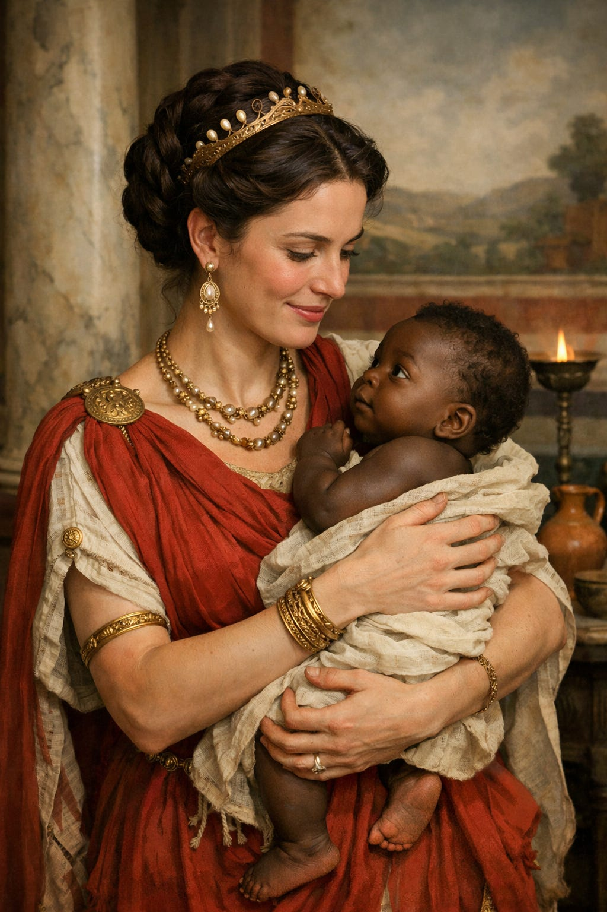

# A Roman Matron & her Black Child

> A fictional debate & Roman ideas about race


_I had previously started to write a piece on the ideas about race, ethnicity and nationalism in the ancient world but stopped as I felt that I hadn’t done enough background reading on these topics and I don’t want either a misleading post or a shallow AI-like post that doesn’t raise any interesting point. What follows is an introduction and discussion of a Latin source that I had included as an example in that piece as it is both interesting and I haven’t seen it discussed in non-academic places.If anything appears offensive to the reader, he should note that it is only the opinion of the quoted texts and not of the present writer._

### Introduction

It is difficult to find any society in the history of humankind which were as focused on oratory as the Greeks and Romans (or Graeco-Romans as they came to merge more and more over antiquity) were. Although, with the exception of a couple names (Cicero, Demosthenes, etc.), ancient orators and rhetoricians are not household names anymore in the same way as they once used to be, the influence they had had on the subsequent history of literature is nevertheless immense.

> _Sed nihil est tam incredibile, quod non dicendo fiat probabile, nihil tam horridum, tam incultum, quod non splendescat oratione et tamquam excolatur._ (Cicero: Paradoxa Stoicorum 3)
> 
> _But there is nothing so incredible, nothing so horrible, so uncouth that it doesn’t seem probable in speech, that it doesn’t shine through oratory and is a little ennobled._

Though some people may be naturally gifted, the orator is, generally speaking, an educated man and brought up through a curriculum of liberal arts and classics. Through thorough study and emulation of the great speakers of the past are the great speakers of the present made. Thus, the education of young Romans were focused almost wholly focused on rhetoric.

After finishing basic education (reading, writing, basic grammar) with a _grammaticus_, a student studied rhetoric with (no points for guessing) a _rhetor_. The education at this stage included, among other things, giving mock speeches on imaginary topics. Although the topic is more complex than a simple division like this would suggest, these mock speeches are generally divided into _suasoriae_ and _controversiae_.

In the _suasoriae_, the speaker would compose a speech for a popularly known legendary or historical moment. Imagine you are Agamemnon hindered by adverse winds, what speech would you give in front of your troops to encourage them ( and then about sacrificing your daughter )? Imagine you’re Julius Caesar leading your legion down to Rome after the senate ordered you to disband them, how would you convince them that you’re right to oppose the authority of the Roman Senate ? And even though these _suasoriae_ are, of course, not in the league of actual surviving speeches (how could they ?) and otherwise much shorter, they’re quite fun.

The _controversiae_ are about imaginary legal cases that the student is likely to find in the real world if he pursues a life in the forum. Here, one should be able to argue from either side. Even adult men well advanced in their careers would sometimes perform _controversiae_ in public.

The poet Juvenal recalls his educations thus:

> _Et nos ergo manum ferulæ subduximus: et nos  
> Consilium dedimus Syllæ privatus ut altum  
> Dormiret…_
> 
> (Satura I)
> 
> _And thus we gave our hand to the cane (_of the teacher_)[^1] and gave advice to Sulla to sleep well._

The poet Ovid is said to have enjoyed his performances though Seneca says he gave speeches rarely.[^2]

Some collections of these ancient mock-speeches are extant today. _Controversiae_ and (fragments of) _Suasoriae_ of Seneca the Elder, _Declamationes_ of (pseudo-) Quintilian as well as the _Declamationes_ of Calpurnius Flaccus with which we’re concerned here. More or less nothing is known about Calpurnius Flaccus and _Declamationes_ is the only work that have come down to us under his name.



Fig: A Roman Matron holding a black child. This is an AI generated image.

_Declamationes_ contain all sort of amusing cases from sodomizing soldiers to patriotic tyrannicides and from heroic gladiators to scheming prostitutes. The case translated here is the second in the collection. A Roman matron is accused of adultery after her child is born with a dark complexion. Both the defense and the prosecution, so to speak, are presented. First, the accusations are made that while people are diverse, no one is entirely dissimilar to his own parents. Why would she do so ? Well, says the accuser, the thrill of committing ill deeds are their own rewards in many cases. The defending speaker retorts that the darker complexion of the child might as well have been due to the wounds the fetus suffered while still in the womb and not his natural colour at all. Afterall, light skin is often tanned due to exposure to the sun and even darker complexion lightens when one is often in the shade. Might it not be that the darker colour due to wounds suffered might have lightened with time ?

As I said, the defense is a bit funny, at least to me, whether it was intended as such or not. I’ll discuss some themes and translation choices after the translation itself. The Latin text is from Lewis A. Sussman’s 1994 translation and commentary of the _Declamationes_. The translation is my own but Sussman’s translation as well as comments have been of great help as the text is not clear (and potentially corrupted) at times.

### Latin Text

**NATUS AETHIOPS**

Matrona Aethiopem peperit. arguitur adulterii.

> **Pars Prima**
> 
> Expers iudicii est amor: non rationem habet, non sanitatem; alioquin omnes idem amaremus. Nonnumquam incredibiliter peccare ratio peccandi est. "Non semper," inquit, "similes parentibus liberi nascuntur." quid tibi cum isto patrocinio est, nisi ut appareat te pecasse securius? Miramur bane legem esse naturae, ut in subolem transeant formae quas quasi descriptas species custodiunt? sua cuique genti etiam facies manet. rutuli sunt Germaniae vultus et flava proceritas; Hispaniae < ... > non eodem omnes colore tinguntur. ex altera parte, qua convexus et deficiens mundus vicinum + mittit orientem, illic effusiora corpora, illic collectiora nascuntur. diversa sunt mortalium genera, nemo tamen est suo generi dissimilis. "Quid ergo?" inquit, "amavi[t] Aethiopem?" est interdum, iudices, malarum quoque rerum sua gratia, est quaedam voluptas. miraris si aliquis non sapienter amat, cum incipere amare non sit sapientis? da mihi sanos mulieris oculos: nemo adulter formosus est. periturae pudicitiae minima in eo est sollicitudo quemadmodum pereat. proprium est profanae libidinis nescire quo cadat. ubi semel pudor corruit, nulla inclinatis in vitium animis ruina deformis est. Is demum libidini placuit, in quem non posset mariti cadere suspicio.

> **Pars Altera**
> 
> Ita non maius est argumentum pudicitiae, quod parere voluit, quam impudicitiae, quod <in>feliciter peperit? vides partum laesis fortasse visceribus excussum: multum fortunae etiam intra uterum licet. vides sanguinis vitio perustam cutem; colorem putas. istud fortasse infantis iniuria est. hoc ipsum, quod alte infuscatam cutem livor infecit, dies longus extenuat. nivea plerumque membra sole fuscantur, et corpori pallor excedit. quamvis naturaliter fuscos artus umbra cogit albescere. tantum tempori licet quantum putas licere naturae.

### English Translation

A BLACK CHILD IS BORN

A Matron gives birth to a black (child). She is charged for adultery.

> **First Part**
> 
> (Arguing that the matron has committed adultery)
> 
> Love doesn’t know about good judgement: It has neither reason nor sanity. Otherwise, we would all love the same. Oftentimes, the very reason for committing errors is the unbelievableness of the error itself. “Well the children don’t always resemble their parents”, she says. What else does this sort of defense have to you except to show that you have erred quite confidently ?
> 
> Are we to be surprised at the laws of nature that the (parent’s) features are replicated in the children like copies? There’s a a certain countenance to each _gens_. Germans have ruddy faces and there’s a blond tallness about them. In Hispania … not everyone is of the same colour. On the other side, where the world curves and falls away and sends forth the neighboring East, here bodies are born more loose, and there more compact.
> 
> Though the _gens_ of men is diverse no one is dissimilar to his own parents. “What ?”, she says, “I loved a black man ?” There is a certain attraction to bad deeds themselves, o men of the jury, a certain joy. Would you be surprised to learn that someone started loving irrationally when to love is itself irrational ? Give me the eyes of a sensible women : no adulterer is handsome. Debased chastity cares not in what mode it may be debased. It is the characteristic of profane lust to not know where it sinking at all. Once shame has been corrupted, no vice is low enough for the sunken mind. To him, at last, the lust was gratified on whom the suspicion of her husband couldn’t fall upon.

> **Second Part**
> 
> (Arguing that the matron is innocent)
> 
> Is it not a greater argument for her modesty that she wanted to give birth to the child than of of her immodesty that she did so with complications ? Maybe the newborn is just cut up due to internal wounds. Even inside the womb, much must be attributed to fortune. You see skin cut with blood clots and think that’s his color. Maybe it is just the injuries that the child has suffered. This very condition i.e. the deeply colored skin that bruises have imparted may be alleviated with time. Oftentimes snow-white limbs are tanned by the sun and paleness vanishes from the body. Even deeply tanned limbs are often lightened under shade. So much, then, that you think caused by nature should be attributed to time.

### Some Comments

#### Aethiops

If you know Latin, you will have noticed that what is translated as ‘black’ in English is in the original Latin ‘Aethiops’. The English word which is derived from it is, of course, ‘Ethiopian’. As the modern nation of Ethiopia did not yet exist in the ancient world, the ancient authors were of course not speaking of it. The Latin word ‘Aethiops’ is derived from the Greek Αἰθίοψ (_Aithíops_) meaning literally ‘burnt-face’. It thus refers to any dark-skinned person in what is contemporary Africa (as opposed to the ancient limits of Africa which mostly centered around what is today Tunisia) that the Greeks and Romans encountered. I’ve used the word ‘black’ in the translation both as the topic of skin colour is prominent and there seem to be other ancient sources who use the word much to the same effect. Who the Aethiops is supposed to be is not made clear but it seems to be assumed that he is a slave.

In his sixth satire, Juvenal rants against everything that he feels is wrong in his society. In the part we are interested in he goes on to say that either elite women would try everything they can to avoid pregnancy and even if they do get pregnant, the father finds himself with an ‘_Aethiops_’ child that he could hardly see in the day.

> ```
> hae tamen et partūs subeunt discrīmen et omnīs
> nūtrīcis tolerant fortūnā urguente labōrēs,
> sed jacet aurātō vix ūlla puerpera lectō.
> tantum artēs hujus, tantum medicāmina possunt,
> quae sterilēs facit atque hominēs in ventre necandōs
> condūcit. gaudē, īnfēlīx, atque ipse bibendum
> porrige quidquid erit; nam sī distendere vellet
> et vexāre uterum puerīs salientibus, essēs
> Aethiopis fortasse pater, mox dēcolor hērēs
> implēret tabulās numquam tibi māne videndus.
> 
> Satires VI. 628-637
> ```

In English:

> These (women) at least bear the difficulties of childbirth and endure the troubles of nourishing them. But any luxurious woman who lies in a gilded bed (would do so); so potent are the arts and so potent the drugs of the people (abortionists) hired to sterilize and to kill (foetus) in womb. Rejoice, o poor wretch, and mix whatever drink you will; for if she would even wish to trouble her womb with bouncing babies, you would certainly be the father of a black (child) and your off-colour heir, hardly to be seen at daybreak, would fill all (places in your) will.

Juvenal has quite a lot of these rants which, with only a few names changed, fit right into their modern iterations. Here too the word ‘Aethiops’ is used not as the name of a specific tribe but as generic dark skinned people. His rants against abortions is related to our text too. When the defense says that “_Is it not a greater argument for her modesty that she wanted to give birth to the child than of of her immodesty that she did so with complications ?_”, the obvious implication is that the matron could easily have aborted the child were she guilty of adultery and was sure that the baby would be born with dark skin.

As for the idea that children are obviously similar to their parents, Plutarch has an interesting anecdote:

> ἀλλ᾽ ὅσων ἡ φύσις ἔστερξε καὶ προσήκατο τὸ συγγενές, τούτων ἡ δίκη διώκουσα τὴν ὁμοιότητα τῆς κακίας ἐπεξῆλθεν. 4 ὡς γὰρ ἀκροχορδόνες καὶ μελάσματα καὶ φακοὶ πατέρων ἐν παισὶν ἀφανισθέντες ἀνέκυψαν ὕστερον ἐν υἱωνοῖς καὶ θυγατριδοῖς: καὶ γυνή τις Ἑλληνὶς τεκοῦσα βρέφος μέλαν, εἶτα κρινομένη μοιχείας ἐξανεῦρεν αὑτὴν Αἰθίοπος οὖσαν γενεὰν τετάρτην:
> 
> De Sera Numinis Vindicta 21

Or in English:

> But in all those for whom nature has cherished and accepted the family likeness; justice pursuing the similarity of the wickedness exacts (vengeance) as in the case of warts, dark-spots or moles of the fathers, unseen in the children, are seen again the case of grandson and granddaughters. For a Greek woman giving birth to a black baby was tried for adultery found that she herself was a fourth generation descendant of a black person.

This would have been a good point to include in the defense. Maybe the accused woman had some black ancestor in the past. Maybe even both the husband and the wife had such ancestry and the dark skin of the child might not surely mean adultery. This is also a real thing that can actually happen. The most famous modern case is probably that of the South African couple Abraham and Sannie Laing. Both of them were white but their daughter Sandra was born with darker skin. Both Mr. and Mrs. Laing had African ancestry some generations back. Being black in Apartheid South Africa obviously brought hardships, to put it mildly, with it and the idea that the biological child of two white parents should be black or coloured seems absurd on its face.

There are also evidence that unlike what the cliché that racism was invented in the early modern era, there was at least some anti-black sentiment in antiquity. I’m not discussing that topic here and will thus end this section with an amusing anecdote from the _Historia Augusta_ about Emperor Septimius Severus and a dark-skinned guy. _Historia Augusta_ is famously filled all sort of unsubstantiated nonsense; so whether this actually reflects the attitudes in the time period depicted.

> post murum apud Luguvallum visum⁠ in Britannia cum ad proximam mansionem rediret non solum victor sed etiam in aeternum pace fundata, volvens⁠ animo quid ominis sibi occurreret, Aethiops quidam e numero militari, clarae inter scurras famae et celebratorum semper iocorum, cum corona e cupressu facta eidem occurrit. quem cum ille iratus removeri ab oculis praecepisset, et coloris eius tactus omine⁠ et coronae, dixisse ille dicitur ioci causa: "Totum fuisti,⁠ totum vicisti, iam deus esto victor".
> 
> Historia Augusta: Septimius Severus 22

In English:

> When he was going to his nearest quarters after inspecting walls in Luguvallum when he was not only victorious but had placed perpetual peace and was wondering in his mind what omen would present itself, a black guy from the army who was famous among jesters and was ever popular for his jokes, presented himself with a wreath made out of cypress. When he got angry and ordered the black man to be removed from his sight, considering both the colour as well as the wreath to be ill-omened, the black man is reported to have joked: “You became all, you conquered all, Now become victorious as a god.”[^3]

#### Gens and Race

‘_gens_’ is an interesting word. It is ultimately derived from a root that means ‘to give birth’. So, it relates to groups that are related by birth. Romans used it from family groups sharing the same name ( eg. Gens Iulia, Gens Flavia, etc.) to ethnic groups to even human kind (_gens humana_, cf. Horace’s Odes I.3). It is consequently often translated as ‘race’. It is not race in the same as the modern pseudo-scientific idea of race (i.e Caucasian, Mongoloid, etc) but there are enough analogues even in common English speech. One still speaks of human race and even though the idea of labelling what one today would call ‘ethnic groups’ as race was soured only in the mid and late twentieth century after the ‘superior’ German and Japanese races were defeated by the combined might of US and USSR, it was quite common before that.

#### Adultery: Crime and Punishment

The punishment for adultery would perhaps be, if not identical then, similar to those prescribed in _Lex Iulia de adulteriis coercendis_ (~18BCE) which the Emperor Augustus brought as a part of his reforms against what he considered vices in Roman society. Some of these, like encouraging Romans to have more children, are quite topic today when fertility rates are dangerously low in many parts of the world. Adulterers caught _in flagrante delicto_ could be detained or, in some cases, even killed. Augustus exiled his own daughter Julia for her scandalous behaviours. Similarly, the poet Ovid was exiled to the black sea region after some such incident though the exact circumstances are not known.

_If you like my writing, please subscribe to receive similar posts in the future. If there are any errors on my part, I would be grateful to have them pointed out in the comments. Thank you._


---

[^1]: Roman teachers were notorious for their harsh punishments.
[^2]: Seneca Maior, _Controversiae_ 2.2.12
[^3]: All the things related are omens of death. The last one is a reference to the process of deification where deceased Roman Emperors were often granted divine status by their successors.
