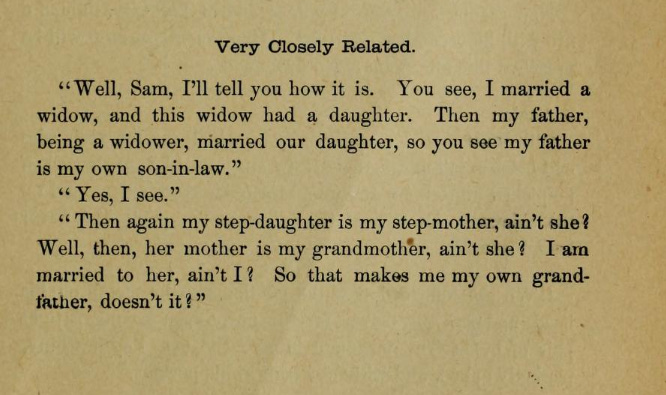
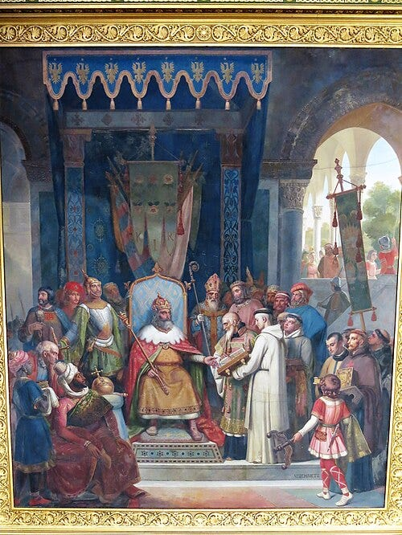

# Alcuin of York, a medieval Indian folk tale and a modern American song

> I am my own grandpa!

What does Alcuin of York, Anglo-Saxon philosopher at Charlemagne’s court, have in common with a medieval India folk tale contained in the _Vetālapañcaviṃśati_ (Twenty five stories of the _Vetāla_) and a twentieth century American song? They all deal with a convoluted situation in which a person turns out to be his own grandfather?

### I am my own grandpa

Let’s start from the most modern one and go backwards. ‘I’m my own grandpa’ is a 1947 song written by Dwight Latham and Moe Jaffe and performed by Lonzo and Oscar. It’s quite funny. The original version is on You Tube.

There have been several remakes and covers of this song since. I quite like the one from the movie The Stupids (1996).

Before proceeding further, it should be cleared that except for some questionable age gaps, there is actually no funny business going on. That is to say, the marriages are not between people related by blood. The narrator happens the marry a widowed woman and his father marries the widows daughter. The relations, with ‘step’ conveniently removed for comedic purposes, just go on recursively from there.

The writers of this song apparently got the idea from Mark Twain[^1]. In his _[Wit and Humor of the Age](https://archive.org/details/withumorofagecom00land/page/87/mode/1up)_ (1883), we read:

Mark Twain probably wasn’t the originator of this idea which seems to have been reported many times in 19th century newspapers as incidents that actually took place but the particulars are usually missing.

### Twenty five stories of the Vetāla

_Vetālapañcaviṃśati_ (Twenty-five stories of the _Vetāla_) was a popular cycle of stories in medieval India. Besides the many versions in Sanskrit, there were adaptations in many vernacular languages. With the transmission of Buddhism, in pre-modern times it reached as far as the Mongols (whence the Russians got to know of it) and the Manchus. There were some adaptations in European languages during the colonial times. Richard Burton, of manifold fame, translated it as _[Vikram & the Vampire: or Tales of Hindu Devilry](https://archive.org/details/cu31924024159760)_; though it is more like loosely inspired trans-creation at best. Thomas Mann’s _The Transposed Heads (Die vertauschten Köpfe)_ was based on a story found in the collection. Douglas J. Penick has recently brought a new translation of one of its [recensions](https://books.google.com/books/about/The_Oceans_of_Cruelty_Twenty_Five_Tales.html?id=nVipEAAAQBAJ&source=kp_book_description).

The stories are set in a frame narrative where a tantric sage (or sorcerer, if you like) goes everyday and gives a fruit to the King _Vikrama_. The king thinks nothing of it and gives the fruit to his servant to place it in the store. This goes on for years. One day, the tantric gives the fruit and leaves but it chances that it falls from the King’s hand and breaks. It turns out there was a precious jewel inside the fruit. The King orders his men to show him all the stored fruits gathered over the ages and voila, its all precious gems now. Next day, the king asks the sorcerer what the reason for this is. The sorcerer in turn replies by asking the king for help. When the king agrees, he is asked to come alone to the cemetery[^2] on the next new moon day armed just with a single sword.

When the day comes, the King does as he was asked. The sorcerer is there all alone in the cemetery, performing some rituals. “Some distance from here”, says the sorcerer “there is a tall tree. There is a corpse lying on one of its branches. Bring it here.” The King goes alone in the wild and finds the corpse. It turns out that the corpse is not entirely dead after all. It is a _Vetāla_ : sort of spirit that possesses dead bodies whose funeral hasn’t been done. The _Vetāla_ moves away constantly and when the King gets a hold of him at last, he says : “The journey is long. I’ll tell you a story and ask you a question. If you know and don’t answer, your head will burst open.”

The _Vetāla_ then starts narrating stories that have some riddle or puzzle at the end. King Vikrama, as a wise king, is able to solve the riddles and as he answers, the _Vetāla_ flies away to his original tree whence the King has to go on and fetch him again. So the cycle continues for twenty five stories. The last story, for which the King is unable to give an answer, is the one which we are interested in right now.

There are, as I said earlier, many recensions of the _Vetālapañcaviṃśati_. The one translated below is from a prose redaction by a certain _Jambhaladatta_. The date of the work is not known, though it is probably not later than 16th century and is probably older. [^3]

> atha rājā vetālaṃ śākhāṃ śākhāṃ bhrāmaṃ bhrāmaṃ kadarthyaikavṛddhaśākhāyāṃ vidhṛtya sthitaḥ । rājā prabandhenānetumakṣamo bhūtvā khaḍgena śākhāmucchidya śākhāsametaṃ vetālaṃ skandhe kṛtvā maunaparāyaṇo bhūtvā kṣāntiśīlasamīpaṃ gantumupacakrame । tathāpi vetālaḥ guruvākyaṃ praśnamakārṣīt ।
> 
> deva, dakṣiṇasyāṃ diśi dharmaseno nāma rājāsīt । tasya mahādevī candrāvatī । tasyāmanena vilāsavatī nāma kanyā samutpāditā । ekadā siṃhaleśvaro rājā taṃ dharmasenaṃ jetumāgataḥ । tadānīmanyonyayuddhaṃ tayornṛpatyorabhūt । atha balavatā siṃhaleśvareṇa parājito dharmasenaḥ svarājyaṃ vihāya hayamāruhya vanaṃ praviveśa | tadvṛttāntamadhigamya tasya mahādevī candrāvatī duhitaraṃ vilāsavatīmādāya vanaṃ prāptavatī । adha tatraiva vane pracaṇḍasiṃho nāma kṣatriyo mṛgānveṣaṇāya sasuta ājagāma । sa kardame strīdvayapadacihnaṃ nirīkṣya pracaṇḍasiṃhaḥ putramabravīt । bho putra, divya strīdvayasya padacihnamupalakṣyate । tad yadi strīdvayaṃ prāptavyaṃ tadā dīrghacaraṇā mama bhāryā hasvacaraṇā tava bhāryā । tacchrutvā 
> 
> tat putreṇa svīkṛtam । tatastena padacihnena gatvā candrāvatīvilāsavatyau sarovare tābhyāṃ prāpte । tadaivavaśād dīrghacaraṇā pracaṇḍasiṃhena svīkṛtā hrasvacaraṇā tatputreṇa svīkṛtā । kālavaśāt tayostābhyāṃ putrāvutpāditau । tatkumārayoḥ sambandhaḥ ko bhavatu । krodhaṃ vimucya sandehacchedamārabhatu deva ।
> 
> tacchrutvā rājā viparatisambandhapariccheda āsakta ivāsīt । ajñātvottaraṃ na dātuṃ doṣo nāsīt । iti vicintya dṛḍhamaunena kṣāntiśīlasamīpaṃ gacchan vidyate ।

Or in English translation:

> Now the _Vetāla_ jumping from branch to branch and smashing them finally dangled in a large branch. The King, unable to catch him with words, cut the branch with his sword , took both the _Vetāla_ and the branch and started his journey towards _Kṣāntiśīla_ (the sorcerer) silently. The _Vetāla_ asked a long question anyway.
> 
> Lord, in the southern regions there was a king named _Dharmasena_. His chief queen was called _Candrāvatī_. From her, he had a daughter named _Vilāsavatī_. Once the King of Sri Lanka came to conquer this _Dharmasena_. Then there was a war between the two kings in which _Dharmasena_ was defeated by the strong king of Sri Lanka . He took a horse and fled towards the forest. Hearing such news, his queen _Candrāvatī_ took her daughter _Vilāsavatī_ and fled to the forest too. In that forest, a _Kṣatriya_ named _Pracaṇḍasiṃha_ had arrived with his son for a hunting expedition. He saw footprints of two beautiful women on the mud-track and said to his son, “This seems to be the footprint of two beautiful women. If they are found indeed, I shall marry the one with longer footprint and you shall marry the one with shorter footprint.”[^4] This the son accepted. They then followed the footprints and found the two women beside a lake. Due to fate, _Pracaṇḍasiṃha_ married the mother with longer footprint and his son married the daughter with shorter footprint. In time, both of them gave birth to sons. What is the relation between the two baby boys? Solve my curiosity without being angry, o King!
> 
> Hearing this, the king was completely unable to untangle the opposite relation. It was no fault to not answer if he did not know. So, he remained silent and continued on his way to _Kṣāntiśīla_.

Though it doesn’t exactly spell out that the son of _Pracaṇḍasiṃha_ is his own (step-) grandfather, the relations is exactly the same as that which is portrayed in the song. The King, who had solved all sort of riddles up until now, is left speechless at last. How could we, mere mortals, then be expected to know what the relation between the two baby boys would be?

Despair not! We have the teacher of Charlemagne himself to set the record straight for us.

### Alcuin of York

Alcuin of York was, as you probably guessed, from York in Anglo-Saxon Northumbria. In the late 8th century, he worked in various high positions in Charlemagne’s court in Aachen and was one of the most learned men of his age anywhere in Europe. Before the devastation caused by Viking raids, Anglo-Saxon England produced some of the brightest minds in all of Christendom. Alcuin played a large part in revival of high learning after decline in late-antique ‘dark age’ and was an important figure in what is often called the ‘Carolingian renaissance’. Except for some exceptions, more or less all ancient Latin literature that survive today do so because of a massive expansion in manuscript production and copying in Carolingian times. Anglo-Saxon scholars like Alcuin played a crucial role in all this development.

Fig: Charlemagne receiving manuscripts from Alcuin.

A large number of works, covering many disciplines, by Alcuin have survived to the present day. Of these _Propositiones ad Acuendos Juvenes_ (Problems to sharpen the young) is an important one. It consists of a series of problems, connect mainly with logic and mathematics, and their respective solutions. The manuscript tradition of this work is apparently quite complex. For our own problem, it is sometimes omitted from the manuscripts and the solution is present only in a few. Anyway, here is the relevant section from Alcuin’s _Propositiones ad Acuendos Juvenes_:[^5]

> 11B PROPOSITIO DE PATRE ET FILIO ET VIDUA EIUSQUE FILIA.
> 
> Si relictam vel viduam et filiam illius in coniugium ducant pater et filius, sic tamen, ut filius accipiat matrem et pater filiam, filii, qui ex his fuerint procreati, dic, quaeso, quali cognatione sibi iungantur.
> 
> SOLUTIO
> 
> Filius igitur meus et filius patris mei avunculus et nepos est unus alteri.

Or in translation:

> 11B PROBLEM CONCERNING A FATHER AND HIS SON AND A WIDOW AND HER DAUGHTER
> 
> If a father and a son marry a widow or a divorcee and her daughter so that the son marries the mother and the father marries the daughter, say, I ask you, with what relation be the sons born be related to each other ?
> 
> SOLUTION
> 
> My son and the son of my father will be both uncle and nephew of one another.

So, here you go. The two young boys will be both uncle and nephew of one another at the same time! Sometimes ridiculous hypotheticals are like crabs; they arise over and over again in different environments.

**Valete sodales!**

_If you like my writing, please subscribe to receive similar posts in the future. If there are any errors on my part, I would be grateful to have them pointed out in the comments. Thank you._

---

[^1]: Mark Twain has a quip for everything lol. If he was born today, he would have been ragebaiting people left and right.
[^2]: Technically a crematory ground.
[^3]: The text is from M.B. Emeneau’s 1934 [edition](https://archive.org/details/jambhaladattasve0000unse). Translations are, unless otherwise specified, mine.
[^4]: This is folk story told in a brief way and the purpose of the backstory is just to introduce the two entangled marriages but the situation is absurd anyway. How does one know whether someone is beautiful or not from footprint of all things? In _[Somadeva’](https://en.wikipedia.org/wiki/Kathasaritsagara)_s recension of this story, the defeated King, the queen and their daughter flee to the forest together. They are there ambushed by a group of bandits where the King stands forth for a last stand to gain time for the queen and the princess to flee.
[^5]: The text is from Folkerts’ [edition](https://www.zobodat.at/pdf/DAKW_116_6_0015-0080.pdf) of the work.
