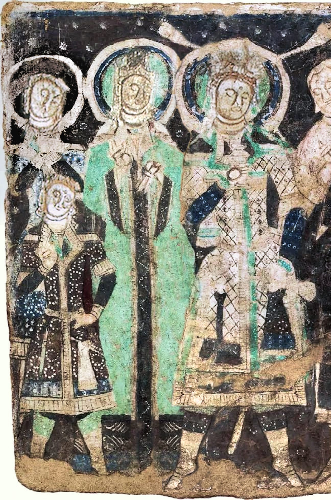
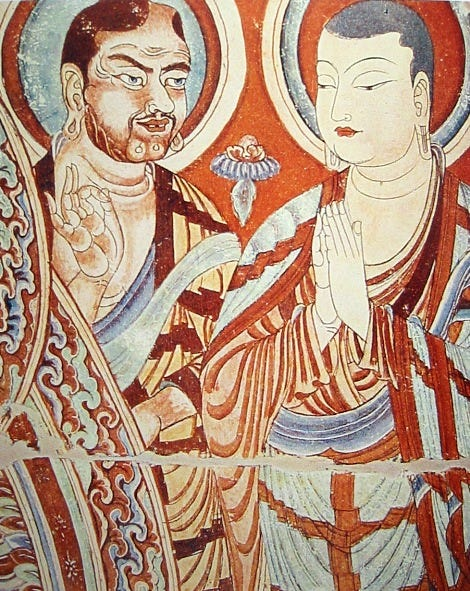
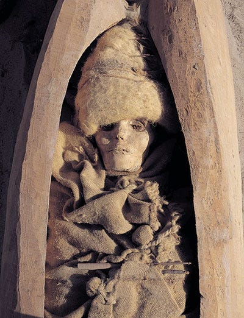
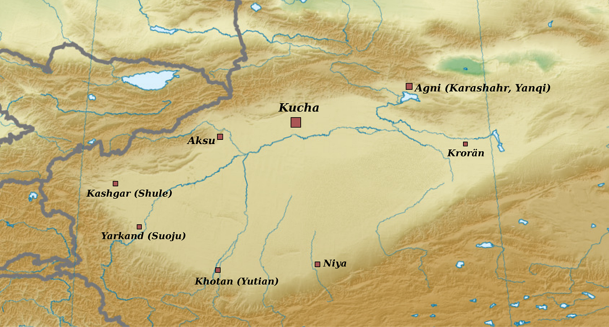

# Blonde Buddhists of the Tarim

> Or the Tocharians


### Introduction

Before being swept away by Turkic and Mongolic groups in the first and second millennium CE, Central Asia and the Eurasian steppe was full of Indo-European speaking folk. The most numerous and geographically spread of these were speakers of Iranic languages, like the Scythians, but there were others as well. The most interesting of these were a people who are commonly, though not entirely accurately, called Tocharians.

In the closing years of the nineteenth and the beginning of the twentieth century, many documents from what were then called Chinese Turkestan were discovered during expeditions to this region. Many of these contain, as we know now, texts in two (or probably three) related but distinct languages that had not previously been deciphered. As scholars studied them, it was revealed that these languages were Indo-European. This was around the same time that Hittite texts from Anatolia were first being discovered. Nowadays, scholars generally agree that Hittite (and the Anatolian branch in general) and Tocharians were the earliest Indo-European branches to separate from the whole.

Tocharians are an interesting people. Living at the edge of the Tarim basin, they were instrumental in the transmission of Buddhism into China. Surrounded by Iranic, Turkic and Sino-Tibetan people, they were a group of their own, being mainly Buddhists and writing in an Indic-derived script. Their languages are interesting in their own right and some of their literature, which however consists mainly of translations of Buddhist texts in Sanskrit or other Indic languages, are so as well.

What has produced most interest on the Tocharians is, however, neither their language nor their culture but their appearance. They look, for a lack of a better word, European, i.e., they have physical features that are associated with native European peoples like lighter hair colors (red, blond, etc.) and light colored eyes besides the general skull shape that are common in Western Eurasia.



Fig: Painting of a Tocharian Royal Family. ~500CE.

Of course, light eyes are not unknown in any part of the world that has some Indo-European ancestry. There are many people with light eyed people in Central Asia even today. Even in the very eastern reaches of the Indo-European speaking world in Nepal, these features are not unknown. In my own family, I’m the first in four generation to have brown eyes. My father, grandfather and great-grandfather all had light colored eyes. Fairer skin color is also common in Central Asia. A bit further south Kalash and Nuristanis are quite famous for resembling Europeans. During the war in Afghanistan, I’ve heard tell, that western journalists wanting to disguise themselves would say that they were Nuristani.[^1]

Still, it is one thing to have rare features appear in a people, it is other to just straight up resemble them. Some [Pacific Islanders](https://upload.wikimedia.org/wikipedia/commons/0/05/Blonde_girl_Vanuatu.jpg) today have blonde hair but I doubt anyone is mistaking them for Swedes. Tocharians seem to have these ‘European’ features at a far higher frequency than expected and unlike the Nuristani or the Kalash who are few in number and possessed no great literary tradition or influence on neighboring civilizations, Tocharians possessed both a literary tradition as well as influenced in a major way the transmission of Buddhism to East Asia. Kumārajīva (4th Century CE) one of the greatest translators of the Buddhist canon into Chinese was the son of a Kashmiri Brahmin and a Tocharian princess.



Fig: Tocharian and Chinese Buddhist monks. 8th Century CE.

### Tarim Basin Mummies

Before proceeding further, let us clear one misconception. The Tarim Basin mummies that show ‘European’ features and were considered the predecessors of the Tocharians were not actually related to Tocharians at all. A series of well preserved mummies were found by expeditions in the Tarim basin around the same time as the texts were being discovered. They date from the middle bronze age all the way to first millennium CE and look mostly non East-Asian. Even the clothing was noted as looking distinctly ‘Celtic’. It was long thought that they must be related somehow to the ancestors of the Tocharians, either the Afanasievo culture (~3300 to 2500 BCE) in the Altai mountains that are considered to the proto-Tocharians or at least to the Andronovo cultural horizon (~2000 to 900 BCE) a bit further west that are generally considered to be Indo-Iranian.



With the technology that were then present, this was actually not a bad theory at all. With the advances in historical genetics (it has been more or less a revolution in the 2010s in historical genetics), it is now known that although later bodies may be related to Tocharians and other groups that lived later in the Steppe and around the Tarim Basin, the earlier mummies are genetically quite distinct. They derive a large part of their ancestry from a population that geneticists call Ancient North Eurasians or ANE who inhabited, as the name says, northern parts of Eurasia; Siberia and regions around it basically. Both East and West Eurasians today have some ANE ancestry but the people who have the highest levels of ANE ancestry today are not in Eurasia at all but in the Americas i.e., Native Americans. The Indo-Europeans from the Yamnaya and related archaeological cultures had some, though not as high as the Tarim mummies, ANE ancestry too. So, any similarities as appear between present day Europeans and early Tarim Basin mummies are due to very old common descent rather than later migrations of Indo-Europeans to the area.

### Tocharians

The Tocharians on the other hand _were_ Indo-European speaking folk. Following the early research on the manuscripts that had been brought from expeditions to Chinese Turkestan, scholars thought the language they had found was probably spoken by a people living in Bactria that Greek geographers had called _Tokharoi_ (Τόχαροι). Friedrich Muller was the first to do so if I recollect correctly. The same name name was known among the Indians (_tukhārāḥ_) and among the Persians (_tuxāri_) in ancient times for a people group in the same area.

Except for some doubtful cases no ethnonym similar to these were used by the Tarim basin people themselves. Thus, even though the name ‘Tocharians’ have become standard, scholars usually consider it to be inaccurate. The major alternative naming is that of Agnean-Kuchean named after the two major settlements - Agni in the east and Kucha in the west. The languages in the manuscripts discovered contain two related but distinct languages. The default position is to consider them languages spoken in different places: an eastern language called Tocharian A or Agnean and a western language called Tocharian B or Kuchean.



Fig: Map of Towns and Settlements around the Tarim Basin. Kucha and Agni give their names to the major Tocharian languages. The settlement labelled Niya was home in antiquity to a population of Middle Indic speakers who seem to have migrated from the upper Indus valley.

In the last centuries preceding the Christian Era, when much of southern Central Asia as well as Northwestern Indian subcontinent was ruled by Greek speaking polities, Buddhism began to spread across those lands. The resulting synthesis of Greco-Buddhism played an important role in the further transmission of Buddhism but we have few texts associated with them now. Sculpture, however, survives in great quantity.[^2] Across the Indus valley and through the silk route, Buddhism would travel to China through the first half of the new millennium. People of all sort of ethnic origins contributed to this process: Greeks, Parthians, Turks, Indians and of course Tocharians.

Of the literature in their own languages, quite a lot survives considering that no continuous manuscript tradition continued beyond the first millennium and the people themselves faded away with their language. The climate of the Tarim basin allows for manuscripts to survive for much longer than most places on earth. Thousands of documents survive, mostly from the latter half of the first millennium CE. They were mostly piles of palm leaf or paper manuscripts preserved due to fortunate happenstance and found from remains of monasteries or administrative sides. As might be expected, most manuscripts are really fragmented. As for the content, they contain, beside administrative texts, mostly translations of Buddhist literature (for many of which we do have known originals in Sanskrit or Prakrit). There are a lot of _jātaka_\-s and _avadāna_\-s.

Over the course of the second half of the first millennium, the oasis cities of the Tarim basin that were the homeland of these Tocharian speakers were conquered by a series of foreign powers: Huns, Turks, Chinese and others. The Tang dynasty was their imperial overlord of for much of the seventh and the eight centuries. Over the course of Uyghur Khaganate conquered the area and with the passage of time both their languages as well as their existence as ethnic group(s) faded away and were replaced by the Uyghurs and their Old Uygur language (which falls in the Turkic family). Quite sad if you ask me but _sic transit gloria mundi_.[^3]

So, this much for the Tocharians themselves. This [site](https://cetom.univie.ac.at/) has much of Tocharian corpus with translation. Go to this [primer](https://lrc.la.utexas.edu/eieol/tokol) from University Texas or [this](https://spw.uni-goettingen.de/projects/aig/lng-toc.html) one from University of Gottingen if you have some familiarity with linguistics and want to know more about the Tocharian languages themselves.

### Some Related Points

I’ll now discuss some topic that related to the Tocharians that I find interesting.

#### The Name Agni

As I said earlier one of the main settlements in the Tarim basin was called Agni and the corresponding language is often called Agnean. _Agni_ is the normal Sanskrit word for fire. (It is cognate to Latin ignis, whence English ignite). It is not surprising that a people who followed Buddhism might have some Indic toponyms. What is that it is infact a Sanskritization of the real Tocharian name _ārśi_. It is expected that foreign people might interpret your language according to their own ways, mispronounce sounds that don’t exist in their language and so on. There are enough examples of Sahara deserts and Avon river type in this world but it is less expected that some people will search for a vaguely similar sounding name in a foreign language for their own use.

I find this interesting because a similar thing has happened on the other side of Eurasia. Sanskrit authors from around ~500 BCE onwards mention a people called _Kamboja_ who dwelt in what is now eastern Afghanistan and western Pakistan. From incidental mention of words in their language, it seems that these Kambojas, whoever they were, spoke some kind of Eastern Iranic language. In the first millennium CE, this word was appropriated by people living in mainland Southeast Asia to refer to themselves. You might have heard of it : this is the origin of the name ‘Cambodia’. Whatever the motive, the process I think was the same in both cases. The Southeast Asian folks too picked whatever ethnic names in Sanskrit that vaguely resembled their own ethnonyms in their tongue, which is _Khmer_.

#### The Law in Kuchean, The Law in Chinese

I remembered reading long ago about a Tocharian monk complaining that while the Kashmiri understood the scriptures in the original and the Chinese in translation, they themselves would neither translate nor understand the original correctly. I spent some time searching for this but found nothing at all and couldn’t even remember where I had read that at all. It turns out that it wasn’t actually Tocharian at all but Khotanese. In Khotanese _Book of Zambasta_ we have:

> I intend to translate it into Khotanese for the welfare of all beings [. . .] But such are their deeds: the Khotanese do not value the Law at all in Khotanese. They understand it badly in Indian. In Khotanese it does not seem to them to be the Law. For the Chinese the Law is in Chinese. In Kashmirian it is very agreeable, but they so learn it in Kashmirian that they also understand the meaning of it. To the Khotanese that seems to be the Law whose meaning they do not understand at all. When they hear it together with the meaning, it seems to them thus a different Law.
> 
> _Book of Zambasta_ 23.2

This complaint comes, as I said, from a Khotanese speaker but something similar could perhaps be true of the Tocharians as well. Michaël Peyrot in his [study](http://dx.doi.org/10.1017/S0041977X16000057) of the Tocharian _Udānavarga_ says :

> This picture is confirmed by preliminary statistics of Tocharian Udānavarga literature in general. There were stand-alone translations, but these seem not to have reached any popularity comparable to the three main texts: first of all the Sanskrit original; then the Udānālankāra commentary in Tocharian; and finally the bilingual version, where the Tocharian is clearly meant as a reading aid to understand the Sanskrit.
> 
> The fact that the doctrine was valued only in Sanskrit, while the native language was better suited for more popular genres finds a nice parallel in a famous and often quoted passage from the Khotanese book of Zambasta …

The Chinese, as usual, managed to have their say on this topic too. In biography of the monk _Manyue_ in Biography of Eminent Monks, we [read](https://www.degruyterbrill.com/document/doi/10.1515/9783111432861-006/html):

> If [one] discusses the essence of the teaching [of the Buddha, one should] make Sanskrit the basis. If [one] explains the minor points, what is called Hu [languages] can be retained. From the Five Indias to the North of the mountain ranges there are countless translations; hence, there is doubt that the original teaching is preserved in [them], so that at present no one dares to let the [texts be translated through] three [different languages]: [it is] either the Hu [language] or Sanskrit. When the sūtras and the vinayas are transmitted to Qiuci(i.e., Kucha), the Kucheans do not understand the language of India – [they] call India (Tianzhu) kingdom of Yintejia– and therefore the [texts] are translated. If it is easy to understand [however], it should completely remain in Sanskrit.  

#### Possible Reference to Tocharians in a Kashmiri Text

Kashmiri Buddhist figures also seem to have prominent in Central Asian Buddhism and thence in the transmission of Buddhism to China. Kumārajīva was, as I mentioned earlier, son of a Kashmiri Brahmin and a Kuchean princess. Recently, DNA analysis of a Kashmiri buried in China was published. Considering the religious as well as economic links between Kashmir and Central Asia, it is interesting that there is possible reference to Tocharian Buddhist monks in a Kashmiri text.

_Mokṣopāya_ is the earlier version of a long Advaita text popularly known as _Yogavāsiṣṭha_. As it mentions the Kashmiri King _Yaśaskaradeva_ (r.939-948), it was composed either in his reign or sometime after in the tenth century. In _Mokṣopāya_ VI.70, _Vasiṣṭha_ recounts how he wandered all through the world in his meditation searching for an enlightened monk when :

> ```
> dhyānenāhaṃ ciraṃ bhrāntas 
> tādṛgbhikṣudidṛkṣayā 
> dvīpāni sapta vipulāṃs 
> tathaiva kulaparvatān  6,70.5
> 
> yāvat kutaścid apy eva 
> bhikṣur labdho na tādṛśaḥ 
> kathaṃ kila manorājyaṃ 
> bahir apy upalabhyate  6,70.6
> 
> tatas tribhāgaśeṣāyāṃ 
> rātrau punar ahaṃ dhiyā 
> uttarāśāntaraṃ yāto 
> velāvāta ivārṇavam  6,70.7
> 
> cīnanāmātha tatrāsti 
> śrīmāñ janapado mahān 
> valmīkopari tatrāsti 
> vihāro jinasaṃśrayaḥ  6,70.8
> 
> tasmin vihāre svakuṭī-
> kośe kapilamūrdhajaḥ 
> bhikṣur dīrghaśayā nāma 
> sthita evaṃparodayaḥ  6,70.9
> ```
> 
> ```
> I wandered long in meditation
> searching for such a monk
> over seven great islands
> and the great mountains. 
> 
> When such a monk was 
> found nowhere by me 
> ( how can the kingdom of mind
> ever be found outside? ), 
> 
> then, when a third was left
> of the night, I went thence
> using my mind to the north 
> like stormy winds over the sea.
> 
> There is a country called China there,
> great and splendid. 
> On a anthill there exists 
> a monastery, dedicated to Buddha. 
> 
> In that monastery, in his own cell, 
> a red-haired monk named Dīrghaśayā
> was present and the following
> was what he was focused on.
> ```
> 
> [^4]

Although it does not say so directly, I think the monk is supposed to be Tocharian. As for the name of the country being China, Sanskrit texts use that term carelessly for any land north of the Himalayas. Though it is not strictly necessary that the reference is to Tocharians and not to some other Central Asian folk, in my heart at least it is. So, the references to Tocharians fade away from history in Kashmir and resume again in the twentieth century when Sir Marc Aurel Stein, who was the leading historian of Kashmir of his time, rediscovered the Tocharian manuscripts in his great Central Asian expeditions in early 20th century.

Adios.

_If you like my writing, please subscribe to receive similar posts in the future. If there are any errors on my part, I would be grateful to have them pointed out in the comments. Thank you._


---

[^1]: I will probably do a deep-dive on the Nuristanis if fate allows. They speak Indo-Iranian languages that belong to neither Indic nor Iranian but their own separate branch and are, in general, quite archaic. Though mostly Muslim nowadays, they remained polytheists until quite late (late nineteenth and early twentieth centuries): late enough for colonial ethnographers to learn about their pre-Islamic ways that are quite interesting.
[^2]: It is often said that the earliest Buddha images are from the Greek inspired style in the late centuries BCE and early centuries CE. This is true. What is less emphasized is that the same is true for Hindu and Jain art. There is an absolute dearth of anthropomorphic sculpture for any religious tradition in India before this time. This could not possibly be due to the lack of knowledge as sculptures of animals survive. There seems to be strong aniconic currents across religious traditions at that time as surviving textual sources which range from hesitant affirmation of icons to full on disdain. Robert DeCaroli’s _[Image Problems](https://www.jstor.org/stable/j.ctvcwnkr0)_ deals with this topic in a detailed manner.
[^3]: Of course, it’s not like the Uyghurs massacred all Tocharians or something. As happens repeatedly over the course of history, they simply mixed though with Tocharian culture being supplanted slowly with that of their conquerors. Uyghurs were at this time primarily Buddhists like the Tocharians themselves.
[^4]: _Kapila_ can mean a range of colors from red to brown to yellowish. I translate like this because Walter Slaje, from whose [article](https://www.academia.edu/7515639/2005b_Locating_the_Moksopaya_Moksopaya_Yogavasistha_and_Related_Studies_) I came to know of this, translate it as such and I think it is correct in the context.
