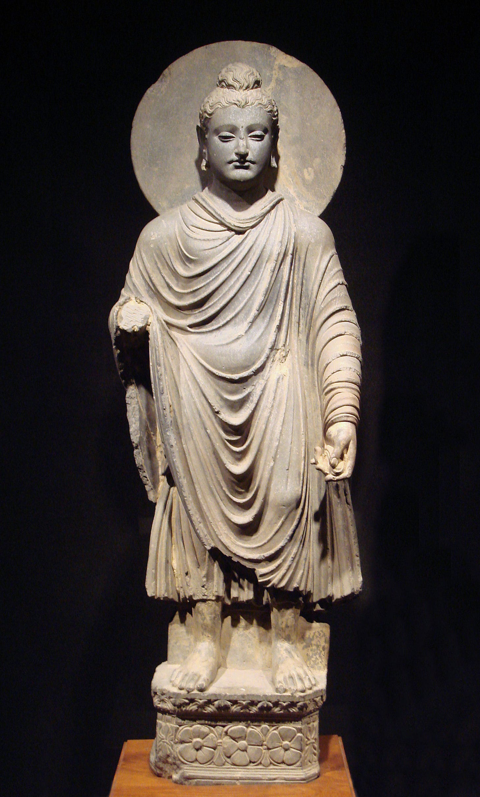

# Consolation of Grief

> English translation of Śokavinodana attributed to Aśvaghoṣa

## INTRODUCTION

The first Sanskrit poet that wrote _kāvya_ style poetry, either epic or drama, that we still possess in any substantial way is the Buddhist master _Aśvaghoṣa_. The traditional accounts (usually preserved in Chinese texts) associate him with the court of the great Kushan king Kanishka (r. 127-151 CE). This date is generally accepted, though some scholars support an earlier date in the first century. Around half of his epic on the life of the Buddha (_Buddhacarita_) has survived in Sanskrit[^1] while the whole survives in early translations to Chinese and Tibetan. A drama is extant completely and another one in fragments. Along with these, which are universally admitted to be of _Aśvaghoṣa’_s authorship, there are a lot of smaller texts that are attributed to him in manuscripts and in tradition, but there is uncertainty about their attribution. Scholars are usually hesitant to accept the genuine authorship in those cases.

Fig: _Graeco-Buddhist Buddha Statue, 1st Century CE. Gandhara_

Recently, as a part of a larger work called _Tridaṇḍamālā_ from Tibet, researchers found the Sanskrit original of the text called _Śokavinodana_ (Consolation of Grief) that was otherwise available only in a Tibetan translation. Some fragments of this text found in ancient manuscripts from Central Asia show that it’s certainly ancient. The scholars who are working on the _Tridaṇḍamālā_, however, seem not to accept the ascription.[^2]

Whatever the authorship, _Śokavinodana_ is written in simple but elegant _anuṣṭup_[^3] verses. Except for a few terms specific to Buddhist doctrines, the ideas presented are common to Buddhists, Jains, and Hindus. It is, as Silk termed the _Praśnottararatnamālā_, trans-sectual.

Peter Daniel Szanto has published a translation into Hungarian but I am unaware of any previous complete English translation. The translation presented here is my own. I’ve translated as literally as I could without making the whole thing unintelligible. Each verse usually consists of a simple sentence followed by an example or metaphor related to it. I have refrained from translating a couple of words like _karman,_ which, though not in exact theological niceties, is familiar enough to English speakers. Another word I have kept as it is is _saṃsāra_. I’ve often seen something like ‘cycle of rebirth’. And in many contexts, it does primarily mean that but it is often the normal word for the mundane world[^4] and should not be unnecessarily overcomplicated.

## TRANSLATION

> kaścit priyaviyogārtaḥ
> 
> pradīptaḥ śokavahninā
> 
> dhṛtim ālambya yatnena
> 
> svacittaṃ paribhāṣate ॥ 1 ॥

Someone hurt by the loss of a loved one, aflame with the fire of grief, gathered strength with effort and said to his own mind:

> prāptakarmapathārūḍho
> 
> vināhūtena yo janaḥ
> 
> gato vināparādhena
> 
> tatra kiṃ paritapyase ॥ 2 ॥

“He was on the path of _karma_ without anyone’s command and went without any fault. Why do you grieve over this?

> yadi tasyaiva maraṇaṃ
> 
> bhaven nānyasya kasyacit
> 
> uccair ākrandituṃ yuktaṃ
> 
> mahān paribhavo hy ayam ॥ 3 ॥

If death was to exist for him and no one else, it would be okay to cry loudly. That would be a great loss indeed.

> atha sarvasya jātasya
> 
> sthitaṃ maraṇam agrataḥ
> 
> sāmānyaṃ vyasanaṃ dṛṣṭvā
> 
> na śokaṃ kartum arhasi ॥ 4 ॥

But death stands before everyone who is born. See that it is a misfortune common to all and do not grieve.

> priyasaṅgamalobhena
> 
> janaḥ śokena dahyate
> 
> camarī vālalobhena
> 
> dāveneva vanāntare ॥ 5 ॥

Greedy to unite with his beloved, a person is burned by grief - like a yak hoping to save here tail is burned by wildfire in the forest.

> yadā sarvaiḥ prayātavyaṃ
> 
> yatra tatra gato hy asau
> 
> kim arthaṃ kriyate śokas
> 
> tasmin pūrvataraṃ gate ॥ 6 ॥

When everyone must go where he has gone, why do you grieve if he has gone a little sooner?

> mṛtyor atyugradaṇḍasya
> 
> pramattā khalviyaṃ prajā
> 
> vane jighāṃsoḥ siṃhasya
> 
> mṛgīvābhimukhī sthitā ॥ 7 ॥

Everyone is heedless before Death, who bears the terrible staff - like a doe in the forest standing before a lion trying to kill here.

> sarvopāyair yadā nāsti
> 
> martavyasya pratikriyā
> 
> dhṛtim ālambase kasmāj
> 
> jalān mīna ivoddhṛtaḥ ॥ 8 ॥

If there is no return for a mortal by any means, why do you not support yourself, like a fish out of water?

> kaścit tāvat tvayā dṛṣṭaḥ
> 
> śruto vā śaṅkito’pi vā
> 
> kṣitau vā yadi vā svarge
> 
> jāto yo na mariṣyati ॥ 9 ॥

Have you ever seen or heard or even suspected anyone, either in earth or in heaven, who will not die?

> traidhātukam idaṃ kṛtsnaṃ
> 
> dahyate’nityatāgniṇā
> 
> dāvāgninā pradīptena
> 
> vanaṃ kusumitaṃ yathā ॥ 10 ॥

Everything formed of three elements is burned by the fire of impermanence - like a flowering forest in burnt up by wildfire.

> nityasaṃjñāviparyastā
> 
> bhavāgrād api jantavaḥ
> 
> kṛṣyante mṛtyupāśena
> 
> pāśeneva mahāgajaḥ ॥ 11 ॥

Even the sublime beings, thinking themselves eternal, are pulled down by the fetters of impermanence - like a great elephant is brought down by fetters.

> niṣevya dhyānajaṃ saukhyaṃ
> 
> brahmā brahmālayāt punaḥ
> 
> nipātyate’nityatayā
> 
> nadīkūlam ivāmbunā ॥ 12 ॥

Having experienced the bliss of meditation, even _Brahmā_[^5] is brought down from the _Brahmā_\-world by impermanence - like riverbanks by water.

> purandarasahasrāṇi
> 
> cakravartiśatāni ca
> 
> nirvāpitāni kālena
> 
> pradīpā iva vāyunā ॥ 13 ॥

A thousand _Indra_\-s[^6] and a hundred _Cakravartin_\-s[^7] have been extinguished by time - like lamps by the wind.

> gatvāpi dūram ākāśaṃ
> 
> pañcabhijñā maharṣayaḥ
> 
> tatra gantum aśaktās te
> 
> yatra mṛtyor agocaraḥ ॥ 14 ॥

Even though the great sages, endowed with five powers, could reach the far sky, they couldn’t go there where death does not exist.

> pṛthivī dahyate yatra
> 
> meruś cāpī viśīryate
> 
> śuṣyate sāgarajalaṃ
> 
> śarīre tatra kā kathā ॥ 15 ॥

Where the earth is burnt, _Meru_[^8] is shattered and ocean’s waters dry up, what can one say about a (mere) body?

> vajrasāraśarīrāṇāṃ
> 
> buddhānāṃ yady anityatā
> 
> kadalīgarbhatulyeṣu
> 
> kā cintānyeṣu dehiṣu ॥ 16 ॥

If even the _Buddha_\-s , whose bodies are made up of the essence of thunderbolt, are impermanent, what hope is there for beings who are like the banana leaves ?

> hriyate mṛtyunā jantuḥ
> 
> pariṣvakto’pi bāndhavaiḥ
> 
> sāgarāntarjalagato
> 
> garuḍeneva pannagaḥ ॥ 17 ॥

Death snatches every creature, even if it is being embraced by its kin - like _Garuḍa_ [^9]snatches up serpents out of the ocean.

> hā jīvaloka hā kānte
> 
> krandamānaṃ sudāruṇam
> 
> maṇḍūkā iva sarpeṇa
> 
> gūryate mṛtyunā jagat ॥ 18 ॥

“Alas! the mundane world! Alas, my beloved!”. Death devours a man crying sadly like this - like a serpent devours a frog.

> agatvā khalv ayaṃ lokaḥ
> 
> kāryapāraṃ sudustaram
> 
> praviśaty ānanaṃ mṛtyoḥ
> 
> poto vā makarālayam ॥ 19 ॥

Without finishing the end of his endless tasks here, living beings enter the mouth of death - like a ship enters the ocean.

> paralokaṃ yadā kaścid
> 
> gacchantaṃ nānugacchati
> 
> nirviśeṣo bhavet tatra
> 
> dveṣyo vā yadi vā priyaḥ ॥ 20 ॥

No one follows a person going to the next world. It doesn’t matter whether the dead person was hated or loved.

> kṛtvā parajane snehaṃ
> 
> janaḥ svajanasaṃjñayā
> 
> majjaty āśāmaye paṅke
> 
> mahāpaṅke yathā gajaḥ ॥ 21 ॥

Placing affection on his kin and thinking them to be his own people, a person sinks into the swamp of hope - like an elephant sinks into a swamp.

> labdhās tyaktāś ca saṃsāre
> 
> yāvanto bāndhavās tvayā
> 
> na santi khalu tāvantyo
> 
> gaṅgāyām api bālukāḥ ॥ 22 ॥

Surely, there are not as many grains of sand in the Ganges as the number of kinsmen you’ve found and lost in this _saṃsāra_.

> ya eva te prayatnena
> 
> lālitaḥ putrasaṃjñayā
> 
> sa eva janmāntaritas
> 
> tāḍitaḥ śatrusaṃjñayā ॥ 23 ॥

One beats up as an enemy in another life, the same person that he loves as his son in this one.

> yasyaiva te stanau pītau
> 
> svajanasya bhavāntare
> 
> tasyaiva rudhiraṃ pītaṃ
> 
> hatvā māṃsaṃ ca bhakṣitam ॥ 24 ॥

One kills, drinks blood and eats the flesh in another life of the same person that he drinks out of the breasts in this one.[^10]

> ya eva te bhaved bhartā
> 
> śataśaḥ śirasārcitaḥ
> 
> sa eva te bhaved dāsaḥ
> 
> pādena śataśo hataḥ ॥ 25 ॥

The same person who was one’s master, to whom one bows his head for a hundred times, becomes one’s slave in the next life, kicked by the feet a hundred times.

> anyathā dṛśyate pūrvam
> 
> anyathā parivartate
> 
> janaḥ kāraṇabhāvena
> 
> saptarṣīṇāṃ yathā gaṇaḥ ॥ 26 ॥

A person seems one way at first and becomes another again due to causality - like the movement of the seven sages[^11].

> samāgamya viśīryante
> 
> yathā khe varṣabindavaḥ
> 
> samāgamya vinaśyanti
> 
> saṃsāre prāṇinas tathā ॥ 27 ॥

As raindrops that meet and scatter in the sky, so beings meet and disappear in this _saṃsāra_.

> saṃgamo vigamaś caiva
> 
> muhūrtam iha dehinām
> 
> nadyām udbhrāntavelāyāṃ
> 
> kāṣṭhānāṃ plavatām iva ॥ 28 ॥

Just for a moment is the meeting and farewell of mortals here - like that of wood beams floating in a flooding river.

> aho mohasya sāmarthyaṃ
> 
> yena vyāmohitaṃ jagat
> 
> viyogaduḥkhaṃ vismṛtya
> 
> saṃyoge praṇayaḥ kṛtaḥ ॥ 29 ॥

Alas! great is the power of delusion that has made the world insane. People forget the sorrow of separation and want to meet again.

> raṅgabhūmir na sā kācic
> 
> chuddhāvāsavivarjitā
> 
> vicitraiḥ karmanepathyair
> 
> yatra sattvair na nāṭitam ॥ 30 ॥

There is no theatre stage, except the pure worlds, where various beings have not acted a drama with the _karma_ as backstage.

> yat pītaṃ kvathitaṃ tāmraṃ
> 
> narakeṣu punaḥ punaḥ
> 
> tatpramāṇaṃ jalaṃ naiva
> 
> samudreṣvapi vidyate ॥ 31 ॥

There is not as much water in all the seas of the world as we have drunk molten copper again and again in the pits of hells.

> purīṣabhakṣaṇaṃ yac ca
> 
> śvavarāhagatau kṛtam
> 
> meroḥ parvatarājasya
> 
> pramāṇād adhikaṃ bhavet ॥ 32 ॥

And the amount of excreta that we have consumed, like dogs and boars, is greater than even _Meru_, king of the mountains.

> ruditaṃ yac ca saṃsāre
> 
> bandhūnāṃ viprayogataḥ
> 
> teṣāṃ netrāśrubindūnām
> 
> samudro’pi na bhājanam ॥ 33 ॥

And even the ocean is not able to hold the amount of tears that people have cried over the loss of their kin.

> śirāṃsi yāni cchinnāni
> 
> bhojanārthe parasparam
> 
> teṣām uccataro rāśir
> 
> brahmalokād viśiṣyate ॥ 34 ॥

The large heap of heads people have cut off of each other for food is greater than even the world of _Brahmā_.

> bhakṣitāḥ pāṃsavo ye’tra
> 
> kṛmibhūtair bubhukṣitaiḥ
> 
> pūraṇaṃ tat suparyāptaṃ
> 
> kṣīrodasya mahodadheḥ ॥ 35 ॥

The amount of filth that have been eaten by hungry beings turned to worms is easily enough to fill the milky sea.

> kṣuttarṣaduḥkhaṃ yat prāptaṃ
> 
> pretaloke sudāruṇam
> 
> tacchrutvā kaḥ sahṛdayaḥ
> 
> svamāṃsāny api na tyajet ॥ 36 ॥

Having listened to the great sorrow over hunger and thirst that have been endured in the world of the departed, is there any compassionate man who wouldn’t sacrifice his own flesh.

> nṛṣu dāridryadoṣeṇa
> 
> yānubhūtā viḍambanā
> 
> tāṃ vaktum asamartho’smi
> 
> jihvā lajāvatīva me ॥ 37 ॥

I’m unable to even describe the humiliations that people have endured over poverty. My tongue is ashamed.

> nākapṛṣṭhe ciraṃ saukhyam
> 
> anubhūya divaukasaḥ
> 
> atṛptā viṣayair divyaiḥ
> 
> śuṣkakāṣṭhair ivāgnayaḥ ॥ 38 ॥
> 
> punaḥ triviṣṭapād bhraṣṭā
> 
> gāṃ patanti gatāyuṣaḥ
> 
> śubhakarmaparikṣīṇāś
> 
> cchinnapakṣāḥ khagā iva ॥ 39 ॥

After enjoying the pleasures of heaven for a long time and still unsatiated, like fires are not satiated with dry wood, they fall again to the earth like birds with their wings cut, their ages spent and their good deeds coming to an end.

> karmāviddhaṃ jagad idaṃ
> 
> yasmād bhramati cakravat
> 
> tasmāt saṅgaṃ parityajya
> 
> mokṣe buddhir niveśyatām ॥ 40 ॥”

As the world pierced by karma rolls on like a wheel, give up attachment and place your mind on liberation.”

## BIBLIOGRAPHY

1.  Hartmann, Jens-Uwe; Matsuda, Kazunobu; Szántó, Péter-Dániel. “The Benefit of Cooperation: Recovering the Śokavinodana Ascribed to Aśvaghoṣa.” _Dharmayātrā: Papers on Ancient South Asian Philosophies, Asian Culture and Their Transmission_ (2022). PDF available via OpenPhilology.
    
2.  Szántó, Péter-Dániel. “Aśvaghoṣa, Gyászbeszéd.” _Keletkutatás_ 2022 (tavasz), pp. 5–20. ISSN: 0133-4778. DOI: 10.24391/KELETKUT.2022.1.5
    
3.  Silk, Jonathan A., and Péter-Dániel Szántó. 2019. “Trans-Sectual Identity: Materials for the Study of the _Praśnottararatnamālikā_, a Hindu/Jaina/Buddhist Catechism (I).” _Indo-Iranian Journal_ 62 (2): 103–161. https://doi.org/10.1163/15728536-06202001.

---

[^1]: The most recent translation of the _Buddhacarita_ by Patrick Olivelle (2008) contains the first fourteen chapters. The fifteenth chapter was discovered recently by Kazunobu Matsuda in 2020. The transmission of the _Buddhacarita_ in India is a fascinating topic in itself and deserves more attention.
[^2]: There’s not much scholarship except some recent publications by the team working on _Tridaṇḍamālā._Two of their articles are listed in the bibliography. The Sanskrit text is taken from Szanto’s article with the Hungarian translation.
[^3]: The _anuṣṭup_ metre consists of 4 feets of eight syllable each. The first and third feets have the pattern X X X X I S S X while the second and fourth feets have the pattern X X X X I S I X. Here I is a light syllable, S is a heavy syllable and X is anceps.
[^4]: _saṃsāra_ is the standard word for world in many New Indo-Aryan languages.
[^5]: The Creator god.
[^6]: King of the gods. Here an epithet is used - _Puran.dara_ ‘Fort destroyer’.
[^7]: Whell-turning (emperor). One whose chariot travels freely without opposition from any rival.
[^8]: Mountain at the centre of the world. Axis mundi.
[^9]: _Garuḍa_ is a mythical bird based on some kind of predatory avian, probably kite or falcon. Eating snakes, towards which he bears a great enmity, is his favorite pasttime.
[^10]: The intended meaning here is that a human may be reborn as an animal only to be eaten by humans, not literal cannibalism.
[^11]: The seven sages are the stars of the constellation Ursa Maior (the Great Bear).
