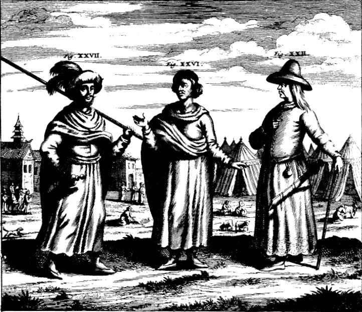

# Diabolis Similiores quam hominibus: China Illustrata & the Knowledge of Asia in Early Modern Europe

> The Account of Nepal in China Illustrata

China Illustrata of Athanasius Kircher (1667 CE) is , as its quite descriptive title shows [^1], a work in Latin describing various facets of China , describing its geography, religion, monuments and so on. It was quite popular in its day with translations into Dutch, English and French being produced within a decade of its publication.

Although the title includes only China ( and the work indeed focuses on China generally), there are also sections on other peoples of Asia and is arguably the first work in any Western language to refer to what is now Nepal in any considerable detail. The information, however, is ... well maybe not entirely accurarate, but quite interesting

> Fig, XXVI & XXVII are labelled as ‘The Dress of Kingdom of Nepal’, more or less imaginary and bearing no relation to reality.

In Chapter 4 of the Second Part, he describes various peoples and kingdoms and includes some paintings illustrating their ways and customs following the authority of the Jesuit fathers who had travelled these regions. In the road connecting Lhasa, Tiber to the plains of Hindustan lies the kingdom of Nepal, whose descriptions follow:

Covered with pagan darkness:

> Relicto regno _Lassa_ seu _Barantola_ , per altissimum montem _Langur_,quem ante descripsimus, menstruo itinere ad Regnum _Necbal_ pervenerunt ; ubi nihil ad humanae vitae sustentationem rerum necessariarum deesse repererunt, excepta fide in Christum, utpote omnibus gentilitiae coecitatis caligine involutis.

> The fathers left _Lassa_ or _Barantola_ and in a month reached the kingdom of _Necbal_. They went over the high mountain _Langur_ described earlier in the book. At this place they found nothing missing for the sustenance of life, except for faith in Christ, for all are wrapped up in pagan darkness.

They drink tea :

> Sunt huius Regni praecipuae urbes _Cuthi_ & _Nesti_[^2]. Mos huius gentis est, ut mulieribus propinantes, potum _Cha_ vel vinum alii viri aut foeminae ter eisdem infundunt, & inter bibendum tria butyri fragmenta ad amphorae limbum affigant, unde postea bibentes accepta fronti affiguntur.

> Cities of this kingdom are Cuthi and Nesti. It is the custom of this tribe when drinking to women, for other men or women to pour out a drink of tea or wine three times for the first woman. While drinking, they fix three pieces of butter to the rim of the cup. Later on they fix this butter to their foreheads.

They throw out the old and the sick :

> Est & alius in hisce regnis mos immanitate formidandus : quo egros suos iam morti vicinos, & desperata salute, extra domum in camporum plenas morticinorum fossas proiectos, ibidemque temporum iniuriis expositos, sine ulla pietate & commiseratione interire. Post mortem vero partim rapacibus volucribus, partim lupis, canibus, similibusque devorandos relinquunt; dum hoc unicum gloriosae mortis monumentum esse sibi persuadent, intra vivorum animalium ventres, sepulchrum obtinere. [^3]

> They have another custom here, fearsome in its barbarism. When sick people are near death and there is no hope for their recovery, they are thrown out of the house into the ditches of the field full of corpses. There, being exposed to all injuries of nature, these die without any acts of devotion or lamentation. After dying, these are left to be devoured by birds of prey, wolves,dogs, and other creatures. They persuade themselves that it is a uniquely glorious monument for the dead to obtain a sepulchre in the stomachs of mission work of our order and to provide living animals.

The women are especially ugly:

> Foemina horum Regnorum adeo deformes sunt, ut diabolis similiores quam hominibus videantur, numquam enim religionis causa aqua se lavant[^4], sed oleo quodam putidissimo foetorem spirent, dicto oleo ita inquinantur , ut non homines, sed lamias diceres.

> The women of these kingdoms are so ugly that they seem more like devils than humans. For religious reasons they never wash themselves with water, but only with totally rancid oil. Moreover, besides exhaling an intolerable stench, they are so stained by the oil that you would call them ghouls and not humans.

---

[^1]: CHINA MONUMENTIS , qua Sacris qua Profanis, Necnon variis, Naturae & Artis Spectaculis, Aliarumque rerum memoriabilium Argumentis ILLUSTRATA.
[^2]: Cuthi & Nesti were not (in any period, neither then nor now) major cities (_praecipuae urbes_). They are border towns that are notable mostly for the trade with Tibet.
[^3]: The sepulchral customs described by Kircher are , as far as I know, unknown in Nepal proper. Maybe it's a reference to Tibetean sky burial.
[^4]:
    Bathing , especially for religious reasons, was common.
    
    ---
    
    ### BIBLIOGRAPHY
    
    1.  CHINA MONUMENTIS , qua Sacris qua Profanis, Necnon variis, Naturae & Artis Spectaculis, Aliarumque rerum memoriabilium Argumentis ILLUSTRATA. Amsterdam: Johannes Janssonius van Waesberge, Elizaeus Weyerstraet, & Jacob van Meurs, 1667. [Internet Archive](https://archive.org/details/bub_gb_CSjQ6j3dWcsC/page/n115/mode/1up)
        
    2.  China Illustrata, translated by Charles Don Van Tuyl, Muskogee: Indian University Press, 1986. [PDF](https://htext.stanford.edu/content/kircher/china/kircher.pdf)
