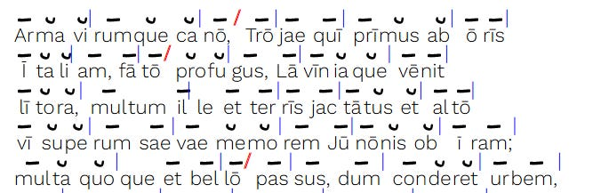
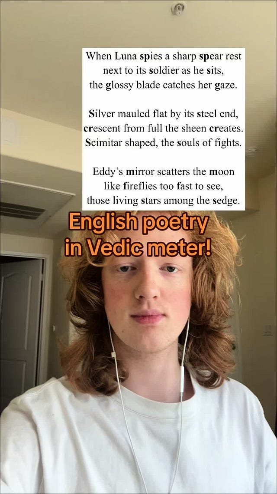

# English Poems in Sanskrit Metre

> by John Brough


")

Bust of Homer

Sanskrit uses, in the main, quantitative metres[^1] for poetry that are in principle almost identical to the one used in Greek and Latin poetry[^2]. This means that the poetic effect is based on a recurring pattern of light and heavy syllables that provides the rhythm and not primarily on, as is usual in the modern languages of Europe as well as of South Asia, rhymes. Whether these similarities are due to common Indo-European inheritance or due to some other factor is not exactly clear but the general rules are extremely similar. One thing that is dissimilar is that most of the Sanskrit metres, at least in the classical language, regulate all syllables while in Graeco-Roman poetry a spondee can be used instead of a dactyl (at least in some positions).



Scansion of the first five lines of Virgil’s Aeneid. from _hypotactic.com_

There is a long tradition of imitating Greek metres in English. As modern English doesn’t have phonemic vowel length distinction[^3], the rhythm is based on patterns of stressed and unstressed syllables. Although, dactylic hexametre, _the_ metre for epic poetry in Latin and Greek is used infrequently in in English, other metres have a been used quite frequently.

The imitation of Sanskrit metre in English is virtually nonexistent. So, it was interesting for me to see the following poem by arumnatzorkhang in Tiktok.



[@arumnatzorkhang](https://www.tiktok.com/@arumnatzorkhang)[Showing off one my poems that uses #sanskrit meter. #linguistics #language](https://www.tiktok.com/@arumnatzorkhang/video/7389798977056623918)

Tiktok failed to load.  
  
Enable 3rd party cookies or use another browser

It is, at least in my opinion, quite good. Now, the older Vedic metres are much, much looser than the classical Sanskrit metres. While there are certain restrictions in latter syllables of each foor, any stanza with 3 feets containing 8 syllables each can technically be called _gāyatrī_ (the metre used in the video), with no restriction on heavy or light syllables.

Classical Sanskrit metres are, as I said earlier, much stricter. The following is the scansion for the popular _mandākrāntā_ metre in the usual Western notation.

| – – – – | u u u u u – | – u – – u – x |

where - is a heavy syllable, u is a light syllable, x is anceps and | is a caesura.

Were such metre to be imitated in English, you’d need four stressed syllables followed by five unstressed syllables in every line. It might be technically possible[^4] but writing something in _mandākrāntā_ in English that both scans and conveys the meaning intended by the poet would be well-nigh impossible.

Not every metre contains this long series of long or short syllables and many could be imitated in English with considerable success ( in the scansion at least if not in quality). This reminded me of the only time I know that a published author has tried doing this. The following excerpt is from the introduction from John Brough’s _Poems from the Sanskrit_ (1968):

> In the majority of the classical metres, however, the quantity of every syllable (except the final anceps) is rigidly determined. Typically, the stanza consists of four lines of the same metrical shape. There are approximately fifty such metres recognized, with quarter-stanzas ranging from four to twenty-six syllables, although, in practice, verses with less than eight syllables or more than twenty-one syllables in the line are extremely rare. And among the twenty or thirty metres which one might reasonably expect to meet in a medieval anthology, there are only a dozen or so which occur with high frequency, and which were obviously the favourites of the poets.
> 
>   
> The following is an example of the _śārdūlavikrīḍita_’ metre, which is one of the most frequently employed of the longer metres:  
> |- - - u u - u - u u u - | - - u - - u x |

```
raktāśoka kṛśodari kva nu gatā tyaktvānuraktaṃ  janaṃ  
no dṛṣṭeti mudhaiva calayasi yad vātābhibhūtaṃ śiraḥ 
utkanṭhaghaṭamānaṣaṭpadaghaṭāsaṃghaṭṭaghṛṣṭacchadas 
tatpādāhatim antarena bhavataḥ puṣpodgamo’yam kutah.
```

> Paraphrased in an English approximation to the same metre:

```
Flame-flower crimson Ashóka-tree, where has she gone? 
                           Why left she this heart aflame? 
No, then! Say you, you saw her not? Ah, but you lie, 
                            Winds force your proud head to shake. 
Bee-swarms, swarming aloft, alust, cluster in clouds, 
                            Crave nectar, yet fail to swarm: 
Could such bounty of blooms abound, but for her touch, 
                             Thus rich to enflower your crown?
```

> Only on very rare occasions can we hope to be able to imitate at all closely in translation any of the Sanskrit metres. One of the very few examples in the present volume (in the dramatic excerpt from _kālidāsa’s_ _vikramorvaśīya_) is the following, in the _drutavilambita_ metre:

```
 tvayi nibaddharateḥ priyavādinaḥ 
praṇayabhaṅgaparāṅmukhacetasaḥ 
kam aparādhalavam mama paśyasi 
tyajasi mānini dāsajanaṃ yataḥ.
```

```
Ever for you is my love, ever constant, kind.
Never unfaithful: a heart ever true I gave. 
Tell me, my darling - forgiveness I pray to find- 
Where is the fault that you found in your humble slave?
```

  
While I’m far from possessing any natural talent in poetry, I’d like to translate my own little poems in Sanskrit or Latin in the same metre into English in the future. Studying previous such attempts is always helpful and I hope readers reading will be encouraged to compose metrical poetry of their own.


---

[^1]: If you are completely unfamiliar with quantitative metre, take a look at the Wikipedia [page](https://en.wikipedia.org/wiki/Metre_\(poetry\)) on metre in poetry.
[^2]: Most Latin metres employed by ancient poets are of Greek origin and are quantitative in nature. The one indigenous Latin metre of which any substantial remains are found, called Saturnian, may be either quantitative or stress-based.
[^3]: This is not entirely true but describing that would lead to a whole different tangent unsuitable for the present occasion.
[^4]: Or not, I don’t know.
