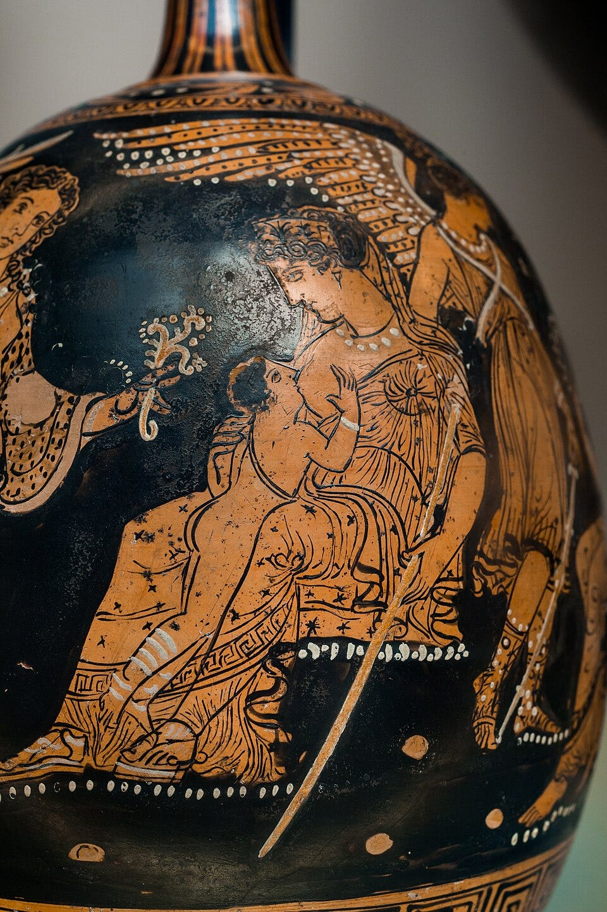

# Indra, Zeus, and the Wife Who Knew

> A scandalous myth across two worlds


Greek gods in general and Zeus in particular have something of a reputation for extra-marital relations with mortal and immortal women. With these Zeus and other major gods sire children who are heroes, in the actual Greek use of the term, and become the ancestors of major dynasties. This sort of thing is usually explained as the result of ancient ideas about gender dynamics as well as morality: like his earthly counterparts Zeus, as the king of heaven, was supposed to sexually _conquer_. Be that as it may, there were certainly critics of such unflattering portrayals of the gods in ancient times. Plato, who was to banish all poets and myth-makers from his utopian polity, is a famous example of such critic.

Out of the many dealings of Zeus with mortal women, I find one in particular quite interesting because it has a close parallel, almost a mythic calque, in a myth told about Indra. Comparative mythology is not an unpopular subject. There have even been attempts at finding the origin of all the world mythologies, to develop complicated theories about what myths actually mean (they’re always solar symbols somehow) and so on which have generally not been very successful. On a smaller, though still vast, scale, comparative mythology has been used to reconstruct the bare details of many Proto-Indo-European myths. all myths they do tell us something about the culture, though perhaps not in a simple one to one allegory or gross euhemeristic way that many people still seem to expect.

What follows is not an exercise in comparative mythology. For one, I do not believe that the myths that are to be discussed, though told by speakers of old Indo-European languages, originate from a proto-myth that is to be reconstructed. Even if I did believe that to be the case, I do not personally feel capable of reconstructing the tale myself. What follows, then, is just a brief exploration of two similar tales arising in two distinct cultural contexts and the ways they are different.

### Zeus and Alcmene

Even if you are not familiar with the myth of Zeus and Alcmene, you probably are familiar with the result. Alcmene was the mother of Hercules and this is the story about how Hercules came to be born. There are a lot of versions of this story which differ from one another. For our purpose the following extract from Hyginus’ Fabulae is optimal for its brevity:

> Amphitryon cum abesset ad expugnandam Oechaliam, Alcimena aestimans Iovem coniugem suum esse eum thalamis recepit. Qui cum in thalamos venisset et ei referret, quae in Oechalia gessisset, ea credens coniugem esse cum eo concubuit. Qui tam libens cum ea concubuit, ut unum diem usurparet, duas noctes congeminaret, ita ut Alcimena tam longam noctem ammiraretur. Postea cum nuntiaretur ei coniugem victorem adesse, minime curavit, quod iam putabat se coniugem suum vidisse.Qui cum Amphitryon in regiam intrasset et eam videret neglegentius securam, mirari coepit et queri quod se advenientem non excepisset; cui Alcimena respondit: "Iam pridem venisti et mecum concubuisti et mihi narrasti, quae in Oechalia gessisses."Quae cum signa omnia diceret, sensit Amphitryon numen aliquod fuisse pro se, ex qua die cum ea non concubuit. Quae ex Iove compressa peperit Herculem.

Or in English:

> When Amphitryon was away to conquer Oechalia, Alcmene, mistaking Zeus for her husband, received him to her bed. When Zeus went to the bed and related to her what he had accomplished at Oechalia, she really believed him to be her husband and slept with him. Zeus slept so longingly with her that when he had spent a whole day, he twinned the nights so that Alcmene wondered that the night was unusually long. After this, when it was announced to her that her husband had returned victorious, she didn’t care at all as she thought she had already seen her husband. When Amphitryon entered the palace and saw her negligent, he started to wonder and asked her why she hadn’t received him as he came. To this Alcmene replied, “You already arrived earlier and slept with me and narrated what you did at Oechalia.” When she had told all the signs, Amphitryon sensed that some divine being was there in his guise and after that day never slept with her. Alcmene, after having slept with Zeus, gave birth to Hercules.

The basic story then is that Zeus impersonates Amphitryon and tricks Amphitryon’s wife Alcmene into sleeping with him. The son born of this union is persecuted by Hera even before he is born. Hera tries many stratagems, which differ according to source, to prevent him from even being born. To cool Hera’s rage, the child is named Herakles (Ἡρακλῆς) or “Hera’s glory” which the Romans turn into Hercules.



Fig: Ancient Greek pottery depicting Hera suckling Hercules. 4th Century BC.

### Indra and Ahalyā

A similar story is told of Indra. When the sage Gautama is out meditating, Indra takes his form, goes to Ahalyā, the sage’s wife, and sleeps with her. Gautama arrives back to his own place while the Indra-as-Gautama is still there. Divining what has happened, he curses Indra some interesting curses to suffer. In some versions, where Ahalyā knows that it is not her husband but proceeds anyway, she is cursed too to be a stone for a long amount of time. There are, as usual, may versions of this myth. The following extract from the _Rāmāyaṇa_ is perhaps the earliest complete form:

> ```
>  gautamasya naraśreṣṭha pūrvam āsīn mahātmanaḥ
> āśramo divyasaṃkāśaḥ surair api supūjitaḥ 1,047.015
> sa ceha tapa ātiṣṭhad ahalyāsahitaḥ purā
> varṣapūgāny anekāni rājaputra mahāyaśaḥ 1,047.016
> tasyāntaraṃ viditvā tu sahasrākṣaḥ śacīpatiḥ
> muniveṣadharo ‘halyām idaṃ vacanam abravīt 1,047.017
> ṛtukālaṃ pratīkṣante nārthinaḥ susamāhite
> saṃgamaṃ tv aham icchāmi tvayā saha sumadhyame 1,047.018
> muniveṣaṃ sahasrākṣaṃ vijñāya raghunandana
> matiṃ cakāra durmedhā devarājakutūhalāt 1,047.019
> athābravīt suraśreṣṭhaṃ kṛtārthenāntarātmanā
> kṛtārtho ‘si suraśreṣṭha gaccha śīghram itaḥ prabho
> ātmānaṃ māṃ ca deveśa sarvadā rakṣa mānadaḥ 1,047.020
> indras tu prahasan vākyam ahalyām idam abravīt
> suśroṇi parituṣṭo ‘smi gamiṣyāmi yathāgatam 1,047.021
> evaṃ saṃgamya tu tayā niścakrāmoṭajāt tataḥ
> sa saṃbhramāt tvaran rāma śaṅkito gautamaṃ prati 1,047.022
> gautamaṃ sa dadarśātha praviśantaṃ mahāmunim
> devadānavadurdharṣaṃ tapobalasamanvitam
> tīrthodakapariklinnaṃ dīpyamānam ivānalam
> gṛhītasamidhaṃ tatra sakuśaṃ munipuṅgavam 1,047.023
> dṛṣṭvā surapatis trasto viṣaṇṇavadano ‘bhavat 1,047.024
> atha dṛṣṭvā sahasrākṣaṃ muniveṣadharaṃ muniḥ
> durvṛttaṃ vṛttasaṃpanno roṣād vacanam abravīt 1,047.025
> mama rūpaṃ samāsthāya kṛtavān asi durmate
> akartavyam idaṃ yasmād viphalas tvaṃ bhaviṣyati 1,047.026
> gautamenaivam uktasya saroṣeṇa mahātmanā
> petatur vṛṣaṇau bhūmau sahasrākṣasya tatkṣaṇāt 1,047.027
> tathā śaptvā sa vai śakraṃ bhāryām api ca śaptavān
> iha varṣasahasrāṇi bahūni tvaṃ nivatsyasi 1,047.028
> vāyubhakṣā nirāhārā tapyantī bhasmaśāyinī
> adṛśyā sarvabhūtānām āśrame ‘smin nivatsyasi 1,047.029
> yadā caitad vanaṃ ghoraṃ rāmo daśarathātmajaḥ
> āgamiṣyati durdharṣas tadā pūtā bhaviṣyasi R_1,047.030
> 
> Rāmāyaṇa 1.047.15-30
> ```

Or in English translation:[^1]

> ```
> Here great-souled Gautama had of old, a divine hermitage praised even by the gods. He, greatly famed, stayed here with Ahalyā for many years and performed austerities.
> 
> Finding out that Gautama was not there, the thousand-eyed lord of Śacī (=Indra) took on the sage’s form and spoke thus to Ahalyā:
> “Those who desire do not wait for the fertile season. I wish to unite with you.”
> 
> Recognizing the thousand-eyed one in the sage’s disguise, the foolish one made up her mind out of curiosity about the king of gods. Then she spoke inwardly satisfied: “I am satisfied. Go quickly from here. Protect yourself and me always.” Indra laughed and spoke to Ahalyā: “I am well pleased. I shall go as I came.”
> 
> Having lain with her, he departed from the hermitage, fearful and anxious about Gautama.
> 
> Then he saw the great sage Gautama entering; he who was unconquerable by gods and demons, filled with the power of austerities, wet from the waters of the sacred ford, blazing like fire, bearing fuel and kuśa grass.
> 
> Seeing him, the lord of gods became frightened and downcast. Then seeing the thousand-eyed one in the sage’s disguise, the sage, virtuous and enraged, spoke:
> 
> “You have done what ought not to be done, taking on my form. Therefore you shall be rendered fruitless.” At the words of the wrathful great-souled Gautama, the testicles of the thousand-eyed one fell to the ground instantly.
> 
> Having thus cursed Indra, he cursed his wife also: “You shall dwell here for many years, subsisting on air, without food, lying in ashes, tormented, invisible to all beings in this hermitage. When Rāma, the unconquerable son of Daśaratha, comes to this dreadful forest, then you shall be purified.”
> ```

### Similarities and Differences

The similarities between the Zeus-Alcmene and Indra-Ahalyā stories are, I think, fairly clear. In both cases, the sky-god takes the form of the husband and sleeps with the wife who, depending on the version, may or may not have some doubts about the identity of her husband. In both cases, the mortal husband finds out the whole thing.

But there are differences. These differences are as illuminating as the similarities. The Greek myth is really speaking not about either Zeus or Alcmene but about Hercules. The focus of the story is not on Zeus’ infidelity but on the reason why Hercules is just born great. Thus, it is not a solo piece either but forms just a part for the Hercules cycle. The story immediately continues after the part that we translated to Amphitryon’s reaction on finding out and then to Hera’s efforts to prevent the birth of Hercules.

The myth of Indra-Ahalyā however stands alone. Except for the frame narrative about how Ahalyā is ultimately turned back to human form again by _Rāma_, there is nothing more to the story.

The greatest difference is in the nature of Indra and Zeus. Unlike Zeus who presides over Olympian gods who are related to him, Indra doesn’t have much of a family. In early texts, his wife is named _Indrāṇī_ (just the name Indra with a feminine suffix) and features in just a handful of stories. His son appears in later texts but there are no important stories about him.

Zeus is constantly anxious that one of his sons may depose him and take his place. To prevent this from happening, he swallows Metis whole whence Athena is born directly from the head of Zeus. As a woman, Athena cannot take Zeus’ place and so the commotion settles down. In another myth, it is prophesized that the son born of sea-goddess Thetis would be greater than his father. Seeking to prevent any mishaps, Zeus gets her married to a mortal and Achilles is born. The birth of Hercules itself or of Dionysus follows similar pattern. Zeus, in short, is anxious not to let his son depose him and take his place. This was, after all, how Zeus took over from his father Cronus and Cronus from his father Uranus.

This is never the case with Indra. Various demons do, in later myths, try to contend with Indra or to take his place but their position as the king of the gods is never legitimate. This is not the case with Zeus. Were Apollo or Dionysus or some other son of his were to take its place, it would just be one more step in the father to son succession that has been carried out multiple times before.

The mundane reason for this is, in my opinion, the role of kingship in the respective societies while the great myths were being composed. Even in archaic Greece, kingship carried along with it a notion of heredity. A king is a king because his father was a king and so on. Of course, that may not always be the case on the ground but the ideal was still there. By even the archaic era, Greeks lived sedentary, agricultural lives. Zeus shows the characteristics not only of the Indo-European Sky-Father from whom he derives his name but also from the chief gods of the Near-East: the very epicenter of civilization. In Vedic India, this was not the case. Even into the early Iron Age (~1100 BC), Indo-Aryan tribes led lifestyle that alternated with the seasons: a period of settlement (_kṣema_) followed by a period of nomadic migration with their livestock (_yoga_) depending upon whether it’s summer or winter. In such society, the ‘king’ was more of a seasonal war-chief than what would be called king in a settled society. The king is just a clan-leader chosen to lead this particular season; next year another clan-leader may be chosen king or maybe the same one will. There’s no way to tell. Zeus of the settled and agricultural Hellenes is the civilized kings who rules year-round and year-over. Indra of the semi-nomadic Vedic tribes is a war chief for this raiding season. He’s the Indra until the next Indra, so to speak.

This particular myth about Indra and Ahalyā is not attested so early; only from the late centuries before the common era where not only Indo-Aryan tribes had shifted to permanent settled farming but even to urban way of life but the earlier resonances still carry on dimly. In any case, there are reasons to believe that although the myth is attested only later, it was told much earlier.

Another point of difference is the reaction of the husband. There is no indication in the Greek tale that Zeus will suffer any retribution on account of his actions. Instead, Amphitryon even tries to set Alcmene on fire in some versions of the story, with Alcmene barely surviving at the last minute due to Zeus’ intervention. Men caught committing adultery could be punished in Ancient Greece, with some laws even allowing the husband to kill the adulterer if caught red-handed. So, this is not the case of ancient and modern morals misaligning. Still, except maybe some nagging by Hera, Zeus is in no way implicated. The father of gods and men reigns supreme as he ever does.

But Indra is punished. In the version translated above, Gautama curses Indra to have his balls fall down and they do. This is both in line with what we know of ancient legal practice where castration is sometimes recommended for adulterers as well as the words of holy men, like Gautama the sage, coming true inevitably. This difference is due, I think, to the differing ordering principles. Much of Hindu myth revolves around the idea of dharma (or earlier _ṛta_). The gods are not above this ordering principle and will have to play by the rules, so to speak. Read [my piece on ṛta](https://psugam.substack.com/p/on-rta) if you want to learn more. As for Greek mythology, I don’t know what the central focus is in their many differing types of tales; or even there is any such thing. Maybe the idea of _hybris_, idk. In any case, the gods repeatedly do get away with things that is specifically forbidden for mortals. This does make for much good literature but does lend itself more to criticism.

### Sheep-balled and red-bearded

In the story of Indra and Ahalyā translated above, the curse that Indra suffers from is having his testicles fall off as a consequence of which the gods furnish him with the balls of a sheep. In other versions of the myth, Gautama curses Indra to be covered by a thousand vulva. These curses, though weird, make sense. Another one which is first encountered in the _Mahābhārata_, however, doesn’t seem to make any sense at all:

> ahalyādharṣaṇanimittaṃ hi gautamād dhariśmaśrutām indraḥ prāptaḥ
> 
> Mahābhārata XII.329.14
> 
> For forcing Ahalyā, Indra got red-beardedness from Gautama.

Being forced to have red-beard doesn’t sound much of curse to me, not for adultery at least. So, what’s going on ?

The reason is that all these curses and solutions in the story are narrativizations of epithets used for Indra in Vedic hymns. The thousand-vulva is a comic reversal of ‘_sahasramuṣka_’ (thousand-testicled. It means virile. The later part of this compound is the ultimately the origin of the English word Musk). The thousand-eyed is from ‘_sahasrākṣa_‘ (Thousand-eyed. It means all-seeing). The red-bearded is from ‘_hariśmaśru_’ (Redbearded). The usual interpretation is that when the Vedic hymns were being composed in mid to late 2nd millennium BCE, red hair and beards must have been some sort of beauty ideal so that the most prominent god is so addressed in them. In later times, these must have been uncommon and weird and must have been considered negatively to be associated with a curse. This is the common interpretation at least.

It is often said that stories that cast Indra in a negative light, like the one we are discussing, were composed later as the worship of Indra waned and that of Śiva or Viṣṇu became more common. After all, in earlier Vedic hymns Indra is celebrated in the most positive of terms. There is something to this idea but it is generally speaking not true. For our specific story, there is evidence that the story itself was known much earlier. Its absence in the hymns themselves can be explained away by the fact that no one is likely to mention negative stories while praying to that specific god. In the _subrahmaṇya-mantra_ found in various texts, we read:

> 18.  ‘Come, O Indra!’ Indra is the deity of the sacrifice: therefore he says, ‘Come, O Indra!’ ‘Come, O lord of the bay steeds! _**Ram of Medhātithi**_! Wife of Vṛṣaṇaśva! Bestriding buffalo! _**Lover of Ahalyā!**_’ Thereby he wishes him joy in those affairs of his.
>      
> 19.  ‘O Kauśika, Brahman, _**thou who callest thee Gautama**_.’
>      
>      _ŚatapathaBrāhmaṇa_ III.3.4.18-19. Translated by Julius Eggeling (1882). Emphasis mine.
>      

Something of the story must then have been known earlier.

_**namo vaḥ**_

_If you like my writing, please subscribe to receive similar posts in the future. If there are any errors on my part, I would be grateful to have them pointed out in the comments. Thank you._


---

[^1]: I have omitted the frequent vocatives from the translation.
