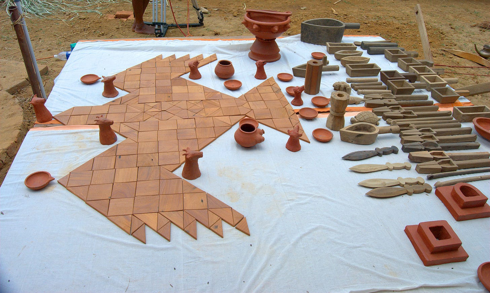
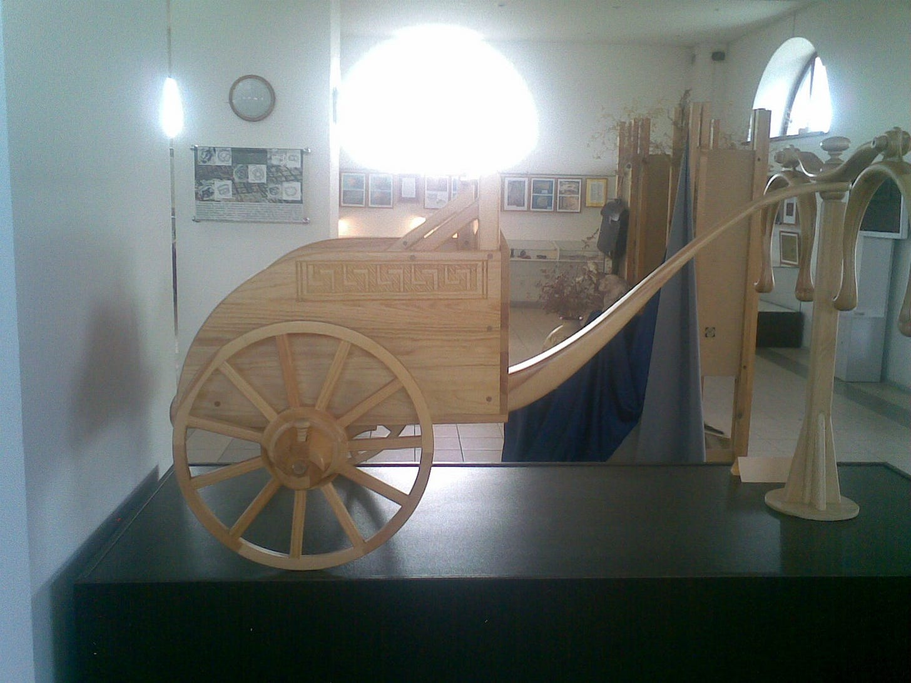
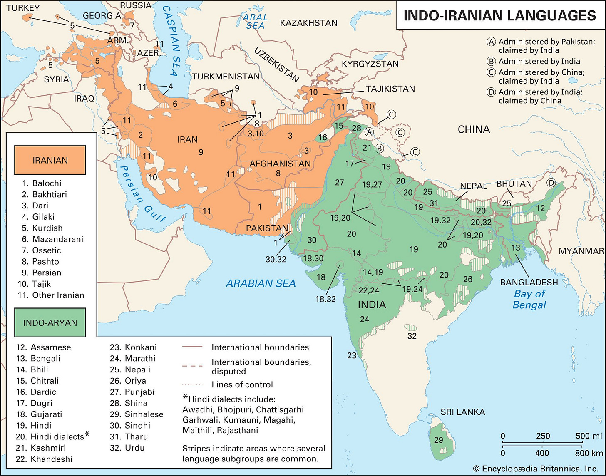
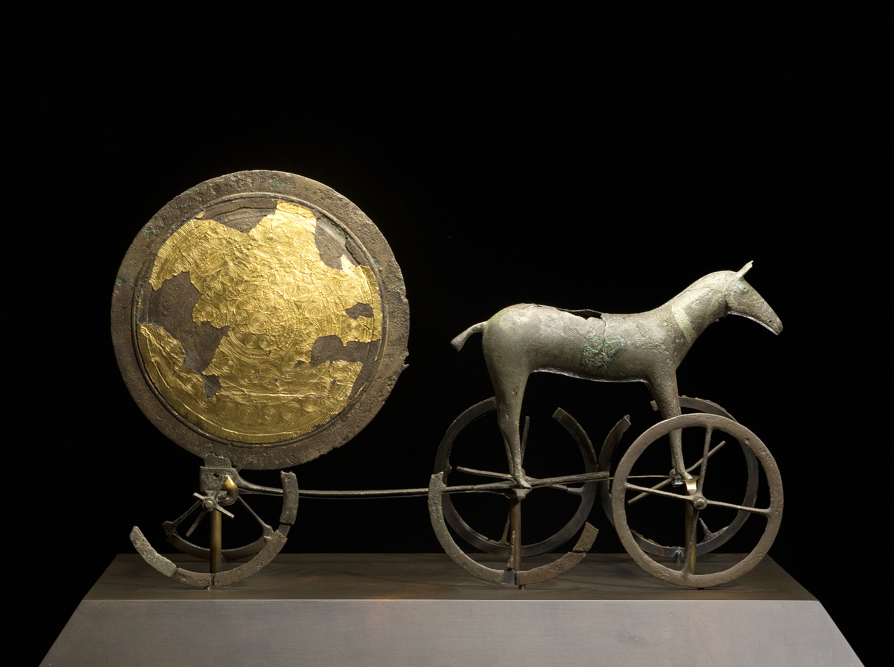

# On ṛtá

> An introduction and a poem


### INTRODUCTION

It has been known for some time that the many people-groups speaking various Indo-European languages have striking similarities and correspondences not only in the obvious field of languages but also in their practices, religious or otherwise, myths, social organization and so on. A vast body of scholarship exists on many finer points of these comparative IE mythology but the most famous are probably the works of the French scholar Dumézil .

In a series of articles and books, Georges Dumézil (1898-1986 AD), propounded something called ‘trifunctional hypothesis’. The basic idea was that many Indo-European shared in their myths, and probably in their social organization, the division into three groups or ‘functions’ that can broadly be called - priests, warriors and producers. The most striking example of these three functions that comprise the society is the three upper castes in India: _brāhmaṇa_ for the priestly function, _kṣatriya_ for the warrior function and _viś_ or _vaiśya_ for the producer function. Similar ideas were found among the ancient Iranians, Gauls, Germanic peoples, and so on.

Though profoundly influential in the subsequent IE studies, Dumézil’s theories have also been criticized by many scholars. As this is not an article on Dumézil or on IE mythology, I’ll pass upon all these criticisms here with just a single mention. One of these criticism is that many of the analogues of the three functions that he cites are not so clear cut as he proposes them to be. This is of course understandable. By the time that we get earliest texts, either literary or otherwise, from any IE speaking people, the period of IE unity in their ur-homeland would have been thousands of years in the past and thousands of kilometers away.

Among the great branches of the Indo-European language tree, the oldest representatives of the Iranian and Indic branches (Old Avestan and Vedic Sanskrit) are undoubtedly much closer to each other than any others branches to each other[^1]. This in turn is true for the religious beliefs and practices as well. Though with a subsequent reversal of roles, the names of various gods and demons are cognate. Many that are not exactly cognates have close parallels and so on.



Fig: A reconstruction of an altar for the Vedic Agnicayana ritual. The sacrificial altar is visualized as a hawk which flies away with the oblation to the gods.

Of the religious concepts that are shared between the Old Indic and Old Iranian speakers, _ṛtá_/_aṣ̌a_[^2] is the perhaps most prominent. The central importance of this concept, meaning something like ‘truth, order, right’[^3], is unparalleled in other branches of IE tree, nothing that permeates the whole worldview to the same extent. There are, however, parallels in the religions of ancient middle east - in Mesopotamia and Egypt, that have lead some scholars to propose inspiration from that direction. We’ll return to this later.

Though the etymology of any word might not always be a reliable indicator to its usage in real life, it is useful to know them - particularly for ancient languages. Both Vedic _ṛtá_ and Avestan _aṣ̌a_ are ultimately derived from Proto Indo-Iranian \*Hṛtá. More distantly, they are derived from Proto Indo-European _\*h₂r̥-tós_ from the root _\*h₂er_ meaning ‘to fit or to fix’. From the same root, the Latin word _ōrdō_ is derived, whence English _order_.



Reconstructed model of a chariot from Sintashta culture. The people of this archaeological complex are usually identified the Indo-Iranians and to be the first people to use war-chariots. The wheels seem well fitted (\*Hṛtá) indeed.

#### Darius and the ‘Lie’

Let us begin with an example. The Behistun inscription of Darius I is certainly the most famous text in Old Persian language. It tells of the rise of Darius to kingship and the various rebellions he quelled to do so. Whether something is ‘true’ or a ‘lie’ plays an important role in the text. Darius’ enemies constantly ‘lie’ all over the text of his narrative. The summary part towards the end of the inscription shows this particularly well:[^4]

> (51) King Darius says: This is what was done by me in Babylon.
> 
> (52) King Darius says: This is what I have done. By the grace of Ahuramazda have I always acted. After I became king, I fought nineteen battles in a single year and by the grace of Ahuramazda I overthrew nine kings and I made them captive.
> 
> One was named Gaumâta, the Magian; he **lied**, saying ‘I am Smerdis [Bardiya], the son of Cyrus [Kûruš].’ He made Persia to revolt.
> 
> Another was named ššina, the Elamite [Ûvjiya]; he **lied**, saying: ‘I am king the king of Elam.’ He made Elam to revolt.
> 
> Another was named Nidintu-Bêl [Naditabaira], the Babylonian [Bâbiruviya]; he **lied**, saying: ‘I am Nebuchadnezzar [Nabukudracara], the son of Nabonidus [Nabunaita].’ He made Babylon to revolt.
> 
> Another was named Martiya, the Persian; he **lied**, saying: ‘I am Ummanniš, the king of Elam.’ He made Elam to revolt.
> 
> Another was Phraortes [Fravartiš], the Mede [Mâda]; he **lied**, saying: ‘I am Khshathrita, of the dynasty of Cyaxares [Uvaxštra].’ He made Media to revolt.
> 
> Another was Tritantaechmes [Ciçataxma], the Sagartian [Asagartiya]; he **lied**, saying: ‘I am king in Sagartia, of the dynasty of Cyaxares [Uvaxštra].’ He made Sagartia to revolt.
> 
> Another was named Frâda, of Margiana; he **lied**, saying: ‘I am king of Margiana [Marguš].’ He made Margiana to revolt.
> 
> Another was Vahyazdâta, a Persian; he **lied**, saying: ‘I am Smerdis [Bardiya], the son of Cyrus [Kûruš].’ He made Persia to revolt.
> 
> Another was Arakha, an Armenian [Arminiya]; he **lied**, saying: ‘I am Nebuchadnezzar, [Nabu-kudra-asura], son of Nabonidus.’ He made Babylon to revolt.
> 
> (53) King Darius says: These nine kings did I capture in these wars.
> 
> (54) King Darius says: As to these provinces which revolted, **lies** made them revolt, so that they deceived the people. Then Ahuramazda delivered them into my hand; and I did unto them according to my will.
> 
> (55) King Darius says: You who shall be king hereafter, protect yourself vigorously from **lies**; punish the **liars** well, if thus you shall think, ‘May my country be secure!’

If you know your Herodotus, you would know that Smerdis (Gaumata), a Magi, pretends to be Smerdis the son of Cyrus to usurp the throne. The same happens here according to Darius. Along with Smerdis, however, everyone else who rebelled against him lied too. At face value, this leads one to suspect that it might actually be Darius that is lying and not the other way around. Afterall, there mustn’t be that many cases of identity theft all once.

That is, if we take it at face value. Let’s take a look at the actual Old Persian text. This is the part about Martiya at Elam:[^5]

> Martiya nâma Pârsa hauv **adurujiya** avathâ athaha adam Imaniš amiy Ûvjaiy xšâyathiya hauv Ûvjam hamiçiyam akunauš

The ‘he lied’ part is ‘**adurujiya**’ highlighted above. The nominal form of the root which forms this verb is ‘_drauga_’, cognate to Avestan ‘_druxš_’ and Sanskrit ‘_druh_’. All of these usually mean ‘lie’ or ‘untruth’. In the religious domain, however, these are usually the form the antonyms to words derived from Indo-Iranian \*_Hṛtá_.

Martiya and co are thus lying not only because they may or may not have taken of the false identities of kings of this or that land but also because in propping themselves as kings, they are going against the natural order of the universe. This natural order of the universe is, very conveniently of course, that Ahura Mazda has personally made everybody else subject to Darius himself. To go against Darius and to rebel is then not only untrue but unnatural. Looking at the narrative this way, the use of ‘lie’ does make sense and is not as ridiculous as it first seems.[^6] Encyclopedia Iranica, which is a great resource for all ancient and modern Iranic things and is maintained by experts of their field, says this on the topic:

> In Old Persian _drauga-_ and the personal forms of the verb _druj_:_durujiya-_ connote more specifically the lie about dynastic legitimacy.

The use of the related term ‘_droha_’ in modern Indo-Aryan language has similar history. It means generally not only challenge to state legitimacy but more specifically treason. There are probably near-eastern origins to this too which we shall return to later.

#### Zoroaster and the Mindful Lord

Moving on to the sacred literature of the Zoroastrians, they are full of this opposition, so much so that _drvgvant_ ( possessing _druj_, liar) and _aṣ̌avan_ (possessing truth, righteous) are often used separate those who are not the followers of Zoroaster and those who are. The binary opposition between druj and _aṣ̌a_ is also very clear from the sources. For example[^7]:

> ```
> Once those two Wills join battle, a man adopts
> life or non-life, the way of existence that will be his at the last:
> that of the wrongful the worst kind, but for the righteous one,
> best thought.
> 
> Yasna 30.4
> ```

> ```
> Minding these rules of Yours, we proclaim words unheeded
> by those who with the rules of Wrong are disrupting Right’s flock,
> but the best for those who will trust in the Mindful One.
> 
> Yasna 31.1
> ```

Greek sources on Persia, though not exactly privy to the theological niceties of Zoroastrianism, often emphasize the role of truth:[^8]

> ἐγένετο οὖν ἐκ τούτων ῥήτρα, ᾗ καὶ νῦν χρώμεθα ἔτι, ἁπλῶς διδάσκειν τοὺς παῖδας ὥσπερ τοὺς οἰκέτας πρὸς ἡμᾶς αὐτοὺς διδάσκομεν ἀληθεύειν καὶ μὴ ἐξαπατᾶν καὶ μὴ πλεονεκτεῖν: εἰ δὲ παρὰ ταῦτα ποιοῖεν, κολάζειν, ὅπως σὺν τοιούτῳ ἔθει ἐθισθέντες πρᾳότεροι πολῖται γένοιντο.
> 
> In consequence of those things, an agreement arose, the same that we still use; namely to teach this single thing to our children as we teach our slaves with respect to us - to be truthful and never to deceive or take unfair advantage and if they act to the contrary, that they would be punished so that they may turn out more benign members of the community.
> 
> Xenophon. Cyropedia. 1.6.33

And

> ἐπειδὰν δὲ ἑπτέτεις γένωνται οἱ παῖδες, ἐπὶ τοὺς ἵππους καὶ ἐπὶ τοὺς τούτων διδασκάλους φοιτῶσιν, καὶ ἐπὶ τὰς θήρας ἄρχονται ἰέναι. δὶς ἑπτὰ δὲ γενόμενον ἐτῶν τὸν παῖδα παραλαμβάνουσιν οὓς ἐκεῖνοι βασιλείους παιδαγωγοὺς ὀνομάζουσιν: εἰσὶ δὲ ἐξειλεγμένοι Περσῶν οἱ ἄριστοι δόξαντες ἐν ἡλικίᾳ τέτταρες, ὅ τε σοφώτατος καὶ ὁ δικαιότατος καὶ ὁ σωφρονέστατος καὶ ὁ ἀνδρειότατος.
> 
> ὧν ὁ μὲν μαγείαν τε διδάσκει τὴν Ζωροάστρου τοῦ Ὡρομάζου—ἔστι δὲ τοῦτο θεῶν θεραπεία— διδάσκει δὲ καὶ τὰ βασιλικά, ὁ δὲ δικαιότατος ἀληθεύειν διὰ παντὸς τοῦ βίου, ὁ δὲ σωφρονέστατος μηδ᾽ ὑπὸ μιᾶς ἄρχεσθαι τῶν ἡδονῶν, ἵνα ἐλεύθερος εἶναι ἐθίζηται καὶ ὄντως βασιλεύς, ἄρχων πρῶτον τῶν ἐν αὑτῷ ἀλλὰ μὴ δουλεύων, ὁ δὲ ἀνδρειότατος ἄφοβον καὶ ἀδεᾶ παρασκευάζων, ὡς ὅταν δείσῃ δοῦλον ὄντα…

> When the boys are seven years old, the start visiting the horse and the corresponding trainers (i.e. they learn horse-riding) and start learning to hunt wild beasts. When they are fourteen years old, those who are named ‘Royal Tutors’ take them. These are four chosen Persians of mature age: the wisest one, the most just one, the most temperate one and the most brave one.
> 
> The first of these teaches _mageia_ ( magic, or the knowledge of the Magi) of Zoroaster, son of Horamazes[^9], which consists of the worship of the gods. He also teaches the kingly arts. The most just one teaches to stay truthful throughout the life; the most temperate one teaches never to be ruled by even one of the pleasures so that he may retain mastery of himself and be king of all that is within him and no to be a slave; the most brave one prepares him for fearlessness and steadfastness, for whoever fears is a slave ….
> 
> (Pseudo- ?) Plato. Alcibiades. 1.121e-1.122a

#### Some Vedic Parallels

I think the selection of original sources is fairly representative. Here are some from the Rig-Veda just for the sake of completeness.[^10]

> ```
>  By truth— o Mitra and Varuṇa, strong through truth, touching truth—
> you have attained your lofty purpose.
> RV 1.2.8
> 
> Those who through truth increase by truth, the lords of truth, of light,
> these two, Mitra and Varuṇa, do I call.
> RV 1.23.5
> 
>  Of truth there exist many riches. The vision of truth smashes the 
> crooked,
> and the signal call of truth bored open deaf ears—(the signal call) of 
> Āyu [=Agni], awakening and blazing.
> RV 4.24
> 
> What bonds do you have for the cheat, Agni? What brilliant protectors 
> will keep winning gain (for him)?
> Which ones protect the wellspring of untruth, o Agni? What herdsmen 
> are there for false speech?
> RV 5.13
> ```

### Mitra-Varuna: Mithra-Ahura

I said earlier that many practices of Old Indic and Old Iranic speakers offer many parallel points. That is, in general, true. No one who has ever tried to gain even a passing familiarity with them can help but be struck by the apparent inversion between them. In Vedic, ‘_deva_’ is the normal word for the gods and ‘_asura_’ for the enemies of the gods i.e. anti-gods or demons. In Zoroastrianism, it is exactly the opposite- ‘_ahura_’ here signifies the main god Ahura Mazda as well as some other major gods while ‘_daeva_’ are the evil beings that a pious Zoroastrian is not only not supposed to worship but is supposed to actively denounce as a part of their creed.



Fig: Map of contemporary Indo-Iranian languages and dialects. From Encyclopedia Britannica

As ‘_deva/daeva_’ is from an securely reconstructed old Indo-European word for gods and has cognates in several languages ( cf. Latin _deus_, Old Norse _Týr_ ) while ‘_asura/ahura_’ is not entirely clear[^11]. Thus, there is a temptation to speculate that Zoroaster in his religious reforms just condemned whatever old gods that the Old Eastern Iranians worshipped, relegating them to the level of demons while upholding Ahura Mazda alone as the great god of the Iranians. At a glance, this does make sense. Among the condemned _daevas_, we find _Indra_ (Vedic _Indra_/_Indara_) , _Nā̊ŋhaiθya_ (Vedic _Nāsatya_) , and _Saurva_ (Vedic _Śarva_ = _Rudra_).

This split is often supposed, especially in non-academic discussions, to have happened due to some sort of antagonism between Indian and Iranic tribes after they had separated. This, however, doesn’t make sense. Why would any people degrade their own gods just because their rivals or enemies happened to worship them too.[^12] There are moreover other difficulties against supporting this view. Divine personalities like Miθra, Apąm Napāt, Āramaiti, etc. retain their divinity both in India and Iran.

As the point of this post is not to discuss why exactly this inversion in the divinities occur in India and Iran but to discuss the role of truth in both of them and how they relate to Near-Eastern parallels, I will pass the topic here, noticing only that Hartmut Scharfe has treated of this topic clearly in his 2016 paper.[^13]

Mitra and Varuṇa form a pair in the Vedas so consistent that more hymns are dedicated to their joint form _mitrā́váruṇā_ (nominative dual) than to either of them alone. If the name Mitra alone is declined in the dual ( _mitrā́)_ it refers to both of them jointly. It is curious then that these are the same two gods that are referred to as ‘_asura_’ far more often than anyone else. The word ‘_asura’_ clearly doesn’t have negative connotation here. It means ‘lord’ or ‘lordly’ like its Avestan counterpart and the later references to _Asuras_ as a class of demons is explained by gradual semantic change from human or divine lords (positive) to human lords (negative) to a class of anti-gods. Words like ‘tyrant’ or ‘despot’ or ‘autocrat’ in English seem like good parallels. These words almost always bear a negative association nowadays but these are titles that were used with no such baggage in the (sometimes very recent) past.[^14]

If the Vedic Mitra has the Zoroastrian Miθra as his counterpart, who would be the counterpart of Varuṇa ? A plausible etymological cognate of Varuṇa does occur in the Avesta but not as a divine name.

Looking not only at the linguistic cognates but also the religious character, scholars have often surmised that the Avestan counterpart of Varuṇa should be Ahura-Mazdā himself.

Oldenberg’s _Die Religion Des Veda_ (1894) seems to me to be the first to discuss this in detail and makes all the basic arguments that are wont to be repeated or to be strengthened by later scholars. In English:[^15]

> Just as Mitra and Varuṇa appear in constant union in the Vedas, for whose age the divine pair Mi i tra u ru w na of Boghazköy[^16] (see above, p. 24) provides extra-Indian, albeit hardly necessary, confirmation, so too do we find Mithra in the Avesta as part of a pair, in which, just as with Mitra-Varuṇa, the form of the dualistic compound characterizes the union as an essential, lasting one. It is the pair Mithra-Ahura or Ahura-Mithra, the two great, feared gods, friends of Asa (cf. p. 195). No Vedic reader can consider the Avestan passages without perceiving with immediate evidence the equivalence of this pair and the Vedic pair of Mitra-Varuṇa, the two lords of Ṛta. It is Varuṇa who, above all other Vedic deities, bears the title Asura (Iranian Ahura). Thus, the correspondence between Varuṇa and the great Ahura of the Zoroastrians (i.e., Ahura Mazda) arises. How could one expect otherwise?
> 
> While Mithra demonstrated such vitality in Iran, his ancient companion Varuna is said to have vanished without a trace there? And on the other hand, is the great Ahura Mazda of Iran supposed to be his creation from nothingness, without a foundation in the ancient faith? But where did this faith know a figure so predestined to evolve into Ahura Mazda as Varuna? The lines convincingly fit together to form a clear picture; the positive testimonies confirm what the overall situation suggests.
> 
> Indeed, the Vedas and Avesta are full of testimonies that show Varuṇa’s image in all its features similar to that of Ahura Mazda. A few hints may suffice: Both are lords and supreme representatives of the world order, of Ṛtá/Aša. Infallibly, sleeplessly, they see through everything, revealing as well as the hidden deeds of humankind. They have ordered the world, assigned all beings their place, and charted their paths. “Who is the progenitor, the father of Asa, the first? Who set the way for the sun and the stars? Who is it through whom the moon waxes and wanes?” — so asks the Zoroastrian poet, thinking of Ahura Mazda. And the Vedic poet says: “Varuṇa opened the paths for the sun. Onward rushed the sea-waters of the rivers, the mares (= waters) like an outpouring that follows Ṛtá.” “Varuṇa’s commandments are infallible. The moon walks through the night, gazing.”
> 
> pg. 184-186. 2nd edition.

The identification of Ahura-Mazdā with Asura-Varuṇa seems to be the consensus view in Academia as far as I can tell. Dumézil wrote a book literally entitled “Mitra Varuna”[^17] and integrates this connection as well as opposition within his trifunctional hypothesis. There are indeed some criticisms of this idea and counter-identifications but I am personally not convinced by them. Mary Boyce in her History of Zoroastrianism, for example, tries to equate Vedic Varuṇa to Zoroastrian Apąm Napāt and Ahura-Mazdā to an unnamed, higher Asura. This, however, seems highly unlikely to me, not the least of the reasons being that an exact cognate to Zoroastrian Apąm Napāt is Vedic Apā́ṁ Nápāt who is consistently identified with Agni[^18].

If Varuṇa or Ahura-Mazdā are guardians of ṛtá or aṣ̌a, where does the concept itself, or rather whatever their proto-form was, derive from ? Many societies, maybe even most societies both in the present and the past, valued truthfulness as a virtue. To say that such and such society values truth is not much different from saying ‘food is actually very important in my culture’ or that “_Murder_ is actually really frowned in _Japan_. It goes against the traditional concept of 生きる, which means ‘to live’ ”; just stating the obvious.

That said with ṛtá or aṣ̌a, we are not dealing with the general virtue of truth but with the specific belief on truth as the ordering principle of the universe. While other Indo-European peoples do indeed place importance on truthfulness and have words and deities to that end neither do they use a cognate term nor is the cosmic role of truth as prominent in them. Thus, we are dealing with a particular Indo-Iranian phenomenon here.



Fig: Trundholm sun chariot. This one is not related directly to any Indo-Iranian peoples but comes from Bronze Age Scandinavia. The idea of a chariot pulling the sun is quite common among the Indo-European peoples generally. Miθra becomes increasingly identified with the sun in Iran. Sun is also often called the ‘eye’ of Mitra-Varuṇa

### **Mesopotamian \*Hṛtá**

If some features present in Indo-Iranian are suspected to be innovations, the probable source of these that come to mind are either the peoples of Bactria–Margiana Archaeological Complex (BMAC) or the people of the various civilizations in the fertile crescent. Scholars have indeed tried to point out various Indo-Iranian words and practices that originated from the BMAC peoples. These include things as central as ‘seer’( Vedic _ṛ́ṣi_, Avestan _ərəšiš_), the cult of the pressed liquid[^19] (Vedic _sóma_, Avestan _haoma_) and a whole lot of agricultural terminologies. About the exact religious ideas of the BMAC inhabitants, however, we are mostly in the dark as compared to Mesopotamia and Egypt. There is only so much that even dedicated scholars can squeeze out of archaeological sources only without any written testimonies.

Looking at Mesopotamian and Egyptian sources, we do indeed find the idea of truth-order among them that could have influenced the Indo-Iranians. While the domination of the whole of the middle east from the border of Libya to the Indus valley by the Persian Achaemenids came later, there were already trade networks between Mesopotamia and Central Asia for millennia before that.

Oldenberg, whom we quoted above, did opine that the Vedic Ādityas (which include Mitra and Varuṇa ) and the Zoroastrian Aməša Spəṇta are somehow related to the Mesopotamian gods, he did not go for one to one identification. A.J Carnoy did try to link specific Ādityas and Aməša Spəṇtas with specific gods from various Mesopotamian people[^20]. Some of these, like the identification of Mitra and Varuṇa with solar and lunar deities, are more convincing than the others. An important point is that while Ādityas are always said to be seven in number there is no consensus in our sources on who exactly should be counted as the seven. Similarly, Aməša Spəṇtas are seven in number. This does make sense in terms of the importance of the number seven in Mesopotamia where it signals totality and reoccurs again and again in many different contexts. There have been many, many studies in this field since then, some likely, some, well let’s say quite imaginative. There’s one by the Assyriologist Simo Parpola trying to show that Zoroaster was likely an Iranian raised in the Assyrian court who fled eastwards later and that the form of Yasna 44 parallels Assyrian haruspicy practices.[^21] While the parallels themselves cannot be denied, cognate practices among Indic and Scandinavian sources mean that it is not a clear cut case. Similarly, the idea that the Yasna must have been in a written form early, an ‘archival copy’, as he says strikes highly unlikely to me.

The connection between Šamaš and truth or justice, however, is one that should be pursued further:

> As a matter of fact, one does not have to make this implausible leap to medieval Scandinavia to find a perfect parallel to the formula: the introductory formula of the Assyrian queries to the sun-god is, except for the inclusion of the divine name, Šamaš, _word for word identical_ with the query formula of Yasna 44 (see fig. 1). Unlike the refrains in Edda this parallel also perfectly matches the formula of Yasna 44 functionally and is found literarily “next door” to the prophet, whose Iranian home land in the early first millennium b.c.e. was for many centuries under major Assyrian cultural influence. (pg. 375-376)

Šamaš was the ( or perhaps _a_ ) Mesopotamian sun-god and was characterized as a sort of divine judge who keeps an account of right and wrong. His character, in distinction to the often fickle nature of other Mesopotamian gods, is dignified and stern, kindly to the innocent but vengeful against the sinner. As such he is often termed “God of Justice” in modern introductions to Mesopotamian religion(s) and myths. As such he is similar to Ahura-Mazdā and Mitra-Varuṇa. As an aside, I just recently finished reading Andrew George’s revised edition of the Gilgamesh poems and its striking how Šamaš ( or Utu ) _differs_ from deities like Inanna or even Gilgamesh himself. While reviling of Inanna/Ishtar in very frank ( and borderline vulgur) words by Gilgamesh and his buddy Enkidu forms a major plot point, there is nothing but respect shown to Šamaš. Gilgamesh himself prays to him multiple times and in some versions of the story, the killing of Humbaba is only possible due to the help of Šamaš.

Even a glance at his characterizations in Hammurabi’s famous Law Code makes this quite clear:[^22]

> … then Anu and Bel called by name me, Hammurabi, the exalted prince, who feared God, to bring about the rule of righteousness in the land, to destroy the wicked and the evil-doers; so that the strong should not harm the weak; so that I should rule over the black-headed people like **Shamash**, and enlighten the land, to further the well-being of mankind.
> 
> By the command of **Shamash**, the great judge of heaven and earth, let righteousness go forth in the land:
> 
> Hammurabi, the king of righteousness, on whom **Shamash** has conferred right (or law) am I.
> 
> May **Shamash**, the great Judge of heaven and earth, who supporteth all means of livelihood, Lord of life-courage …

The following is from a hymn to Utu ( the Sumerian name of Šamaš ) probably dating to early 2nd millennium BCE: [^23]

> Utu who decrees judgments for all countries, the **lord**, the son of Ningal, who renders decisions for all countries, the **lord** who is highly skilled at verdicts, the son of Enlil, highly knowledgeable and majestic Utu, the son of ...... -- Utu has placed the ...... on his head.
> 
> The **lord**, the son of Ningal, holds the 50 ...... in his hand and thunders over the mountains like a storm. He has lifted his head over the Land. My **king** Utu, you cross all the shining mountains like an eagle! He has lifted his gaze over the mountains.

The relation between Šamaš and justice is clear. Even the wording of these hymns remind one of the hymns in Zoroastrian and Vedic contexts as we will see later. If the association between Šamaš and justice were still unclear, the goddess Kittum ( Truth) was often associated with him, usually as his daughter. This is quite analogous to the emanation of the deified Aṣ̌a as Aṣ̌a Vahišta (Best Aṣ̌a) from Ahura-Mazdā.

Another point in the favour of Mesopotamian influence on the Indo-Iranian identification of some gods as special protectors of truth and justice is that they often use the word ‘lord’. In the case of Zoroastrian head god, it has stuck so strongly as to be part of his name (Ahura). In the Vedas, many gods including Indra and Agni are called 'lords’ (Asura) but none as consistently as Mitra-Varuṇa.

> ```
>  You are the king of all, Varuṇa, both gods and mortals, o lord.
> Give us a hundred autumns to gaze far. We would reach the secure
> lifetimes of former times.
> RV 2.27.10
> ```

> ```
> He who was lying down far away—now he who has two mothers roams 
> without a binding (rope), their only calf.
> These are the commandments of Mitra and Varuṇa: Great is the one and 
> only lordship of the gods.
> RV 3.55.6
> ```

> ```
> You upheld the earth and heaven, o you two kings, Mitra and Varuṇa, by 
> your great powers.
> Make the plants grow! Swell the cows! Send the rain gushing down, o 
> you of lively waters!
> ```
> 
> [^24] RV 5.63.3

> ```
> I proclaim this great cunning of the lordly, famed Varuṇa,
> who, standing in the midspace as if with a measuring rod, measured out 
> earth with the sun.
> 
> O Varuṇa, the offense that we have committed against any partner, be he 
> one by alliance or one by custom, or against a brother,
> or against a neighbor—whether native or foreign—o Varuṇa, 
> loosen that.
> RV 5.85.5 and RV 5.85.7
> ```

Šamaš ( or Utu ) is repeatedly called ‘lord’ in the prayer quoted above. This is not a quirk of this specific text. Some major gods, with Šamaš among them, are often referred to as not only ‘_ilu_’ (god) but specifically ‘_bēl_’ (lord). Šamaš, for example, is specially called ‘_bēl dīni_’ (lord of judgement). It is also a name probably known to people familiar with the Bible: the name of the Canaanite god Baʿal is cognate to the Akkadian word and means the same thing.

As for how the Mesopotamian ideas got to Indo-Iranians: I don’t know. I know more or less nothing about archaeology and whether there are actually some archaeological remains that could throw light on this topic. Even so, there obviously were vast trade routes already in the bronze age and trade or conquest could be a potential way. Iranians ultimately conquered almost the whole of the known civilized world. The presence of the Mitanni state deep in Syria should remind us that the presence of unlikely peoples in unlikely places might be rare but not impossible. Who is to say that some other such group might not have existed whose records didn’t survive these long millenia like that of the Mitanni ? Even the history of the Mitanni-s is based mostly on the records of their neighbors like the Hittites or the Egyptians as neither their state archives nor even their actual capital have been conclusively identified. David Pingree has demonstrated the strong influence on Babylonian astronomy and astrology in India in the second half of the first millennium BCE while the routes of transmissions are similarly opaque.[^25] There have been attempts to link various Indic stories to Mesopotamian ones: like the famous flood myth or the wild man type[^26]. These are indeed possible though I’m not actually convinced by the latter one.

### **Egyptian \*Hṛtá**

Here’s a quote on Ma’at which is a parallel concept in ancient Egypt:[^27]

> ```
> Maat is good and its worth is lasting.
> It has not been disturbed since the day of its creator,
> whereas he who transgresses its ordinances is punished.
> It lies as a path in front even of him who knows nothing.
> Wrongdoing has never yet brought its venture to port.
> It is true that evil may gain wealth but the strength of truth is that it lasts;
> a man can say: "It was the property of my father."
> ```

I don’t know whether any connection with the Egyptian Ma’at can be possibly constructed but it is interesting nonetheless. The Maxims of Ptahhotep from where the above quotation is taken is an interesting text in itself and deserves more to be read more.

### POEM

This is a little pastiche of a poem that I wrote quite some time ago. This article was supposed to be just a brief introduction to this poem but somehow grew longer and longer. It is mostly in classical Sanskrit but has a few Vedic peculiarities thrown in. It is, unlike the cryptic and mysterious style of the Vedic seers, quite clear and straightforward. In this respect it, as also in the refrain used, it mimics some late Vedic verses grouped in Book X of the Ṛgveda whose borrowings are explained in the notes.

As for why a poem at all; well I’m not a crazy dictator to force my shitty poetry to innocent citizens’ throats. So, you gotta do what you gotta do.

#### Sanskrit Text

```
ṛtena balino devā ṛtena balino vayam
druhaṃ vi vṛha devā’smad ṛtaṃ no hṛdam ā viśāt ॥01॥

ṛteno’ttabhitā bhūmir ṛteno’ttabhitā diauḥ
ṛtaṃ devānāṃ devatvam ṛtaṃ no hṛdam ā viśāt ॥02॥

ṛtam evā hataṃ hanti rakṣati rakṣata ṛtam
ṛteno’deti sūryo’han ṛtaṃ no hṛdam ā viśāt ॥03॥

ṛta indra ṛte mitro yuṅktād ṛte nŏ aryamā
ṛte pathi carantaṃ saṃ mā dhrug vikṣad manāṃsi naḥ  ॥04॥
```

#### Translation

```
By ṛta are the gods strong, by ṛta are we strong.
Expel falsehood from us, o god, may ṛta enter our minds. 1

By ṛta is the world sustained, by ṛta the heaven.
ṛta is the divinity of gods. May ṛta enter our minds. 2

Harmed ṛta harms. Protected ṛta protects.
By ṛta does the sun rise everyday. May ṛta enter our minds. 3

May Indra, may Mitra join in ṛta, may Aryaman do so.
Let not falsehood enter my mind, who is treading on the right path. 4
```

### NOTES AND COMMENTS

#### **Verse 1** :

*   “_By ṛta are the gods strong, by ṛta are we strong._” This is a reworking of the second verse of the Rigvedic marriage hymn X.85.2:
    
    > ```
    > By Soma the Ādityas are strong; by truth is the earth great.
    > And in the lap of these heavenly bodies Soma is set.
    > ```
    
*   The translation by Jamison and Brereton of RV X.85.2 is in part incorrect. There is no ‘truth’ in this verse in the original. It should be ‘by Soma is the earth great’.
    
*   _vi vṛha_ “Cast off” or “expel”. When used with the prefix vi, the root √vr̥h- has the sense of violently rolling out. It is consequently used for a sort of exorcistic expelling as in RV X.163 (and is used with such intention here):
    
    > ```
    > “From your eyes, your nostrils, your ears, your chin,
    > I tear the disease of the head out of you—from your brain, your 
    > tongue."
    > ```
    
*   “_May ṛtá enter our minds_”. The last foot of the first three verses is a refrain. Although the word for mind is not the normal “_manas_” but “_hṛd_” ( heart; cf. Greek _κᾰρδῐ́ᾱ_, Latin _cor,_ English _heart_), the connection between ṛtá and mind echoes the Zoroastrian connection between _aṣ̌a_ and _Vohu Manah_.
    

#### **Verse 2**

*   “_By ṛtá is the word sustained, by ṛtá the heaven._” This is a reworking of the first verse of the Rigvedic marriage hymn X.85.1:
    

> ```
> By reality is the earth propped up; by the sun is heaven propped up.
> By truth do the Ādityas stand, and Soma is fixed in heaven.
> ```

*   ṛtá is translated as ‘reality’ by Jamison and Brereton which does make the translation sound strange.
    
*   The word for heaven used here is “_dyauḥ_” (sky) which forms the first element of the sky-father’s name. As is the case in many Vedic case, it is to be read as disyllabic “_daub”_ to fit the metre here.
    
*   “_ṛtá is the divinity of gods_”. That truth is the very essence of the gods and falsehood of mortals ( or demons ) is a recurring theme in the Brāhmaṇa-s.
    
    > **Aitareya-brāhmaṇa 1.6.7**
    > 
    > “_atho khalu āhuḥ kaḥ arhati manuṣyaḥ sarvam satyam vaditum satyasaṃhitāḥ vai devāḥ anṛtasaṃhitāḥ manuṣyāḥ iti_”.
    > 
    > “Thus do they say ‘which man can ever speak the whole truth ? Gods are indeed composed of truth and men of falsehood.’”
    
    > **Śatapathabrāhmaṇa 9.5.1.12-16**
    > 
    > _“devāś cāsurāś cobhaye prājāpatyāḥ prajāpateḥ pitur dāyam upeyur vācam eva satyānṛte satyaṃ caivānṛtaṃ ca ta ubhaya eva satyam avadann ubhaye’nṛtaṃ te ha sadṛśaṃ vadantaḥ sadṛśā evāsuḥ |_
    > 
    > _te devā utsṛjyānṛtam satyam anvālebhire’surā u hotsṛjya satyam anṛtam anvālebhire |_
    > 
    > _te devāḥ sarvaṃ satyam avadant sarvam asurā anṛtaṃ |”_
    > 
    > “The gods and the demons, both the children of Prajāpati got their inheritance from their father Prajāpati, namely speech, both true and false. They both spoke the truth and both spoke the falsehood and were thus similar.”
    > 
    > “The gods relinquished the falsehood and held on to the truth. The demons relinquished the truth and held on to the falsehood.”
    > 
    > “The gods spoke only truth and the demons only falsehood.”
    

#### **Verse 3**

*   “_Harmed ṛtá harms. Protected ṛtá protects._” This is a reworking of a famous verse from the Laws of Manu that says “Harmed Dharma harms. Protected Dharma protects”. It is 8.15 in the new critical edition of Manu produced by Patrick Olivelle.
    
*   “_ṛteno’deti sūryo’han_”: The use of ‘_ahan_’ in locative is Vedic and doesn’t survive in the classical language where it should be ‘_ahani_’.
    

#### Verse 4

*   “_May Indra, may Mitra join us in ṛtá, may Aryaman do so._” Or more literally ‘yoke us to ṛtá’. The root √yuj- both means ‘to yoke’ and is cognate to that English verb. This line is based on the famous mantra that is often placed at the beginning of Upaniṣad-s. RV 1.90.9
    
    > ```
    > Luck for us Mitra, luck Varuṇa; luck be Aryaman for us—
    > Luck for us Indra and Br̥haspati; luck for us Viṣṇu of the wide strides.
    > ```
    
*   “Let not falsehood enter me”. Falsehood translates '“_dhruk_” here which is etymologically cognate to Avestan “_druj_” as we discussed earlier.
    

### FOOTNOTES


---

[^1]: Unless, that is, you count the various branches of Italic languages or various Greek dialects separately, which I do not.
[^2]: There is some debate on the specific phonetic value of ‘_ṣ̌’_ that won’t be discussed here. The Old Persian cognate is _arta_ that occurs so frequently in the names of Achaemenid nobles (Artaphernes, Artaxerxes, Artabanos, etc.) that are included in Greek and Roman sources.
[^3]: About the specific connotations, see below.
[^4]: The English translation is from a public domain source from the early 20th century available in [Wikisource](https://en.wikisource.org/wiki/The_Sculptures_and_Inscription_of_Darius_the_Great_on_the_Rock_of_Behist%C3%BBn_in_Persia/Annotated/The_Persian_Text). There have been improvements in the text since, along with parallel passages in other languages like Elamite but that need not detain us here.
[^5]: The Old Persian text is from a 19th century source and is thus not in modern orthography but Old Persian texts are hard to access and I’m lazy.
[^6]: There is, of course, the matter of religious themes in political discourse by the powerful in any society. As the topic here is the use of certain words and their semantics and not the role of religion in political legitimacy or imperialism, whether or not Darius believed these things himself is immaterial.
[^7]: The English translation of Zoroaster’s hymns i.e Gathas, are from M.L. West’s translation. West, M. L. _The Hymns of Zoroaster: A New Translation of the Most Ancient Sacred Texts of Iran_. Bloomsbury, 2010.
[^8]: The Greek translations are my own and are consequently quite rough.
[^9]: Zoroaster is not usually considered a literal son of Ahura Mazda in the Persian tradition as we know them.
[^10]: All the translations from the Ṛgveda are from Jamison and Brereton’s 2014 English translation. Jamison, Stephanie W., and Joel P. Brereton. _The Rigveda: The Earliest Religious Poetry of India_. Oxford University Press, 2014.
[^11]: Old Norse áss/æsir is probably cognate.
[^12]: The identification of the god of the Jews with Set by the Egyptians could possibly be adduced as a parallel but I don’t think it is particularly conclusive.
[^13]: Scharfe, Hartmut. “Ṛgveda, Avesta, and Beyond—_ex occidente lux?_” _Journal of the American Oriental Society_ 136, no. 1 (2016): 47–67.
[^14]: δεσπότης ( despótēs) was a widely used title in the medieval Roman empire. Russian Tsars used Autocrat in their title upto the very end in the early 20th century. τύραννος ( túrannos) similarly means ‘ruler’. cf. Sophocles’ Οἰδίπους Τύραννος which is often referred to by its Latin title “Oedipus Rex”.
[^15]: Oldenberg’s work hasn’t been translated to English as far as I know and my knowledge of German is elementary. The translation given here is largely the work of Google Translate. There might be a few grammatical mistakes there but the idea is clear enough.
[^16]: This refers to the naming of Indic Gods in the treaty between Hittite King Suppiluliuma I and the Mittani King Shattiwaza (=Vedic Sātivāja).
[^17]: Dumézil, Georges. _Mitra-Varuna: An Essay on Two Indo-European Representations of Sovereignty_, 2nd ed. Zone Books, 1988.
[^18]: Boyce, Mary. _A History of Zoroastrianism: Volume 1, The Early Period_.E. J. Brill, 1975 (3rd impression with corrections, 1996), 32‑52. Of course, Boyce is aware of this but her reconstruction of _\*Asura Medhā_ is unconvincing.
[^19]: The word itself descends from Proto-Indo-European but the cultic practices likely do not.
[^20]: Carnoy, Albert J. “The Moral Deities of Iran and India and Their Origins.” _The American Journal of Theology_ 21, no. 1 (January 1917): 58–78.
[^21]: Simo Parpola, “The Originality of the Teachings of Zarathustra in the Light of Yasna 44,” in _Sefer Moshe: The Moshe Weinfeld Jubilee Volume_, ed. Chaim Cohen, Avi M. Hurvitz, and Shalom M. Paul (Winona Lake, IN: Eisenbrauns, 2004), 373–383.
[^22]: The translation of the Code of Hammurabi is by L.W. King.
[^23]: Utu B. The translation is from The Electronic Text Corpus of Sumerian Literature. See [here](https://etcsl.orinst.ox.ac.uk/section4/tr4322.htm).
[^24]: There is an ‘asura’ here in the second line in the original.
[^25]: Pingree, David E. _A History of Indian Literature_. Vol. VI: _Scientific and Technical Literature, Part 3, Fasc. 4: Jyotiḥśāstra: Astral and Mathematical Literature_. Wiesbaden: Otto Harrassowitz, 1981. Chapter 2, “Astronomy,” 8–55.
[^26]: The story of ṛṣyaśṛṅga was connected in a paper I had read to Humbaba from the Gilgamesh cycle but I can’t exactly remember or find the author or any reference now.
[^27]: It is from the maxim of The Maxims of Ptahhotep.
