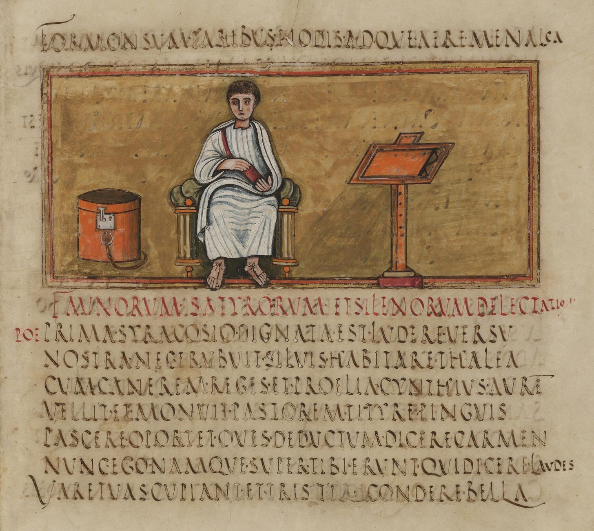

# Romans and Greeks thought there were more than two genders

> Maybe three. Or four. Actually five.


_The following post is about grammatical gender in Greek and Latin and how the ancients thought of it. I have neither the knowledge nor the inclination to deal with the culture war issues and the following post is entirely unconnected to that topic except insofar as it may relate tangentially to grammatical gender in modern languages derived from Latin like Spanish or French._

If you were to pick up any Latin or Greek textbook today, you’ll almost certainly be taught that there are three grammatical genders and that these may not always correspond to biological gender of the things that they refer to. The Greek word for child _παιδίον_ and the Latin word for prostitute (_scortum_) both are in neuter.

Wheelock’s Latin has the following introduction:

> Like English, Latin distinguishes three genders: masculine, feminine, and neuter. While Latin nouns indicating male beings are naturally masculine and those indicating female beings are feminine. the gender of most other nouns was a grammatical concept. not a natural one. and so a noun’s gender must simply be memorized as part of the vocabulary entry.
> 
> The normal role of adjectives is to accompany nouns and to modify, or limit. them in size, color, texture. character, and so on; and, like nouns. adjectives are declined. Naturally, therefore, an adjective agrees with its noun in gender, number, and case (an adjective that modifies more than one noun usually agrees in gender with the nearest one. though sometimes the masculine predominates).
> 
> Wheelock’s Latin, 6th Edition, pg. 12

The Student’s Manual to Ørberg’s Lingua Latina has the following to say:

> Note that the names of these people end in either -us or -a, none of them end in-um. You will see that the ending -us is characteristic of male persons (Iūlius, Marcus, Quintus, Dāvus, Mēdus) and -a of female persons (Aemilia, Iūlia, Syra, Dēlia). This also applies to nouns that denote persons. Nouns referring to males generally end in us: filius, dominus, servus (but -us is dropped in some nouns in -r, e.g. vir, puer), while nouns denoting females end mostly in -a (femina, puella, filia, domina, ancilla); but no persons are denoted by words ending in -um. We say therefore that nouns ending in -um, e.g. oppidum, vocabulum, imperium, are neuter (Latin neutrum, ‘neither’, i.e. neither masculine nor feminine), while most words in us are masculine (Latin masculine), and most words in -a are feminine (Latin fémininum, from femina). But as grammatical terms ‘masculine’ and ‘feminine’ are not restricted to living beings: the words fluvius, numerus, titulus, liber are grammatically masculine, while însula, littera, provincia, familia are feminine. The grammatical term, therefore, is not ‘sex’, but gender (Latin genus). The abbreviations used for the three genders are m, f and n.
> 
> Latine Disco. pg. 12

Examples like these could be easily multiplied in the introductory textbooks. I include these not because they are somehow wrong ( they aren’t) but because it is an influential way of looking at grammatical genders and are culled from popular textbooks aimed towards beginners. Of course, other languages may have all sort of exotic animate-inanimate or countable-uncountable distinctions but Latin and Greek themselves are supposed to have only three genders - what else can there be ?


Fig: An (imaginary) image of Quintilian

I thought so as well. I was, therefore, a bit surprised when I first read this in a grammatical work by an ancient Roman author: [^1]

> _**genera nominum quot sunt?**_ quattuor.
> 
> _**quae?**_ masculinum, ut _hic magister_, femininum, ut _haec Musa_, neutrum, ut _hoc scamnum_, commune, ut _hic_ et _haec sacerdos_. est praeterea trium generum, quod omne dicitur, ut _hic_ et _haec_ et _hoc felix_; est epicoenon, id est promiscuum, ut _passer aquila_.
> 
> (Donatus. Ars Minor.)

or in English:

> ```
> How many genders do nouns have ?
> - Four
> 
> What are they ?
> - Masculine, like hic magister (this teacher);
> - Feminine, like haec Musa ( this Muse);
> - Neuter, like hoc scamnum ( this bench);
> - besides these there is one of three genders called common, like hic/haec/hoc felix (this fortunate one);
> - and epicoenon or mixed, like passer (sparrow) and aquila (eagle).
> ```

Here, the late ancient grammarian Donatus, whose works were wildly popular during the middle ages, makes a distinction not only between masculine, feminine, and neuter but also a common and a mixed gender. Each word in the example uses a demonstrative pronoun to show the gender of the word: _hic_ for masculine, _haec_ for feminine and _hoc_ for neuter. Before we proceed to other grammarians, let us first be clear what the the common and mixed genders actually mean.

Those nominal words are said to belong to common gender if it exhibits the same form in masculine, feminine and neuter forms. Let us take an example; if you look the entry of an adjective in a Latin dictionary, it would usually be included in the form of _bonus, -a, -um_. That is to say, the word for ‘good’ is _bonus_ in masculine, _bona_ in feminine and _bonum_ in neuter. But there are other words that do not adhere to this pattern and remain the same for masculine, feminine and neutral. The masculine, feminine and neuter forms for the Latin word for ‘lucky’ are all the same: _felix_. Donatus in the above quotation indicates this by using the different demonstrative pronouns for the same word: _hic_ (M) _et_ _haec_ (F) _et_ _hoc_ (N) _felix_.

Unlike the common gender, the mixed or epicoenen has a single gender but can refer to beings that may be biologically male or female. For example: a male lion is _leo_ which is masculine and a female lion is _lea_ or _leaena_. But an _aquilla_ ( eagle) may refer to either male or female eagle. Thus, even if _aquilla_ seems to be transparently feminine in gender, it is classified here as mixed.

It would, of course, be easy to dismiss this classification as overly pedantic hairsplitting by grammarians who had nothing better to do - _How many angels can dance on the head of a pin?_ and all that. Is it not clear to us that the so called common and mixed genders are simply words relating to beings that do not correspond to their biological gender ? We could just remind ourselves that grammatical gender may but need not necessarily correspond to biological gender, that they are not the same thing and move on.



Fig: A folio from the manuscript Vergil Romanus.

We could do that but doing so would not only be imposing our on perspective over how native speakers thought of their own languages but also rob us of seeing familiar things from a different lens. Past is a foreign country and if we are to be familiar with its customs, we must be cognizant of what its citizens think.

If you read the Donatus’ passage carefully, you’d have noticed an interesting point. He says that there are four genders and then proceeds to list five in the following passage. Is this an error on his part ? We’ll discuss some other grammatical sources before coming back to this.

Priscian’s _Institutiones Grammaticae_, more advanced and thus not as well suited to classroom as Donatus’ work, was, more or less, _the_ Latin grammar for much of the middle ages. He deals with gender of words in the beginning of the fifth book :

> genera igitur nominum principalia sunt duo, quae sola nouit ratio naturae, masculinum et femininum. genera enim dicuntur a generando proprie quae generare possunt, quae sunt masculinum et femininum. nam commune et neutrum uocis magis qualitate quam natura dinoscuntur, quae sunt sibi contraria. nam commune modo masculini modo feminini significationem possidet, neutrum uero, quantum ad ipsius uocis qualitatem, nec masculinum nec femininum est. unde commune articulum siue articulare pronomen tam masculini quam femini generis assumit, ut hic sacerdos et haec sacerdos, neutrum autem separatum ab utroque genere articulum asciscit, ut hoc regnum.
> 
> epicoena, id est promiscua, uel masculina sunt uel feminina, quae una uoce et uno articulo utriusque naturae animalia solent significare. dubia autem sunt genera, quae nulla ratione cogente auctoritas ueterum diuerso genere protulit, ut hic finis et haec finis, cortex, silex, margo. similiter grus, bubo, damma, panthera in utroque genere promiscue sunt prolata. sunt alia communia non solum masculini et feminini, sed etiam neutri, et sunt adiectiua, ut hic et haec et hoc felix, sapiens.
> 
> sunt quaedam tam natura quam uoce mobilia, ut natus nata, filius filia; sunt alia natura et significatione mobilia. non etiam uoce, ut pater mater, frater soror, patruus amita, auunculus matertera; sunt alia uoce, non etiam naturae significatione mobilia, ut lucifer lucifera, frugifer frugifera: siue enim de sole siue de luna siue de agro siue de terra loquar, nulla est discretio generis naturalis in rebus ipsis, sed in uoce sola; sunt alia quasi mobilia, cum a se, non a masculinis feminina nascuntur, ut Helenus Helena, Danaus Danaa, liber libra, fiber fibra. unumquodque enim eorum propriam et amotam a significatione masculini habet demonstrationem et positionem; sunt alia, quae differentiae significationis causa mutant genera, ut haec pirus hoc pirum, haec malus hoc malum, haec arbutus hoc arbutum, haec myrtus hoc myrtum, haec prunus hoc prunum. et hoc in plerisque inuenis arborum nominibus, in quibus ipsae arbores feminino genere, fructus neutro proferuntur uel ligna, ut haec buxus arbos, hoc buxum lignum.

In English:

> There are two main genders of nouns that the laws of nature know: masculine and feminine. Gender is so called from begetting (_generare_) and can be properly said of those that can beget i.e. masculine and feminine. For the (genders called) common and neuter are known more from the features of sound rather than their nature which are the opposite of one another. For the common gender sometimes signifies the masculine and sometimes the feminine; neuter, however, as far as the quality of the word itself is concerned signifies neither masculine nor feminine. Thus, the common gender takes the article or articular pronoun of both the feminine and the masculine gender, for example, _hic sacerdos_ (this priest, M) and _haec sacerdos_ ( this priest, F). Neuter however takes a separate article from both of these, for example _hoc regnum_ (this kingdom, N)
> 
> Epicenes, i.e. promiscuous nouns, are either masculine or feminine, which are accustomed to signify animals of both natures with a single word and a single article. There are also nouns of dubious gender which are used without any specific reason just because the ancients used them as such without distinction: _hic finis_ (end, M) and _haec finis_ (end, F), _cortex_ (bark), _silex_ (flint), _margo_ (border). Similarly, _grus_ (crane), _bubo_ (owl), _damma_ (deer), _panthera_ (panther) are used in both masculine and feminine without distinction. There are other of gender common not only to the masculine and the feminine but to neuter as well and these are adjectives, for example _hic/haec/hoc felix_ (fortunate, M/F/N) and _sapiens_ (wise , M/F/N).
> 
> There are others which are changeable both by nature and by sound for example: _filius_ (son) and _filia_ (daughter)[^2]. There are others which are changeable by nature and signification but not by sound for example: _pater_ (father) and _mater_ (mother), _frater_ (brother) and _soror_ (sister), _patruus_ (paternal uncle) and _amita_ (paternal aunt). There are others which are changeable by sound but not by nature, for example _lucifer_ (lightbearer, M) and _lucifera_ (lightbearer, F), _frugifer_ (fruitbearer=Tree, M) and _frugifera_ (fruitbearer, F), for when we talk of the sun or the moon or field or land, there is no natural distinction of gender in the things themselves but only in the sound of the words.
> 
> There are others which are quasi-changeable when feminine words are derived from themselves and not from masculine ones, such as _Helenus_ (M) and _Helena_ (F), _Danaus_ (M) and _Danaa_ (F) , _liber_ (book, M) and _libra_ (scales, F), and _fiber_ (beaver, M) and _fibra_ (fiber, F). For each of these has its own distinct demonstration and position, removed from the masculine meaning.
> 
> There are still others which change gender for demonstrating a distinction in meaning, for example; _haec_ _pirus_ (pear tree, F) and _hoc_ _pirum_ (pear, N) , _haec_ _malus_ (apple tree, F) and _hoc malum_ (apple, N), _haec arbutus_ (strawberry tree, F) and _hoc_ _arbutum_ (strawberry, N) , _haec myrtus_ (myrtle tree, F) and _hoc myrtum_ (myrtle, N), _haec prunus_ (plum tree, F) and _hoc prunum_ (plum, N). You will find this mostly in the case of trees where the trees themselves are referred to in the feminine and their fruit or wood in the neuter gender, for example _haec buxus_ (boxwood, F) tree, _hoc buxum_ (boxwood, N) wood.

Priscian’s discussions are more in depth than Donatus’ but the idea of many grammatical gender is in itself not a late antique elaboration either. Quintilian’s _Institutio Oratoria_ contains a short discussion of the topic and Varro already knew about it in the late Republic. Quintilian’s discussion moreover shows that this is a base level topic that good teachers and supposed to go over and beyond:

> atqui si quis et didicerit satis et (quod non minus deesse interim solet) voluerit docere quae didicit, non erit contentus tradere in nominibus tria genera et quae sunt duobus omnibusve communia. nec statim diligentem putabo, qui promiscua, quae ἐπίκοινα dicuntur, ostenderit, in quibus sexus uterque per alterum apparet; aut quae feminina positione mares aut neutrali feminas significant, qualia sunt Murena et Glycerium.
> 
> Insitutio Oratoria I.4.23-24

In English:

> And whoever (=teacher of rhetoric) has learned enough and (these things are quite rare nowadays) wishes to teach what he has learnt shouldn’t be satisfied just to teach the three genders of nouns and which are common to two or all three genders. Nor will I think him especially diligent who shows (to his students) the promiscuous and ἐπίκοινα gender in which either both the sexes are referred to by one or the other, or in which males are referred to by feminine nouns or females by neuter ones; e.g. _Murena_ and _Glycerium_.

I didn’t knew about these examples. Glycerium, it turns out, is the name of a female character in Terence’s Andria. The name seems obviously to be in neuter gender but agrees with the feminine. “_Glycerium mea suos parentis repperit_”.

Moreover, as the word ‘_epicoenon_’, which is borrowed from Greek _ἐπίκοινος_ (common to all), shows, Roman authors built upon the works of their Greek predecessors and contemporaries in this topic as in many others. Although the recognition of grammatical gender itself was early in Greek history[^3] , the only discussion including the common gender I can find that could have served as the predecessor to the Latin grammarians is the following one by the grammarian Dionysius Thrax (2nd century BCE) :

> Γένη μὲν οὖν εἰσι τρία· ἀρσενικόν, θηλυκόν, οὐδέτερον. ἔνιοι δὲ προστιθέασι τούτοις ἄλλα δύο, κοινόν τε καὶ ἐπίκοινον, κοινὸν μὲν οἷον ἵππος κύων, ἐπίκοινον δὲ οἷον χελιδών ἀετός.

> There are three genders: masculine, feminine and neuter. Some people also add two more to these, common and epicoenon. Common, for example, includes ἵππος (horse), κύων (dog) and epicoenon includes χελιδών (swallow) and ἀετός (eagle).

Heliodorus’ commentary on this passage reads:

> Γένη μὲν οὖν εἰσι τρία. Γένος ἐστὶ χαρακτὴρ λέξεων σημαίνων τὸ ἐν φωνῇ ἄρσεν ἢ θῆλυ ἢ οὐδέτερον. Καὶ ἄρσενικόν μὲν ἐστιν οὗ προτάσσεται κατ’ εὐθεῖαν καὶ ἐνικήν πτῶσιν ἄρθρον τὸ ὁ, θηλυκὸν δὲ οὗ προτάσσεται κατ’ εὐθεῖαν καὶ ἐνικήν πτῶσιν ἄρθρον τὸ ἡ, οὐδέτερον δὲ οὗ προτάσσεται κατ’ εὐθεῖαν καὶ ἐνικήν πτῶσιν ἄρθρον τὸ τό.
> 
> Ἔγκειται δὲ τῷ ὅρῳ τὸ «ἐν φωνῇ», ἐπεὶ οἱ φιλόσοφοι ἀπὸ τῆς σημασίας νοοῦσι τὰ γένη· ἄρρεν μὲν γὰρ καλοῦσι τὸ σπέρματος ἀποβλητικόν,θηλυκὸν δὲ τὸ σπέρματος δεκτικόν, οὐδέτερον δὲ τὸ μηδενὸς τούτων μετέχον· οἱ δὲ γραμματικοὶ ἀπὸ τῶν ἄρθρων.
> 
> Τινὲς δὲ δύο μόνα γένη λέγουσι· τῶν γὰρ ὄντων τὰ μὲν ἄρρενά ἐστι, τὰ δὲ θήλεα· τὸ δὲ ἐξ ἀναιρέσεως τῶν δύο οὐδέτερον. Ζητητέον δέ, εἰ ἀπὸ τοῦ σημαινομένου δεῖ τῶν γενῶν στοχάζεσθαι ἢ ἀπὸ τῶν τύπων <ἢ ἀπὸ τῶν ἄρθρων>· εἰ μὲν γὰρ ἀπὸ τῶν σημαινομένων, πῶς τὸ ἡ πόλις θηλυκόν φαμεν; εἰ δὲ ἀπὸ τῶν ἄρθρων, παντὶ ὀνόματι ὃ βούλομαι ἄρθρον προστιθεὶς ποιῶ οἷον βούλομαι γένος, ὡς λέγομεν ὁ ἔλαφος καὶ ἡ ἔλαφος. Φαμὲν ὅτι ποτὲ μὲν ἀπὸ τῶν σημαινομένων, ποτὲ δὲ ἀπὸ τῶν τύπων καὶ τῆς τῶν ἄρθρων εὐφωνίας· οὐ γὰρ ὃν τρόπον προστεθὲν τὸ ὁ τῷ πόλις [ποιεῖ ὁ πόλις] ἀφωνίαν ἀπεργάζεται, τοῦτον τὸν τρόπον καὶ ἐν τῷ ὁ ἵππος καὶ ἡ ἵππος· διὰ τοῦτο γὰρ καὶ τὸ ἵππος νοοῦμεν ὡς ἀρσενικὸν <καὶ ὡς θηλυκόν, καὶ οὐχὶ μόνως ἀρσενικὸν> ἢ μόνως θηλυκὸν εἶναι ἔδοξε· τὸ μὲν γὰρ σημαινόμενον δίδωσι τὴν ἑκατέρου ἔννοιαν, δεῖ γὰρ εἶναι καὶ θήλειαν ἵππον καὶ ἄρρενα· τὸ δὲ ἄρθρον ἑκάτερον προσκείμενον εὔφωνον ἔχει τὸν τύπον.
> 
> Τινὲς δὲ προστιθέασι τούτοις ἄλλα δύο, κοινόν τε καὶ ἐπίκοινον.\] Κοινόν ἐστιν ὃ τὰς μὲν πτώσεις ἔχει τὰς αὐτάς, ὑποτάσσεται δὲ ἰδίοις ἄρθροις, οἷον ὁ ἵππος καὶ ἡ ἵππος· καὶ ἐν πάσαις ταῖς πτώσεσιν ὁμοφωνοῦσιν ἐναλλασσομένων τῶν ἄρθρων, ὡς πατρῴαν οὐσίαν κοινὴν ἀδελφῶν φαμεν. Ἐπίκοινον δὲ ὃ διὰ μιᾶς λέξεως τό τε ἀρσενικὸν καὶ τὸ θηλυκὸν σημαίνει, τῷ ἑτέρῳ τῶν ἄρθρων προκατειλημμένον, ἤτοι ἀρσενικῷ ἢ θηλυκῷ, ὥσπερ ἐπίκοινον κτῆμά φαμεν τὸ μὴ ἐξ ἴσης μοίρας ἀλλ’ ἐξ ἀνίσων μερῶν ἀπονέμον δεσπόταις τὴν χρῆσιν. Τότε δὲ τὸ ἐπίκοινον ἐν ἑνὶ ἄρθρῳ τὰ δύο ἔχει γένη, ὅταν ὁ χαρακτὴρ ἑνὸς γένους ᾖ ἐπιδεκτικός, οἷον ἡ περιστερά, ὁ ἀετός.

In English:

> **There are three genders:** Gender is the property of the word which signifies in its speech either masculine or feminine or neuter. Masculine is that in which nominative and singular case is preceded by the article ὁ, feminine is that which in nominative and singular case is preceded by the article ἡ, neuter is that which in nominative and singular case is preceded by the article τό.
> 
> In the definition, ‘in speech’ has been included as the philosophers understand gender from its signification; masculine they call the discharger of seed, feminine the receiver of seed and neuter which does neither. The grammarians, however, understand gender from the article.
> 
> Some say there are only two genders, for whatever exist have either masculine or feminine gender and neuter is that which is left after removing those two. It is to be investigated whether gender is to be guessed at by the meaning signified or from the form themselves (from the articles). If it is to be guessed from the meaning, why do we say ἡ πόλις (the city) in the feminine ? If it is from the articles, well I may add any article to any word and use them in whatever gender that I wish like ὁ ἔλαφος and ἡ ἔλαφος (he and she deer). We say that the gender is to be guessed sometimes from the meanings signified and sometimes from the forms and euphony of articles. For in the same way that adding ὁ to πόλις (thus making it ὁ πόλις in masculine) produces a lack of euphony that is not produced when we add ὁ ἵππος and ἡ ἵππος (horse male and female). For we consider that the horse is both masculine and feminine and not masculine only or feminine only. The conception of gender for each word is given the signification of the word (for horses are both masculine and feminine) and the article placed before the word gives euphony to the form of the word.
> 
> **Some people also add two more to these, common and epicoenon.** The common gender is the one in which the inflections are the same but they are ruled by their own articles like ὁ ἵππος and ἡ ἵππος. In all the cases, they words are the same just with the change of article in the same way that we say the paternal estate is common to brothers. Epicoenon, however, signifies both masculine and feminine through the same word with the use of just one article, either masculine or feminine in the same way we say epicoenon to property that is given to the owners to use not in equal shares but in unequal parts. So the epicoenon contains two genders using one article while the character of the word is such that it is receptive of one gender only, for example ἡ περιστερά (dove, feminine) and ὁ ἀετός (eagle, masculine) .

Perhaps the most extreme view of grammatical gender in antiquity is found in Ammonius’ commentary of Aristotle’s _De Interpretatione_. Discussing whether names of certain things are by nature or by convention, he goes on to discuss grammatical gender :

> Τῶν δὲ αὖ θέσει εἶναι τὰ ὀνόματα διαταττομένων οἱ μὲν οὕτως τὸ θέσει λέγουσιν, ὡς ἐξὸν ὁτῳοῦν τῶν ἀνθρώπων ἕκαστον τῶν πραγμάτων ὀνομάζειν, ὅτῳ ἂν ἐθέλῃ ὀνόματι, καθάπερ Ἑρμογένης ἠξίου, οἱ δ’ οὐχ οὕτως, ἀλλὰ τίθεσθαι μὲν τὰ ὀνόματα ὑπὸ μόνου τοῦ ὀνοματοθέτου, τοῦτον δὲ εἶναι τὸν ἐπιστήμονα τῆς φύσεως τῶν πραγμάτων οἰκεῖον τῇ ἑκάστου τῶν ὄντων φύσει ἐπιφημίζοντα ὄνομα, ἢ τὸν ὑπηρετούμενον τῷ ἐπιστήμονι καὶ διδασκόμενον μὲν παρ’ ἐκείνου τὴν οὐσίαν ἑκάστου τῶν ὄντων, ἐπιταττόμενον δὲ πρεπῶδες αὐτῷ καὶ οἰκεῖον ὄνομα ἐπινοῆσαι καὶ θέσθαι.
> 
> κατ’ αὐτὸ δὲ τοῦτο θέσει εἶναι τὰ ὀνόματα, διότι οὐ φύσις ἀλλὰ λογικῆς ἐπίνοια ψυχῆς ὑπέστησεν αὐτὰ πρός τε τὴν ἰδίαν ὁρῶσα τοῦ πράγματος φύσιν καὶ πρὸς τὴν ἀναλογίαν τοῦ ἄρρενος καὶ θήλεος, τῶν κυρίως ἐν τοῖς θνητοῖς ζῴοις ὁρᾶσθαι πεφυκότων· οὐ γὰρ ἀσκέπτως τοὺς μὲν ποταμοὺς ἀρρενικῶς τὰς δὲ θαλάσσας καὶ τὰς λίμνας θηλυκῶς οἱ τῶν ὀνομάτων δημιουργοὶ προσηγόρευσαν, ἀλλ’ ἐκείνας μὲν ὡς ὑποδοχὰς οὔσας τῶν ποταμῶν διὰ τοῦ θηλυκοῦ γένους ὀνομάζειν δοκιμάσαντες, τοὺς δὲ ποταμοὺς ὡς ἐμβάλλοντας εἰς αὐτὰς οἰκείως ἔχειν πρὸς τὴν τοῦ ἄρρενος ἀναλογίαν νομίσαντες καὶ ἐπὶ τῶν ἄλλων ἁπάντων ὡσαύτως ἢ τρανότερον ἢ ἀμυδρότερον τὴν ἀναλογίαν εὑρόντες· κατὰ ταύτην γὰρ τὴν ἔννοιαν καὶ τὸν μὲν νοῦν ἀρρενικῶς τὴν δὲ ψυχὴν θηλυκῶς λέγειν διέταξαν, τὸν μὲν ἐλλάμπειν δυνάμενον τὴν δὲ ἐλλάμπεσθαι πεφυκυῖαν ὑπ’ αὐτοῦ θεασάμενοι.
> 
> προϊόντες δὲ οὕτως οὐδ’ ἐπ’ αὐτῶν τῶν θεῶν τῇ τοιαύτῃ κατὰ τὰ γένη διαφορᾷ χρήσασθαι ὤκνησαν, τὸν μὲν ἥλιον ἀρρενικῶς τὴν δὲ σελήνην ἅτε παρὰ τοῦ ἡλίου τὸ φῶς δεχομένην θηλυκῶς λέγειν ὁρίσαντες· καὶ γὰρ εἰ ἀρρενικῶς Αἰγύπτιοι τὴν σελήνην ὀνομάζειν εἰώθασιν, ἀλλ’ ὡς πρὸς τὴν γῆν, οἶμαι, αὐτὴν παραβάλλοντες, οὐχ ὑπὸ ἡλίου μόνον ἀλλὰ καὶ ὑπ’ αὐτῆς φωτιζομένην. διὸ καὶ ὁ ἐν τῷ Συμποσίῳ τοῦ Ἀριστοφάνους λόγος τὸ μὲν ἄρρεν τῷ ἡλίῳ προσήκειν ἔφη, τὸ δὲ θῆλυ τῇ γῇ, τῇ σελήνῃ δὲ τὸ ἀρρενόθηλυ. καὶ φανερὸν ὅτι κατορθοῦσι μᾶλλον τῶν Αἰγυπτίων οἱ Ἕλληνες, ἐπεὶ καὶ δέχεται μὲν κατὰ πρῶτον λόγον ἡ σελήνη παρὰ τοῦ ἡλίου τὸ φῶς, διαπορθμεύει δὲ αὐτὸ κατὰ τὴν ἀφ’ ἑαυτῆς ἀνάκλασιν ἐπὶ τὴν γῆν. οὕτω δὲ καὶ τὸν μὲν οὐρανὸν ἀρρενικῶς, τὴν δὲ γῆν θηλυκῶς λέγουσιν ὡς τὴν ἐκείνου δραστήριον δύναμιν ὑποδεχομένην καὶ γεννητικὴν διὰ τοῦτο τῶν φυομένων γινομένην. παραπλησίως δὲ τούτοις καὶ τῶν ὑπερκοσμίων διαφόρους οὔσας τὰς ἐνεργείας ἰδόντες, οἷς ταῦτα ὁρᾶσθαι πέφυκεν ὄμμασι, πόρρωθεν μὲν εἰλήφασι δὲ ὅμως καὶ ἐπὶ τῶν ταῦτα σημαινόντων ὀνομάτων τὴν αὐτὴν ἀναλογίαν. ἐκ δὲ τούτων συλλογίζεσθαι ῥᾴδιον καὶ τῶν οὐδετέρων λεγομένων ὀνομάτων τὴν ἔννοιαν ἢ ἐπὶ τὸ πρὸ ἀμφοῖν ἀγομένην, ὡς ὅταν τὸ πρῶτον λέγωμεν, ἢ ἐπὶ τὸ ἐξ ἀμφοῖν, ὡς ὅταν τὸ παιδίον, ἢ κατὰ τὸ προϊὸν ἐκ τοῦ κρείττονος εἰς τὸ χεῖρον, ὡς ὅταν τὸ σπέρμα καὶ τὸ ὕδωρ, ἢ κατὰ τὸ κοινῶς ἐπ’ ἀμφοῖν, ὡς ὅταν τὸ ζῷον, ἢ κατ’ ἄλλους τοιούτους τρόπους, ἵνα μὴ παρὰ καιρὸν περὶ ταῦτα διατρίβωμεν.

In Enlglish:[^4]

> Of those who classify names as by imposition, some mean ‘by imposition’ in this way, that it is possible for any man to name any thing with whatever name he likes, as Hermogenes thought, while others do not mean it thus, but rather mean that names are given by the ‘namegiver’ alone, and that he is the one who has knowledge of the nature of things and states a name appropriate to the nature of each existing thing, or else he is the servant of the one who knows, and, learning from him the substance of each existing thing, is instructed to invent and impose a fitting and appropriate name for it. It is in this very respect that names are ‘by imposition’, because not nature, but the inventiveness of a rational soul established them, looking both at the particular nature of the thing and at the analogy of the male and female, which are such as to be seen in their proper sense among mortal animals. For the craftsmen of names did not thoughtlessly call rivers masculine, but seas and harbours feminine, but rather because they decided to speak of the latter with the feminine gender, as receptacles of rivers, while they thought the rivers, as flowing into them, appropriately related to the analogy of the male; and similarly in the case of all other things they found this analogy more or less clearly. It was with respect to this idea that they also determined to speak of the mind as masculine and the soul as feminine, since they observed that the former was able to illuminate, and the latter was naturally such as to be illuminated by it. Continuing in this way, not even in the case of the gods did they shrink from employing this distinction according to genders, deciding to call the sun masculine and the moon, since it receives its light from the sun, feminine. In fact, if the Egyptians used to call the moon masculine, then they did so, I believe, because they compared it to the earth, the latter being illumined not only by the sun, but by the moon as well. Hence, too, Aristophanes’ speech in the Symposium claimed that the masculine befitted the sun, the feminine the earth, and the mascufeminine (arrenothêlu) the moon. And it is clear that the Greeks are more correct than the Egyptians, since the moon receives its light in the first instance from the sun, and that light crosses over by reflection from it to the earth. In the same way they say that the sky is masculine and the earth feminine, as receiving the active force of the sky and because of it becoming productive of things which grow. And, in a way similar to these, seeing with the eyes by which these things were naturally seen that the activities of the hypercosmic entities were different, even if from far off, they have nonetheless adopted the same analogy in the case of the names which signify these entities. From these one can easily infer the sense of the so-called ‘neuter’ names too, as either referring to what comes before both, as when we say ‘the First’, or to what is from both, as when we say ‘the child’, or according to what proceeds from the superior to the inferior, as when we say ‘the sperm’ and ‘the water’, or according to what applies jointly to both, as when we say ‘the animal’, or according to other such modes (tropoi), not to dwell too long on these matters.

In English, epicene was sometimes used in the past as sort of synonym to intersex or hermaphrodite but that seems to be rare nowadays. As for the other genders in Latin that the ancient grammarians recognized, they were still being taught even in English language grammars of Latin until quite recently. Cleveland’s [Latin Grammar](https://www.google.com.np/books/edition/A_Grammar_of_the_Latin_Language/TYQAAAAAYAAJ?hl=en&gbpv=0) or [Lewis](https://www.google.com.np/books/edition/A_Latin_grammar/zesIAAAAQAAJ?hl=en&gbpv=1)’, like many other 19th century Latin grammars in English, still discuss common and epicene genders in much the same terms as Donatus or Priscian.

_If you like my writing, please subscribe to receive similar posts in the future. If there are any errors on my part, I would be grateful to have them pointed out in the comments. Thank you._


---

[^1]: All the translations are, unless otherwise specified, mine.
[^2]: These are the same word just in masculine and feminine
[^3]: Aristotle quotes the fifth century BCE philosopher Protagoras as recognizing the three genders.
[^4]: The translation is by David Blank from his translation of Ammonius’ commentary on Aristotle’s _De Interpretatione_. **Ammonius**. _On Aristotle On Interpretation 1–8_. Translated by David L. Blank. Ancient Commentators on Aristotle. London: Bloomsbury Academic, 2014 (Originally published by Duckworth, 1996), pp. 44–45.
