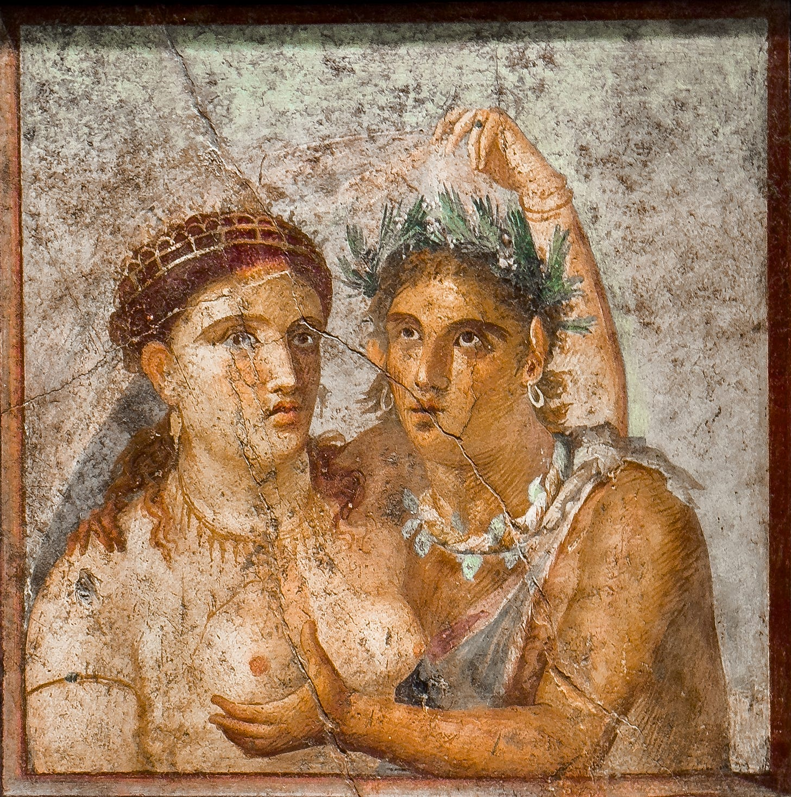
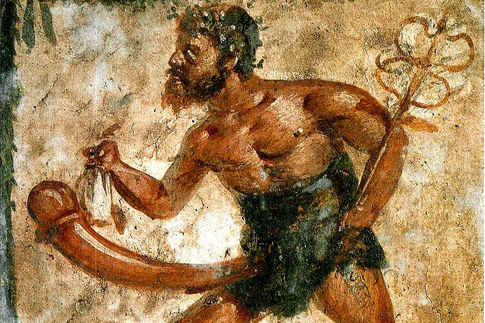

# Some Humorous and Obscene Poems translated from Latin

> And not only Catullus.


_There is apparently an audience for PG poems from ancient and medieval times if my previous post is of any indication. And though I do not particularly enjoy this sort of thing, either ancient or modern, one has got to feed the algorithm somehow. The following post obviously contains explicit material. Proceed only if you are okay with that._

## Introduction

If you were to ask otherwise well-read people who had no specific Latin focus on whether they knows any sort of vulgar poetry from ancient times, the name of Catullus would probably be the most common answer. Everyone has heard of the famous “_Pēdīcābō ego vōs et irrumābō_”, haven’t they? Catullus 16 in particular seems to be somewhat of a meme in the online Latin community for being unusually explicit and bawdy. I don’t really know what the reason behind this perception is, though if I had to throw a guess it’s because Catullus is one of the authors usually included in school curriculums and going from the lofty pietas of the Aeneas to Catullus is indeed a strange experience. And while Catullus is indeed quite explicit, he is not an aberration unheard of in Latin poetry. Martial, for example, can be as explicit and graphic as Catullus, sometimes more.



Fig: Erotic fresco from Pompeii.

The poems translated below contain mainly poems from the ancient era (so no medieval Latin poetry or Renaissance stuff) : Catullus, Martial, Priapeia and so on. As always, I have translated into prose but with line breaks for I have no skill in (English) poetry. For each poem, I have included both the original text for those who know Latin and have followed the translation with some basic notes that draw attention to anything I find noteworthy in the original or on translation choices.

On a more general note, I don’t find these Latin epigrams, even those of Catullus, very interesting. Latin poetry in general has much to offer but those on the more explicit end are all kind of monotonous. _Haha, I’ll r\*pe you_. This is more or less what all these come down to. I don’t really know why this is or how it connects to Roman and wider Mediterranean understanding of sexuality and human nature. Maybe they are shocking for the first time.

## Catullus

Catullus perhaps needs no introduction. I have included both his famous _Pedicabo_ poem and some others.

### 1

> ```
> Pēdīcābō ego vōs et irrumābō,
> Aurēlī pathice et cinaede Fūrī,
> quī mē ex versiculīs meīs putāstis,
> quod sunt molliculī, parum pudīcum.
> nam castum esse decet pium poētam
> ipsum, versiculōs nihil necesse est;
> quī tum dēnique habent salem ac lepōrem,
> sī sunt molliculī ac parum pudīcī,
> et quod prūriat incitāre possunt,
> nōn dīcō puerīs, sed hīs pilōsīs
> quī dūrōs nequeunt movēre lumbōs.
> vōs, quod mīlia multa bāsiōrum
> lēgistis, male mē marem putātis?
> pēdīcābō ego vōs et irrumābō.
> 
> Catullus XVI
> 
> I'll fuck you in the ass and face-fuck you,
> bottom Aurelius and ass-giving Furius,
> who think that from my little poems,
> which are a bit soft, that I'm shameless. 
> Yes the poet should be chaste himself
> but it's not like that for the poems themselves;
> in fact, they are witty and charming
> if they are soft, without much shame
> and can excite some itch;
> and not in, like, boys but in hairy old fogeys
> who can't get their dicks hard.
> You read my 'thousands of kisses'
> and think I'm less of a man ?
> I'll fuck you in the ass and face-fuck you.
> ```

The ‘thousands of kisses’ are references to Catullus’ poems where such phrases occur usually in relation with his love to Lesbia. It should be emphasized that although Catullus seems to be lashing out at his critics for criticizing his poems and raising questions on his manhood, it is likely not serious but banter with his close friends. Furius and Aurelius appear in other poems as Catullus’ buddies. Catullus 11 even starts with “_Furius and Aurelius, the companions of Catullus, whether he reaches the furthest Indies …_ ”.

### 2

> ```
> Pulcrē convenit improbīs cinaedīs,
> Māmurrae pathicōque Caesarīque.
> nec mīrum: maculae parēs utrīsque,
> urbāna altera et illa Formiāna,
> impressae resident nec ēluentur:
> morbōsī pariter, gemellī utrīque,
> ūnō in lecticulō ērudītulī ambō,
> nōn hic quam ille magis vorāx adulter,
> rīvālēs sociī puellulārum.
> pulcrē convenit improbīs cinaedīs.
> 
> Catullus LVII
> 
> It fits the two faggots perfectly,
> Marmurra and bottom Caesar.
> No wonder: Both have equal stains,
> one from the city and another from Formiae,
> are impressed on them, which remain unwashed.
> Both are sick, both twins, 
> both brought up in the same small bed.
> One is not a lesser adulterer than the next,
> rivals and sharers of girls.
> It fits the two faggots perfectly.
> ```

The Caesar is Julius Caesar. Suetonius reports that the two were ultimately reconciled when Caesar was hosted in Catullus’ paternal villa.

### 3

> ```
> Ō rem rīdiculam, Catō, et jocōsam,
> dignamque auribus et tuō cachinnō!
> rīdē quidquid amās, Catō, Catullum:
> rēs est rīdicula et nimis jocōsa.
> dēprēndī modo pūpulum puellae
> trūsantem; hunc ego, sī placet Diōnae,
> prōtēlō rigidā meā cecīdī.
> 
> Catullus LVI
> 
> An absurd thing, Cato, quite funny
> and worthy for you to hear and laugh. 
> As much as you love Catullus, Cato, laugh!
> The thing is absurd and too funny. 
>  I just caught a boy penetrating a girl.
> May Diana be gracious, I fell upon him 
> using my own rigid tool as a spear.
> ```

Doesn’t sound very funny to me. Cato the younger was a notorious party pooper. I don’t think he’d have found it very funny either.

### 4

> ```
> Lesbius est pulcer. Quid nī? Quem Lesbia mālit
> quam tē cum tōtā gente, Catulle, tuā.
> Sed tamen hic pulcer vendat cum gente Catullum,
> sī tria nōtōrum suāvia reppererit.
> 
> Catullus 79
> 
> Lesbius is handsome. What's more? Lesbia loves him
> more than you or your whole race, Catullus.
> But this handsome guy will sell you and your race
> if he were to get kisses from three friends for it.
> ```

As Lesbia is commonly identified with Claudia, the Lesbius will be her brother Publius Clodius Pulcher. Catullus is accusing Claudia of incest here, an accusation that was not unknown in the public at that time. Cicero brandishes similar accusations in his _Pro Caelio_. Pulcher is moreover not just an adjective for Lesbius but also refers to the cognomen Pulcher of Clodii.

### 5

> ```
> Nōn (ita mē dī ament) quicquam rēferre putāvī,
> utrumne ōs an cūlum olfacerem Aemiliō.
> nīlō mundius hoc, nihilōque immundius illud,
> vērum etiam cūlus mundior et melior:
> nam sine dentibus est. hic dentīs sēsquipedālīs,
> gingīvās vērō ploxenī habet veteris,
> praetereā rictum quālem diffissus in aestū
> mejentis mūlae cunnus habēre solet.
> hic futuit multās et sē facit esse venustum,
> et nōn pistrīnō trāditur atque asinō?
> quem sīqua attingit, nōn illam posse putēmus
> aegrōtī cūlum lingere carnificis?
> 
> Catullus 97
> 
> It doesn't matter (may the gods love me) whether
> I smell Aemilius' mouth or his ass:
> his mouth is no cleaner, his ass no filthier.
> In fact his ass is cleaner and better:
> it has got no teeth. He's got a feet and a half
> long teeth and gums like old wagon-boxes.
> Moreover, it opens like how the she-mule's
> ass opens in summer when she pisses. 
> He fucks many women and thinks himself
> handsome; isn't he given to the mill's donkey?
> If any women touches him, shouldn't we think 
> that she'd even lick a diseased executioner's ass?
> ```

Poor Aemilius. He should visit the dentist soon.

### 6

> ```
> Ō fūrum optime balneāriōrum
> Vibennī pater, et cinaede fīlī,
> (Nam dextrā pater inquinātiōre,
> cūlō fīlius est vorāciōre)
> cūr nōn exilium malāsque in ōrās
> ītis, quandoquidem patris rapīnae
> nōtae sunt populō, et natīs pilōsās,
> fīlī, nōn potes asse vēnditāre?
> 
> Catullus 33
> 
> O Vibennus father, best of thieves
> at the baths, and his faggot son, 
> (for the father is worse with his right hand
> and the son with his voracious ass)
> why don't you to exile yourself and go
> to shitty shores now that the thefts
> of the father are well know to people and 
> you can't sell the son's hairy bottom for an as.
> ```

The as is a Roman coin designation.

This much for Catullus. There are a lot more of Catullus’ invectives against all sort of people which are generally full of curses and vulgarity but I’ve included some of my favourites. But Catullus also has serious and heart touching poems. His poem on the death of his brother (No 101) is extremely good. His joy on homecoming after a long time (No. 31) is great too. He can translate and adapt older poems so good people start thinking it’s actually about his own life (No. 51, which is a translation from Sappho). It is perhaps well that the more shocking poems introduce new readers to his poetry which is not all crass and vulgar but also high and cultured.

## Priapeia



Fig: Priapus from a fresco in Pompeii.

I have translated an interesting long poem from the Priapeia before. I’ll just quote that [post](https://psugam.substack.com/p/philologist-priapus-uncovers-the) for an introduction:

> _Priapeia_ or _Carmina Priapeia_ is a collection of short Latin epigrams in various meters on the shenanigans of the god Priapus. Priapus is, as the subtitle says, is the well-endowed one. The comically large phallus, which is his most characteristic aspect, seems to connect him to fertility though he himself is tragically infertile. Compared to the major Olympian gods, there are few myths about Priapus that survive and those that do survive often have contradictory information even on things as basic as his parentage. The more popular version seems to have him a son of Aphrodite (i.e. Venus) cursed by Hera with ugliness and an ever-erect large penis (which amusingly he cannot sustain for an actual intercourse). Another myth records him as attempting to rape a sleeping Hestia who was waken up by an ass. As a result, Priapus bears a deep hatred for asses ever since.
> 
> _Priapeia_, then, is a collection of about 80 epigrams about this Priapus. When was it written? Is the whole collection by a single poet or is it a product of different hands over time and space? Even as the god himself, we don’t have a certain answer to any of these basic questions. From at least the time of Suetonius (early 2nd CE) there was a tradition that Priapeia was written by Vergil. Manuscripts evidence generally supports this view. From the Renaissance onwards, scholars often couldn’t believe that a poet like Vergil, whose serious and high-minded Aeneid was one of the most popular Latin works in the middle ages and who was seen as a sort of pre-Christian prophet due to one of his eclogues being interpreted as a foretelling of Christ, could have written so much explicit and vulgar epigrams. There arose a multitude of opinions as to the date and authorship in the succeeding centuries. Ovid, Martial, group of poets under Maecenas’ patronage, etc. were the common contenders. At the beginning of the 20th century, the received wisdom seems to point that the it was collection of Priapic poems by various authors compiled sometimes in the Augustan or silver ages of Latin literature.
> 
> After the pioneering study by R.S. Radford (1921), pendulum has swung back to a unitary authorship, though necessarily not Ovid as he suggested.

More or less all of the poems collected in Priapeia are connected in one way or the other to the Priapus’ phallic form. I have generally chosen shorter epigrams to longer ones.

### 1

> ```
> Quam puerō lēgem fertur dīxisse Priāpus,
> versibus hīs īnfrā scrīpta duōbus erit:
> ‘quod meus hortus habet sūmās inpūne licēbit,
> sī dederīs nōbīs quod tuus hortus habet.
> 
> Priapeia V
> 
> What Priapus is said to have spoken to a boy
> will be written below in two verses:
> "You may take freely what my garden has
> if you give me what your garden contains."
> ```

The double entendre is clear enough. This sort of threats against intruders and thieves who try to steal from the garden where Priapus has been set up is his stock in trade. It should be kept in mind while reading Priapus’ threats that it is not Priapus as a generic figure but especially as the dedicated statue placed at gardens that is threatening the thieves.

### 2

> ```
> Cum loquor, ūna mihī peccātur littera; nam Tē
> Pē dīcō semper blaesaque lingua mihi est.
> 
> Priapeia VII
> 
> When I speak, I err in one letter. For I say tē
> as pē. My tongue is always in error.
> ```

This one plays on the difference between _tē dīcō_ (I say to you) and _pēdīcō_ (I’ll sodomize you).

### 3

> ```
> Percīdēre puer, moneō: futuēre puella:
> barbātum fūrem tertia poena manet.
> 
> Priapeia XIII
> 
> Boy, you'll be sodomized and girl, you'll be fucked.
> For a bearded thief, a third punishment awaits.
> ```

The third punishment is _irrumatio_ (oral). As opposed to a boy (_puer_) or a girl (_puella)_, a bearded (_barbatus_) thief implies that it is an adult male who is being threatened.

### 4

> ```
> Commoditās haec est in nostrō maxima pēne,
> laxa quod esse mihī fēmina nūlla potest.
> 
> Priapeia XVIII
> 
> This is the great advantage of my penis:
> no women could ever be loose to me.
> ```

### 5

> ```
> Fulmina sub Jove sunt; Neptūnī fuscina tēlum;
> ēnse potēns Mārs est; hasta, Minerva, tua est;
> sūtilibus Līber committit proelia thyrsīs;
> fertur Apollineā missa sagitta manū;
> Herculis armāta est invictī dextera clāvā:
> at mē terribilem mentula tenta facit.
> 
> Priapeia XX
> 
> Lightening is under Jove; trident is Neptune's weapon;
> Mars is strong with his sword; spear is for you, Minerva;
> Liber goes to war with his stitched wand,
> by Apollo's hands are arrows said to fly
> and Hercules' right hand is armed with an invincible club:
> So does stretched penis makes me fearsome.
> ```

Priapus here compares his own weapon, if it be styled as such, to the characteristic weapons of other gods. There are a handful of epigrams on this theme in the Priapeia. In one (No IX), Priapus directly questions why his weapons should be covered while the other gods display their quite proudly.

Jove is Jupiter. Liber is the Roman god often identified with Greek Dionysus. Minerva was equated with Greek Athena.

### 6

> ```
> Hoc scēptrum, quod ab arbore est recīsum
> nūllā et jam poterit virēre fronde,
> scēptrum, quod pathicae petunt puellae,
> quod quīdam cupiunt tenēre rēgēs,
> cui dant ōscula nōbilēs cinaedī,
> intrā vīscera fūris ībit usque
> ad pūbem capulumque cōleōrum.
> 
> Priapeia XXV
> 
> This sceptre, which was cut from a tree
> and can never sprout with foliage again, 
> sceptre which perverse girls seek out, 
> which some kings desire to hold,
> to which noble faggots give kisses,
> will reach the very guts of the thief
> and to my pubes and hilt of my balls.
> ```

This one, like others, threaten the prospective thief too but is in addition to that a parody of epic themes. The bearing of royal sceptres which often occurs in epics, Homeric and otherwise, in descriptive epic metaphors is here parodied by Priapus to the bearing of a different type of sceptre. I’m quite fond of this scene in Iliad I:[^1]

```
But here is what I say: my oath upon it 
by this great staff: look: leaf or shoot 
it cannot sprout again, once lopped away 
from the log it left behind in the timbered hills; 
it cannot flower, peeled of bark and leaves; 
instead, Achaean officers in council 
take it in hand by turns, when they observe 
by the will of Zeus due order in debate: 
let this be what I swear by then: I swear 
a day will come when every Achaean soldier 
will groan to have Achilles back. That day 
you shall no more prevail on me than this
dry wood shall flourish - driven though you are,
and though a thousand men perish before 
the killer, Hector. You will eat your heart out, 
raging with remorse for this dishonor 
done by you to the bravest of Achaeans."
```

### 7

> ```
> Simpliciter tibi mē, quodcumque est, dīcere oportet,
> nātūra est quoniam semper aperta mihī:
> pedīcāre volō, tū vīs dēcerpere pōma;
> quod peto, sī dederis, quod petis, accipiēs.
> 
> Priapeia XXXVIII
> 
> It's fitting that I speak everything to you simply
> for my nature is always open:
> I want to sodomize, you want to pluck the fruit;
> If you give me what I want, you'll receive what you want.
> ```

The nature of Priapus is, of course, very open.

### 8

> ```
> Velle quid hanc dīcās, quamvīs sim ligneus, hastam,
> ōscula dat mediō sī qua puella mihī?
> augure nōn opus est: ‘in mē' mihi crēdite, dīxit
> ‘ūtētur vērīs vīribus hasta rudis.
> 
> Priapeia 43
> 
> Why would you say that any girl likes me, though wooden, 
> a spear if she kisses me in the middle ? 
> No need for augury here: "In me", she says,
> "this rough spear will demonstrate its true strength."
> ```

Priapus responding to an unnamed questioner about why the girls love him though he is but a wooden _spear_ and his weapon is, let’s say, ineffective.

### 9

> ```
> Quīcumque vestrum, quī venītis ad cēnam
> lībāre nūllōs sustinet mihī versūs,
> illīus uxor aut amīca rīvālem
> lascīviendō languidum, precor, reddat
> et ipse longā nocte dormiat sōlus
> libīdinōsīs incitātūs ērūcīs.
> 
> Priapeia XLVII
> 
> Whoever among you comes to the dinner
> and doesn't offer me a libation of poetry,
> I pray his wife or his girlfriend may 
> wantonly render his rival languid
> while he sleeps alone long night over
> aroused by lusty aphrodisiacs.
> ```

Priapus’ curse to the guest invited to dinner at his place who don’t recite some poem. I quite like the image of offering a libation of verses (lībāre … versūs)

### 10

> ```
> Quod partem madidam meī vidētis
> per quam significor Priāpus esse,
> nōn rōs est, mihi crēde, nec pruīna,
> sed quod sponte suā solet remittī,
> cum mēns est pathicae memor puellae.
> 
> Priapeia XLVIII
> 
> The wet part of mine that you all see
> and know that I'm actually Priapus:
> Its not dew, believe me. It's not frost either.
> It's the thing that is automatically emitted
> when my mind remembers a perverse girl.
> ```

### 11

> ```
> Tū, quīcumque vidēs circā tēctōria nostra
> nōn nimium castī carmina plēna jocī,
> versibus obscaenīs offendī dēsine: nōn est
> mentula subductī nostra superciliī.
> 
> Priapeia XLIX
> 
> You, whoever you are, that observe our walls
> full of funny, not very chaste poems, 
> stop being offended by obscene verses: my dick
> is not one with raised eyebrows.
> ```

The raising of the eyebrow is an indication of seriousness and moral gravity. The person likely to be characterized as raising an eyebrow is certainly not the one to enjoy such vulgar poetry. This also gave rise to the longest attested Latin word in antiquity: _subductisupercilicarptor_ (an eyebrow-raising fault-finder), said to have been coined by the poet Laevius to describe his critics.

As for ‘observing our walls’, the poems in the Priapeia are supposed to have been written into walls in much the same way that the surviving Pompeii graffiti are.

### 12

> ```
> ED sī descrībās tēmōnemque īnsuper addās,
> quī medium volt tē scindere, pictus erit.
> 
> Priapeia LIV
> 
> If you write E and D and then add a line too,
> the thing that wants to split you down in half will be drawn.
> ```

Usual Priapean threat. E——D looks something like an erect penis.

### 13

> ```
> Crēdere quis possit? falcem quoque turpe fatērī
> dē digitīs fūrēs subripuēre meīs.
> nec movet āmissī tam mē jactūra pudorque
> quam praebent jūstōs altera tēla metūs:
> quae sī perdiderō, patriā mūtābor, et ōlim
> ille tuus cīvis, Lampsace, Gallus erō.
> 
> Priapeia LV
> 
> Who can believe it? The sickle too, shameful
> to confess, did the thieves steal from my hands.
> The cost of the lost thing doesn't trouble me much,
> or shame, but the true fear of losing another spear. 
> If I lose that, I'll change nationalities. I was your 
> citizen first, Lampsacus, but I'll be a Gaul.
> ```

Some thieves have stolen the sickle of Priapus but he fears lest even his other spear, i.e, his characteristic organ, be stolen. If even that be stolen, Priapus would go from being a citizen of Lampsacus in Anatolia to being a Gaul. The Gaul (Gallus) is a double-entendre. It refers to Gauls as in Celts but also to Galli who were castrated priests of Cybele.

So much for Priapus. I’ve translated a longer piece from the Priapeia in which Priapus does some lighthearted literary criticism of Homeric Epics. If you want to read it, you can find it [here](https://psugam.substack.com/p/philologist-priapus-uncovers-the).

## Martial

Martial was a first century CE Roman poet who basically invented the modern epigram. He wrote short, biting poems that focused on the real and often messy lives of everyday people in Rome rather than myths or legends. He frequently turns out little disses on people.


Fig: Martial roasting fellow Romans. 1st Century AD. Colorized.

Martial has a lot, and I mean a _lot_, of obscene verses but he also does have other insults and invectives. His verses are, moreover, short enough.

### 1

> ```
> Sī meminī, fuerant tibi quattuor, Aelia, dentēs:
> expulit ūna duōs tussis et ūna duōs.
> Jam sēcūra potes tōtīs tussīre diēbus:
> nīl istīc quod agat tertia tussis habet.
> 
> Epigrams I.19
> 
> If I remember, you had four teeth, Aelia:
> one cough dislodged two and another two. 
> Now you can cough all day without worrying:
> the third cough can do nothing to you.
> ```

Poor Aelia.

### 2

> ```
> Ventris onus miserō, nec tē pudet, excipis aurō,
> Basse, bibis vitrō: cārius ergo cacās.
> 
> Epigrams I.37
> 
> You unload your bowels shamelessly in a gold bowl, Basse, 
> and drink from glass: your shit's more expensive.
> ```

Bassus has got his own priorities. There’s no bowl in the original just ‘miserable gold’.

### 3

> ```
> Versūs scrībere mē parum sevērōs
> nec quōs praelegat in scholā magister,
> Cornēlī, quereris: sed hī libellī,
> tamquam conjugibus suīs marītī,
> nōn possunt sine mentulā placēre.
> Quid sī mē jubeās thalassiōnem
> verbīs dīcere nōn thalassiōnis?
> quis Flōrālia vestit et stolātum
> permittit meretrīcibus pudōrem?
> Lēx haec carminibus data est jocōsīs,
> nē possint, nisi prūriant, juvāre.
> Quārē dēpositā sevēritāte
> parcās lūsibus et jocīs rogāmus,
> nec castrāre velīs meōs libellōs:
> Gallō turpius est nihil Priāpō.
> 
> Epigrams I.35
> 
> I write verses that aren't very serious
> and no teacher would recite in in school.
> So you say, Cornelius, but these little books,
> like husbands to their own wives,
> aren't able to be pleasing without dicks. 
> Do you want me to have no wedding-words
> in wedding-songs themselves ?
> Who is dressed for Floralia or permits 
> the propriety of matrons to whores?
> This is the law for funny poems:
> they're worth nothing if they can't scratch an itch.
> So stop with your seriousness and spare,
> I pray, the jokes and jests. 
> Don't you even wish to castrate my books:
> there's nothing worse than a Gallic Priapus.
> ```

Many poets who write these lewd verses seem to have a poem or two justifying their oeuvre. Catullus does this in his famous poem (translated as No 1 above), Priapeia has some of these, Pliny the Younger expresses this sentiment and now Martial does too.

Floralia was a flower festival where prostitutes performed naked. Gallic means, as we explained above, an eunuch priest of Cybele. Being an eunuch would deprive Priapus of his very character, his very essence: what could be worse than that?

### 4

> ```
> Dās Parthīs, dās Germānīs, dās, Caelia, Dācīs,
> nec Cilicum spernis Cappadocumque torōs;
> et tibi dē Phariā Memphīticus urbe futūtor
> nāvigat, ā rubrīs et niger Indus aquīs;
> nec recutītōrum fugis inguina Jūdaeōrum,
> nec tē Sarmaticō trānsit Alānus equō.
> Quā ratiōne facis, cum sīs Rōmāna puella,
> quod Rōmāna tibī mentula nūlla placet?
> 
> Epigrams VII.30
> 
> You give it to Parthians, Germans,  o Caelia, and to Dacians.
> You reject the beds of neither Cilicians nor Cappadocians.
> From Alexandria the fucker of Memphis sails to you
> and the black Indian from the red sea.
> Neither do you shun the groins of circumcised Jews
> nor does the Alan, in his Sarmatian horse, pass you by.
> Due to what reason, when you are a Roman girl,
> is it so that no Roman dick pleases you well.
> ```

Nothing new under the sun I guess. Iuvenal has a similar rant in one of his poems (Iuvenal 6 if I remember correctly).

### 5

> ```
> Praedia sōlus habēs et sōlus, Candide, nummōs,
> aurea sōlus habēs, murrina sōlus habēs,
> Massica sōlus habēs et Opīmī Caecuba sōlus,
> et cor sōlus habēs, sōlus et ingenium.
> Omnia sōlus habēs nec mē puta velle negāre
> uxōrem sed habēs, Candide, cum populō.
> 
> Epigrams III.26
> 
> You possess all estates alone, Candidus, & all your money,
> alone you possess all your gold, all your murrhine vases,
> alone you possess all the Massian & Caecubian wine of Opimus' year,
> alone you possess your heart, alone your wits.
> You possess all these things alone (don't think I want to deny it)
> but your wife you share with everyone.
> ```

Candidus apparently had both the chair and the technique perfected.

### 6

> ```
> Ūtere lactūcīs et mollibus ūtere malvīs:
> nam faciem dūrum, Phoebe, cacantis habēs.
> 
> Epigrams III.90
> 
> Make use of lettuce and also of  soft mallows:
> for you have the face, Phoebus, of a constipating man.
> ```

You need to lock in and looksmaxx Phoebus.

### 7

> ```
> Nōn est, Tucca, satis, quod es gulōsus:
> Et dīcī cupis et cupis vidērī.
> 
> Epigrams XII.41
> 
> It isn't enough, Tucaa, that you are obese:
> you want to be called & to be seen as obese too.
> ```

Roman body-positivity ? Probably not.

### 8

> ```
> Nūbere Paula cupit nōbīs, ego dūcere Paulam
> Nōlo: anus est. Vellem, sī magis esset anus.
> 
> Epigrams X.8
> 
> Paula wants to marry me, I don't want to marry Paula:
> she is an old woman. I'd  marry her if she were older still.
> ```

Paula is neither young enough to be of marriageable age nor old enough to make you an inheritor and die off. The word for old woman used here, ‘_anus_’, is a vivid demonstrator of the need of considering vowel length in Latin for the only difference between ‘_anus_’ (old women) and ‘_ānus_’ (anus) is the length of the initial vowel _a_. That there could be some pun at this in the poem itself cannot be completely denied.

Even more than the other authors here, a lot (as in literally thousands) of Martial’s epigrams survive and there are many, many obscene ones. I’d entreat the interested reader to the original work itself, either in translation or in original. But do make sure to get a more recent translation as lots of older translations either omit epigrams that are too salacious or tame them quite forcefully (like the case with ‘wondrous femininity’ discussed below).

## Miscellaneous

### 1\. Caesar’s Soldiers

The following poems are taken from Suetonius’ _Life of Divine Iulius_ (49 & 51) where they are said to be sung by Caesar’s own troops at his triumphs:

> ```
> Galliās Caesar subēgit, Nīcomēdēs Caesarem:
> Ecce Caesar nunc triumphat quī subēgit Galliās,
> Nīcomēdēs nōn triumphat quī subēgit Caesarem.
> 
> Caesar subjugated Gaul and Nicomedes Caesar:
> Look Caesar now triumphs for subjugating Gaul
> but Nicomedes who subjugated Caesar triumphs not.
> ```

The reason for this rumour, that Nicomedes IV of Bithynia, had had illicit relations with Caesar was that Caesar had spent some time at the beginning of his career with that king and apparently returned again even after the rumour had spread on the excuse of having to exact the debt of one of his clients. _Life of Divine Iulius 2._

> ```
> Urbānī, servāte uxōrēs: moechum calvom addūcimus.
> Aurum in Galliā effutuistī, hīc sūmpsistī mūtuum.
> 
> Citizens, save your wives: We bring the bald adulterer hither.
> You have fucked away in Gaul the gold that you borrowed here.
> ```

### 2\. Goodbye Wondrous Femininity

The graffitis that were preserved in Pompeii and Herculaneum after the disastrous eruption of Mt. Vesuvius buried those towns have much interesting content. The following piece, CIL(Corpus Inscriptionum Latinarum) 4.3932 from the Brothel of _Innulus_ and _Papilio_, is often included in pop discussions of Pompeii graffitis. You’ll often encounter the following translation:

```
Weep, you girls. My penis has given you up. Now it penetrates men’s behinds. Goodbye, wondrous femininity!
```

I haven’t been able to find who the original translator was in this specific case but the translation itself has circulated widely. It is interesting then that the translation is very sanitized. The original text is not complete and is missing many words:

```
............... dolete puellae
P(a)edi[cat...] cunne superbe ua(le).
```

This was presumably an elegiac couplet but as it is now reads: “grieve, you girls. Ass-fucks … goodbye over-proud cunt.”

I’ve seen a completion of this that fits the metre which goes like:

> ```
> vōs mea dēservit jam verpa dolēte puellae
> pēdīcat cūlum, cunne superbe valē!
> 
> Weep ye girls! my dick has now abandoned ye
> and fucks ass. Goodbye over-proud cunt!
> ```

The translation quoted above must be of this reconstructed verse. In any case, superbus doesn’t mean superb in the English sense but over-proud, haughty or vain. Similarly, you’d have to do considerable mental gymnastics to justify translating _cunnus_ (cunt) as femininity.

### 3\. More from the Burned Cities

There are many more funny graffiti from Pompeii and Herculaneum but as we’ll included only a few ones that are in verse.

> ```
> Fullōnēs ululamque canō nōn arma virumque.
> 
> CIL IV.9131 
> 
> I sing of launderers and owls not of arms and the man.
> ```

This is a parody of Vergil’s Aeneid, which starts with _Arma virumque canō, Trōjae quī prīmus ab ōrīs_ (I sing of the arms and the man who first from the shores of Troy…), found at a clothes cleaner’s shop in Pompeii.

### 4\. Florus

There is uncertainty whether various authors named Florus were a single person or not but if it was a single person, Florus lived in late first and early second century AD. An epitome of Roman history attributed to him survives, and so does a portion of a work called ‘Vergil: Poet or Orator?’. Beside these there are some surviving epigrams. Many of these are quite nice and standard epigrams. Here’s one on misogyny though:

> ```
> Omnis mulier intrā pectus cēlat vīrus pestilēns:
> dulce dē labrīs locuntur, corde vīvunt noxiō.
> 
> Anthologia Latina 245
> 
> All women hide pestilent venom in their hearts:
> they speak sweetly with their mouths, but live delinquently at heart.
> ```

An anecdote is related in the _Life of Hadrian_ of the uber-reliable Historia Augusta that Florus once criticized Hadrian with these verses:

> ```
> Ego nolo Caesar esse,
> ambulare per Britannos,
> latitare per Syriscos.
> Scythicas pati pruinas.
> 
> I don't want to be Caesar:
> walking among Britons,
> hiding among Syrians
> and enduring Scythian frosts.
> ```

Hadrian[^2], who is characterized as vain to the point of writing his own biography and having others publish it in their name, is said to respond as:

> ```
> Ego nolo Florus esse,
> ambulare per tabernas,
> latitare per popinas
> culices pati rotundos.
> 
> I don't want to be Florus:
> walking through the inns,
> hiding in the brothels
> and enduring fat mosquitoes.
> ```

Well, I’d personally want to to Hadrian, other than the whole Antinous thing of course, than Florus.

_If you like my writing, please subscribe to receive similar posts in the future. If there are any errors on my part, I would be grateful to have them pointed out in the comments. Thank you._

**Valete sodales!**


---

[^1]: This extract from the Iliad is from Robert Fitzgerald’s translation.
[^2]: The last word in the third line is uncertain. I’ve followed Barry Baldwin’s emendation but other alternatives are also possible.
