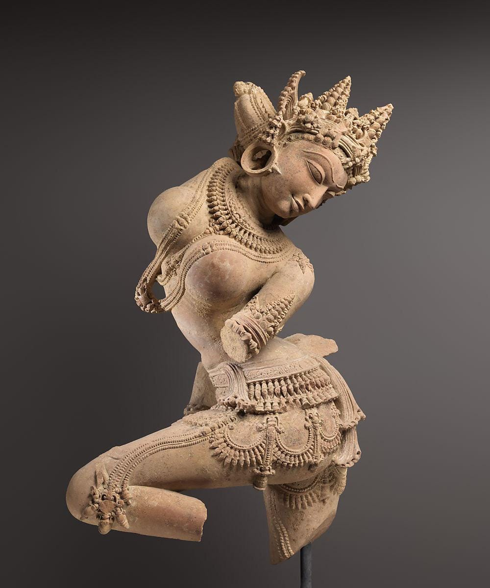

# Some Humorous and Obscene Poems translated from Sanskrit

> Mostly collected from Major Anthologies


(_The following post contains explicit material_.)

### Introduction

Erotic Poetry (śṛṅgāra) might be the only genre of Sanskrit poetry that is well represented in English translations. Andrew Schelling’s translations include mostly erotic poems, Parthaswamy’s _Erotic Poems from the Sanskrit_ and Anusha Rao’s _How to Love in Sanskrit_ tread the same ground as well. Dāmodaragupta’s Kuṭṭanīmata has got a new English translation. Major collections like Amarukaśataka, Caurapañcāśikā, Śṛṅgāraśataka, etc. have been translated multiple times into English.

Humorous and obscene verses seem to be much less covered. Of course, one might say that the erotic verses are often very explicit and might be considered obscene. The erotic verses are, however, highly stylized and are the works of urban and upper class poets. Although they often depict amorous villagers, the poets are anything but that. Indeed, among the critics _grāmya_ (village-like) is often used to mean ‘vulgar’ or ‘obscene’.

Well, what counts as ‘vulgar’ or ‘obscene’? After all what sounds vulgar to us today might not be the same things that were so to the authors themselves. This is not a good place to go into depth on such issues and I’ll just state the obvious. I have no specific criteria for what is ‘vulgar’ and what is not but as U.S. Justice Stewart remarked about pornographic materials: _I know it when I see it_.

The verses translated here are mainly collect from the well-known medieval anthologies _Śārṅgadharapaddhati_ (1363 CE), _Sūktimuktāvalī_ (1257 CE), _Subhāṣitāvalī_ (15th Century CE) and _Subhāṣitaratnakośa_ (12th Century CE). When the verses are attributed to individual poets, I have indicated their names and the rest may be considered anonymous. As I’m not a poet ( not in English anyway) and my versification skills are as wonderful as that of Cicero, no effort has been taken in translating into verse. I’ll translate each stanza separately and note anything that sticks out. Many of the verses are pretty straightforward but many contain puns or double entendres that are common in Sanskrit tradition.



Fig: Celestial Dancer (Apsaras) statue, mid-11th century. Central India, Madhya Pradesh origin. From the collections of Metropolitan Museum of Art.

### 1

> ```
> tavocchritān pātayituḥ 
> patitāṃś coddhariṣyataḥ 
> vidhatur iva dṛśyante 
> bhaga citrā vibhūtayaḥ  
> 
> - Subhāṣitāvalī 2293 Attributed to Vyāghragaṇa
> ```
> 
> ```
> You, who lay low what has gone high
> and uplift what is down low, 
> seem to have wonderful powers
> like fate itself, o pussy.
> ```

This is a common poetical device in Sanskrit poetry where two things are identified by whatever common activity. So, here _bhaga_ (female genitalia) is said to have powers like fate as it makes things go up and down. _bhaga_ is, as often happens with sexual organs, an euphemism and originally meant something like ‘part’ , ‘portion’ or ‘share’. There was in early Vedic times a god _Bhaga_ who personified the domain of wealth ( as the ‘portion’ that men receive after war ). In Old Persian, the cognate term _baga_ which came to mean ‘god’ generically. In pre-history, tribes that would later become Slavic peoples borrowed this word from the Iranians so that the usual Russian word for god is бог (bog), Ukrainian бог (boh), Polish bóg and so on.

In Sanskrit, it seem to have gone down to euphemism route without, however, the older meaning being ever being forgotten. So, we still get words like _bhagavan_ (possessing _bhaga_ = lord, god, etc.). A particularly egregious example is _subhagā_ (one whose bhaga is good) which means fortunate and is a term for addressing women respectfully. Only when the usual meaning is assumed of course as it wouldn’t usually be respectful address otherwise.

### 2

> ```
> raṇḍāḥ pākhaṇḍibhir vyāptāḥ 
> bhartṛbhiḥ kulayoṣitaḥ
> veśyā dhaninam icchanti 
> chātrāḥ karaparāyaṇāḥ 
> 
> - Subhāṣitāvalī 2296 Anonymous
> ```
> 
> ```
> Widows are with hypocrites
> and good women with their husbands.
> prostitutes want only rich men,
> so students depend on their hands.
> ```

Referring to masturbation of course.

### 3

> ```
> ādau namras tataḥ stabdhaḥ 
> kāryakāleṣu niṣṭhuraḥ
> kṛte kārye punar namraḥ 
> śiśnatulyo vaṇigjanaḥ 
> 
> - Subhāṣitāvalī 2298 Anonymous
> ```
> 
> ```
> Placid at first, then shocked, 
> hard when the intercourse takes place,
> placid once again after the intercourse :
> a merchant is like a dick.
> ```

As usual, there is a play on word here that is difficult to maintain in translation. Only perhaps the word ‘intercourse’ is can convey two meanings at once here. The words _namras_ (mild, bent) and _niṣṭhuraḥ_ (hard, obdurate) are used to characterize both the male organ and the merchant. The merchant is mild and soft-spoken while trying to sell his product, then hard as he wants to make much profit and will not give discount, and then mild again when the product is sold.

### 4

> ```
> gaṇayati gagane gaṇakaś 
> candreṇa samāgamaṃ viśākhāyāḥ 
> vividhabhujaṅgakrīḍāsaktāṃ 
> gṛhiṇīṃ na jānāti 
> 
> - Subhāṣitāvalī 2302 Anonymous
> ```
> 
> ```
> The astrologer counts 
> conjunction of asterisms with the moon
> but doesn't know his housewife
> addicted to playing with many bon-vivants.
> ```

The word _bhujaṅga_ refers to a socialite who doesn’t do any day to day work but just moves on in certain circles and is a womeniser. I used _bon-vivants_ as I don’t know what an appropriate modern term would be. Fuckboy? Chad ? idk.

### 5

> ```
> paranārīṣu doṣo’sti 
> svanārī naiva vidyate 
> ata eva kulīnānāṃ 
> praśastā karasundarī 
> 
> - Subhāṣitāvalī 2303 Anonymous
> ```
> 
> ```
> One can't do it with other women
> and one's own woman doesn't exist.
> So, for those of good-birth
> hand-beauty is recommended.
> ```

Similar to the number 2 above.

### 6

> ```
> prapāyāṃ prāpyate 
> vāri satrāgāre’pi bhujyate 
> supyate devasadane 
> yabhyate yatra labhyate 
> 
> - Subhāṣitāvalī 2317 Anonymous
> ```
> 
> ```
> I drink water from the well, 
> food from charities
> sleep on temple floors
> and fuck wherever I can.
> ```

The original is all in passive which I’ve changed to active as it is quite unintelligible in English otherwise. The verb _yabhati_ ( from root _yabh_\-) is the equivalent of the English f-word. In fact a cognate root is still used in Slavic languages for the same meaning and sounds quite similar to the Sanskrit one. It is exceedingly rarely used in Sanskrit literature outside documentary sources and is proscribed by rhetoricians. I can only recall a couple or so uses in actual literature not counting this and the verse 9 below.

### 7

> ```
> nidāghakāle viprasya 
> prasuptasya taroradhaḥ 
> śunā pramūtritaṃ haste 
> devasya tveti so’bravīt 
> 
> - Subhāṣitāvalī 2318 Anonymous
> ```
> 
> ```
> When a Brahmin was sleeping
> below a tree in summer
> and a dog pissed in his hand, 
> he said, "On the impulse of the god....".
> ```

A verse making fun of Brahmins. The verse that the Brahmin quotes is from _Taittirīyasaṃhitā_ i.3.1 which reads in A.B. Keith’s translation “_On the impulse of the god Savitṛ, with the arms of the Aśvins, with the hands of Pūṣan, I take thee ; thou art the spade, thou art the woman._” It is a popular verse and is particularly used in royal consecrations.

### 8

> ```
> chidreṣv anarthābahulībhavantītyalīkametadbhuvi saṃpratītam 
> chidraṃ puraskṛtya hi kāminīnām arthā bhavantyeva hi na tvanarthāḥ
> 
> - Subhāṣitāvalī 2351 Anonymous
> ```
> 
> ```
> I think that saying there's hole in something doesn't always means loss
> as women are making quite a profit using the holes, not losses.
> ```

Probably referring to prostitutes.

### 9

> ```
> yabhasva nityaṃ yadi śaktir asti te 
> dinād dinaṃ gacchati kānta yauvanam 
> mṛtāya ko dāsyati  darbhaviṣṭare 
> tilodakaiḥ sārdham alomaśaṃ  bhagam 
> 
> - Subhāṣitāvalī 2366 Anonymous
> ```
> 
> ```
> Fuck daily if you can, my friend, 
> for youth goes away day by day.
> When you're dead who'll serve you
> wet and clean shaven pussy on a plate ?
> ```

_Carpe diem_, I guess?

### 10

> ```
> anekair nāyakaguṇaiḥ 
> sahitaḥ sakhi me patiḥ 
> sa eva yadi jāraḥ syāt 
> saphalaṃ jīvitaṃ mama 
> 
> - Subhāṣitāvalī 2387 Anonymous
> ```
> 
> ```
> Friend, my husband is filled with
> many heroic qualities. 
> Now, if he was my boyfriend too
> my life would be complete.
> ```

The words of an unfaithful wife to her female friend noting that her husband has all the heroic qualities that she wishes her boyfriend had too.

### 11

> ```
> bhikṣo kanyā ślathā te 
> nanu śapharavadhe  
> jālikaiṣā’tsi matsyāṃs  
> te’mī madyāvadaṃśāḥ 
> pibasi madhu, samaṃ 
> veśyayā, yāsi veśyām
> dattvā’rīṇāṃ gale’ṅghriṃ 
> kimu tava ripavo 
> bhittibhettā’smi yeṣāṃ
> caurastvaṃ dyūtahetoḥ
> kathamasi kitavo 
> yena dāsīsuto’smi 
> 
> - Subhāṣitāvalī 2402 Anonymous
> ```
> 
> ```
> "Monk your clothes are wet."
> "Yeah, I use them as net for fishing."
> "You eat fish ?"
> "Yeah, need something to go with alcohol."
> "You drink wine?"
> "with whores."
> "You visit whores?"
> "After kicking my enemies' necks."
> "Who are your enemies?"
> "Those whose house I break into?"
> "You're a thief ??" "For gambling, yes."
> "How come you're a gambler?"
> "Because I'm a son of slave."
> ```

This one makes fun of a (probably Buddhist) monk. From the very first answer, the monk’s list of ill-deeds grow on and on. The cause of all this comes down at last to being ‘son of a slave’. Whether this is to be taken literally or not, I don’t know. ‘Son of a slave’ was a generic but not specially strong curse word, akin to say ‘son of a bitch’ in English. It could also, however, be taken literally and as socially stratified as pre-modern South Asia was, it can refer to obvious mockery of the monk by referring to his lowly origins. In a variant version of this verse, the reason is at last ‘what else is a corrupt guy gonna do”.

### 12

> ```
> sāmagāyanapūtaṃ me 
> nocchiṣṭam adharaṃ kuru 
> utkaṇḍitāsi ced bhadre 
> vāmakarṇaṃ daśasva me 
> 
> - Śārṅgadharapaddhati 4062 Anonymous
> ```
> 
> ```
> Don't bite my lower lip
> hallowed by sāma chants.
> If you're rally so fired up,
> bite my left ear.
> ```

Probably spoken by a rustic, religious guy to his lover. The next verse is similar in content.

### 13

> ```
> prāyaścittaṃ mṛgayate 
> yaḥ priyāpādatāḍitaḥ
> kṣālanīyaṃ śiras tasya
> kāntāgaṇḍūṣaśīdhubhiḥ
> 
> - Subhāṣitāvalī 2292 Anonymous
> ```
> 
> ```
> He who seeks for purification
> for being kicked in the head by his lover
> should have his head washed 
> by liquour out of her mouth.
> ```

This verse is sometimes quoted anonymously and sometimes under the name _Śyāmalaka_. It seems to refer to an one act comedy drama called Pādatāḍitaka by _Śyāmalaka_ probably composed around 450-500 CE but the verse itself is not found there. In this play, whose characters all seem to be real historical individuals, a certain Viṣṇunāga is a military commander who has lead the imperial armies to many conquests but is otherwise a straightforward, religious man. He goes, as the play says, from the court to the temple and from the temple to the court and that’s it. He is kicked in the head by the popular escort Madanasenā during lovemaking. ( You might ask what he is doing with an escort at all despite his previous characterization. I don’t know though if I had to guess I’d say that visiting escorts was normal and expected in ancient times. There even were state run brothels which generated considerable revenue for the government). Viṣṇunāga is furious at this and takes it as a personal affront. He convenes an assembly of Brahmins expert in Law and asks for what penance or purification is enjoined in his case. His listeners are surprised and wonder whether he is mad or possessed. Being kicked in the head by a women during lovemaking is, they think, the very epitome of eroticism.

The verse given above sounds like an ironic purification process someone made up for Viṣṇunāga. The play itself is quite funny and moves on to further shenanigans.

### 14

> ```
> gatāḥ kecitprabodhāya 
> svayaṃ te kumbhakarṇakam
> tadadhaḥpavanotsargād 
> uḍḍīya patitāḥ kvacit 
> 
> - Subhāṣitaratnabhāṇḍāgāra pg. 364 11
> ```
> 
> ```
> Some of those who had gone 
> to wake up Kumbhakarṇa
> got blown up and fell down
> from the air that he blasted.
> ```

In the Rāmāyaṇa, Kumbhakarṇa is a demon of gigantic size who, due to a misspoken word while asking for a boon, sleeps six months a year and wakes up the next six. To fight in his final battle, he had to be waken up by a myriad of men with all sort of drums and other noises. This is basically a fart joke making light of the situation.

### 15

> ```
> tanvaṅgīnāṃ stanau dṛṣṭvā
> śiraḥ kampāyate yuvā 
> tayor antarasaṃlagnāṃ 
> dṛṣṭim utpāṭayann iva  
> 
> - Subhāṣitaratnakoṣa 438 Attributed to Pāṇini
> ```
> 
> ```
> Seeing the tits of slim-waisted maidens,
> the young man shakes his head
> as if trying to pluck away his gaze
> that are stuck deep between them.
> ```

This one is ascribed to Pāṇini. As the famous ancient grammarian is the only known author of that name, it probably refers to him. It is unlikely to be authentic. As for the ‘slim-waisted’ ones, ancient ideals of female beauty were such that contemporary Instagram proportions might seem actually reasonable. There are, for example, many descriptions of heroines and lovers in poetry where she has such large breasts and such a thin waistline that she can only walk with difficulty and has to stoop down. Here’s an ancient statue for a visual demonstration:

![r/ArtefactPorn - Youthful Indian Damsel, Chandraketugarh, INDIA, 3rd Century[1080 x 1393]](./images/image_3.jpeg "r/ArtefactPorn - Youthful Indian Damsel, Chandraketugarh, INDIA, 3rd Century[1080 x 1393]")

Fig: Sculpture from Chandraketugarh in Bengal. 3rd century.

### 16

> ```
> tvāṃ vīkṣyodyatadaṇḍo’smi 
> nityamāyatalocane
> nityamudyatadaṇḍaḥ syād 
> ācāryāṇāṃ mataṃ kila 
> 
> Seeing thee, o long-eyed one, 
> I am "he who has an upright rod".
> "Let him always have an upright rod",
> such is the view of the teachers.
> ```

To end the post, this is a verse by a more modern poet - me ! The Sanskrit text has a pun and a quotation and is difficult to render in English without sounding stupid. It is a double entrede like some of the poems above and refers to Kauṭilya’s Arthaśāstra 1.4.03-05 :

“_ānvīkṣikī trayī vārttānāṃ yogakṣemasādhano daṇḍaḥ, tasya nītir daṇḍanītiḥ, alabdhalābhārthā labdhaparirakṣaṇī rakṣitavivardhanī vṛddhasya tīrthe pratipādanī ca | tasyām āyattā lokayātrā | tasmāl lokayātrārthī **nityam udyatadaṇḍaḥ syāt** |_” which Patrick Olivelle translates as

“_What provides enterprise and security (6.2.1 n.) to critical inquiry, the Triple, and economics is punishment (daṇḍa); its administration (nīti) is government (daṇḍanīti). Government seeks to acquire what has not been acquired, to safeguard what has been acquired, to augment what has been safeguarded, and to bestow what has been augmented on worthy recipients. 4 On it depends the proper operation of the world. 5 “Seeking the proper operation of the world, therefore, he should always stand ready to impose punishment; 6 for there is nothing like punishment for bringing creatures under his power”—so state the teachers._”

The “ready to impose punishment” is in the original “_udyatadaṇḍaḥ_” meaning “one whose rod is upright”. The “rod” here refers to the royal staff and signifies the king’s readiness to impose punishment on wrongdoers. The other meaning of “one whose rod is upright” should be clear even in the English translation.

_If you like my writing, please subscribe to receive similar posts in the future. If there are any errors on my part, I would be grateful to have them pointed out in the comments. Thank you._

