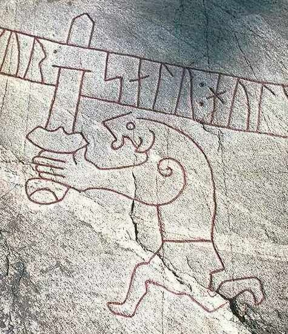
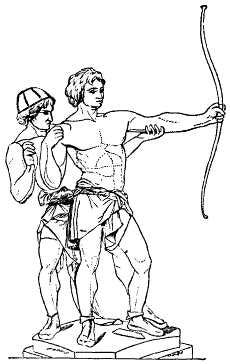

# The Legend of Sigurd and Gudrun by J.R.R. Tolkien

> A review


(_This review grew in its telling until it came to encompass both more and less than I expected and nearly reached the length of a short novella. Still it is defective in several respects - most clearly in that of transliteration. Transliterations of Old Norse and other old Germanic names are inconsistent, especially between the quotes from various authors and the main review. I hope readers will be able to look past this._)

 - IMDb")

Fig: Paul Richter as Siegfried, the German version of Sigurd, in Die Nibelungen; Siegfried (1924). Alberich is the analogue to Regin. Nibelungenlied was popular in Germany in the early 20th century and not always for the better.

As preliminary reading to a series of articles on the Volsung cycle that I’m writing, I decided to re-read the major literary sources of the Volsung-Nibelung stories; both Norse and continental. To these I added some modern works inspired by this legend, mostly the works of Tolkien, William Morris and Wagner. So, I read again J.R.R Tolkien’s “_The Legend of Sigurd and Gudrun_” (henceforth ‘_Legend_’). It has a special place in my heart for this was the place where I read about the Volsungs and first got into Old Norse literature.

")

Cover of the first edition.

The content of the book may be roughly divided into three parts : 1. Introduction to the Elder Edda. 2. Two narrative poems and 3. Commentary on the poems. The first two are by the elder Tolkien and the last by Christopher Tolkien, who is also the editor. In addition to these, an Introduction by the editor opens the book and three appendices ( _can any Tolkien work be complete without appendices ?_) follow. While these appendices are interesting, more so even than the main text I’m tempted to say, we’ll focus on the main body of the book at first.

## Introduction to the Elder Edda

The first part _Introduction to the Elder Edda_ is an edited version of the lecture notes of the lectures delivered on that topic by Tolkien at Oxford. As the poems of the Elder Edda (which is better known as the Poetic Edda these days) are the direct source for Tolkien’s own poems, it is fitting that an introduction should have been included, especially considering that Tolkien’s own poems are well nigh incomprehensible to a reader unfamiliar with them. For a reader already familiar with the Elder Edda, there are hardly any surprises on the factual information. Tolkien’s own views on this corpus, however, are more interesting:

> This is unlike Old English, whose surviving fragments (Beowulf especially) – such at any rate has been my experience – only reveal their mastery and excellence slowly and long after the first labour with the tongue and the first acquaintance with the verse are over. There is truth in this generalization. It must not be pressed. Detailed study will enhance one’s feeling for the Elder Edda, of course. Old English verse has an attraction in places that is immediate. But Old English verse does not attempt to hit you in the eye. To hit you in the eye was the deliberate intention of the Norse poet.
> 
> And so it is that the best (especially the most forcible of the heroic Eddaic poems) seem to leap across the barrier of the difficult language, and grip one in the very act of deciphering line by line.

And,

> Let none who listen to the poets of the Elder Edda go away imagining that he has listened to voices of the Primitive Germanic forest, or that in the heroic figures he has looked upon the lineaments of his noble if savage ancestors – such as fought by, with, or against the Romans. I say this with all possible emphasis – and yet so powerful is the notion of hoary and primeval antiquity which clings to the name (quite recent) Elder Edda in popular fancy (so far as popular fancy may be said to play with so remote and unprofitable a theme at all) that, though the tale ought to begin with the seventeenth century and a learned bishop, insensibly I find myself leading off with the Stone Age.

As interests in northern myths and legends grew in the age of Nationalism and Romanticism, the poems of the Poetic Edda were thought to be much older than we now know them to be. Some were dated as early as late the Roman era. They were used, and misused, for recovering a pure Germanic, an Aryan spirit, with an ethos undominated yet by Christianity. Nineteenth century German scholars, for example, often identified Sigurd the dragonslayer, the hero of the poems here reviewed, with Arminius who defeated and destroyed three whole Roman legions in the Battle of Teutoburg Forest in 9 AD. As for the dating of the poems themselves, Tolkien’s views are generally in line with the modern scholarship, though he perhaps minimizes the role of oral tradition more than is warranted:

> As for when they were written, we have no information other than an examination of the poems themselves will yield. Naturally the datings differ, especially in the case of individual poems. None of them, in point of original composition, are likely to be much older than 900 A.D. As a kind of central period which cannot possibly be extended in either direction we can say 850–1050 A.D. These limits cannot be stretched – least of all backwards. Nothing of them can have been cast into the form we know (or rather into the forms of which our manuscript offers us often a corrupt descendant), except for occasional lines, allusions, or phrases, before 800. Doubtless they were afterwards corrupted orally and scribally – and even altered: I mean that in addition to mere corruption producing either nonsense, or at least ill scanning lines, there were actual variants current.

The remaining part contains mainly of the history of the sole surviving manuscript of the Poetic Edda, GKS 2365 4 or the _Codex Regius_. As Tolkien’s introduction, delivered to a unversity audience, assumes more than the modern reader would likely be familiar with, some notes are introduced by Christopher at the end that are more or less cliffnote-like introductions to Poetic and Prose Edda, Volsung Saga, etc.

## The Poems

Around eighteen[^1] of the poems of the Poetic Edda consists of the stories concerning the Volsung family of heroes. What Tolkien does over the course of the two poems is narrate the whole story of the Volsungs in a compressed mode, encompassing the events from the whole of the Volsung poems of the Poetic Edda. Eight leaves are missing from the middle of the Codex Regius that would have otherwise contained a long poem on Sigurd. For the events lost due to this lacuna as well as for the earlier events not covered by the poems, the major source is the Volsung Saga. Volsunga Saga is the prose version of the story of the Volsungs, written down in 13th century Iceland.

Before dealing with the content of these poems, let us first discuss their form first. For form is fundamental to their conception. _The medium_, in this case, _is the message_, or at least a major part of it.

### The metre

The poems included in the _Legend_ are composed in what is called the alliterative metre. This is the metre used in many old Germanic languages like Old English, Old Norse, Middle High German and so on. It is also the metre of the Beowulf and of the better part of the Poetic Edda. As for its structure, the alliterative verse depends neither on end-rhymes nor on the strict patterns of stressed and unstressed syllables but on alliteration or head rhyme. So, **r**ise and **r**ider alliterate because both of them have the same sound at the stressed position.

As is to be expected, there were some differences in how these metres were used in various languages but the following should cover the basics.[^2]

1.  Each line consists of two half-lines[^3]: an on-verse and an off-verse. These two half-lines are independent of each other and are connected only by the alliteration. Between these two half-lines is a caesura or a pause.
    
2.  Each half line consists of lifts and dips.
    
    1.  A lift is either a long and accented syllable or two syllables where the first is short but accented and the second is unaccented
        
    2.  A dip is any reasonable number of unaccented syllables.
        
3.  Each half line contains two lifts.
    
4.  The lifts of the on-verse should alliterate with the first lift of the off-verse. Sometimes only the first lift of the on-verse may alliterate. The second lift of the off verse must never alliterate with the lift(s) of the on-verse.
    
5.  The alliteration is based on sound and not on spelling. So, in the line ‘_**C**_alm and _**k**_ingly | no _**c**_are darkens’, the letter ‘c’ alliterates with the letter ‘k’.
    
6.  Based on the patterns of lifts and dips, various kinds of lines possible which are generally referred to as A type, B type, C type, etc.
    

As for examples in modern English, the most popular examples might be from Tolkien himself. Tolkien and the Inklings tried to revive the alliterative verse as a suitable medium for modern poetry in the mid-twentieth century. The Lord of the Rings series contains a number of poems in the alliterative metre, used specially by the Old-English speaking Rohirrim, such as:

```
Arise, arise,  |  Riders of Théoden!
Fell deeds awake:  |  fire and slaughter!
Spear shall be shaken,  |  shield be splintered,
a sword-day, a red day,  |  ere the sun rises!
Ride now, ride now!  |  Ride to Gondor!
```

and,

```
We heard of the horns  |  in the hills ringing,
the swords shining  |  in the South-kingdom,
Steeds went striding  |  to the Stoninglands 
wind in the morning.  |  War was kindled.
```

As can be seen from the above examples, when used successfully, alliterative verse has a particular beauty to it that is different from the borrowed continental metres. I usually do not like sweeping statements like this but alliterative metre, as the native English metre, has a natural spontaneity and simplicity that neither the borrowed continental metres nor the mass that passes for free verse can match. The alliterative poems in the Lord of the Rings itself are, if not specially mind-blowing,competent and the war cry of the Rohirrim is as good as it gets.

The Legend, however, is quite a different matter. It was written around 1930 decades before the publication of the Lord of the Rings. And unlike the Lord of the Rings, Tolkien neither spent much time polishing and revising his work or seem to have given much thought to it in later times. Christopher mentions that in one of the few mention of these lays in later times, Tolkien refers to them as, “_a thing I did many years ago when trying to learn the art of writing alliterative poetry_”. For all purposes, his words ring true to me. The alliterative pomes included in the Lord of the Rings, or even with the alliterative Lay of the Children of Hurin, are the works of a more experienced writer.

This difference in quality is no so much about the crafting of the verses themselves, which almost always scan correctly, but of two things. First that the length of these lays are too short to do justice to the story he’s treating of. Unlike a tenth century Icelander, a modern reader cannot be expected to have a good understanding of the Volsung legend to know of the myriad of plot points and other things that the lays assume. The second that in order to accomodate the compressed narrative in alliterative metre, the syntax of modern English is stretched to its limits. So, at least at the lays appear to be, for a lack of a better word, a contorted shadow of what it might have been. Both of these are not total detractions; not for the right sort of reader at least.

I’ll discuss the individual lays before going on to the two points so that they may be clearer to the reader.

### **Völsungakviđa en Nýja**

_Völsungakviđa en Nýja_ ( The New Lay of the Volsungs) or _Sigurdakvida en mesta_ (The Longest Lay of Sigurd)[^4] is the first of the two alliterative lays written by Tolkien to ‘consolidate’ or to ‘smoothen’ the inconsistancies in the available medieval poems.

#### 0-Upphaf

It begins with an introductory poem named _Upphaf_ (Beginning) followed by nine chapters that narrate the story of the Volsung heroes from Rerir, the grandson of Odin, to the death of Rerir’s great grandson, Sigurd the dragonslayer.

The Upphaf is mainly based on the eddic poem _Voluspa_. In Voluspa, Odin wakes up a volva (seeress) to learn from her everything from the creation story to the doom of the gods at Ragnarok. The Upphaf follows Voluspa closely, even to the point of nearing translation for some stanzas, but introduces an important change that sets the tone of the whole lay. In Norse mythology, Odin often wanders the earth far and wide, handing death to heroes at the prime of their life, so that when the Ragnarok finally comes he may have enough warriors to fight. These are the _einherjar_. Although modern readers usually assume Odin’s motivation is to forestall Ragnarok, there is no indication in the original sources that he hopes to win or that it is even possible to win. Fate is inescapable in Norse mythology and what is fated to happen _will_ happen. What you have to do is not try to change fate, which you wouldn’t be able to anyway[^5], but to act nobly, in a manly way. He does so because that is the way Odin, as the king of the gods and an ideal for human warriors, is supposed to act.

Of course, someone as heroic as Sigurd is bound to go to Valholl and to be an _einheri_. Tolkien, however, introduces Sigurd as not one, if an unusually important one, among Odin’s warriors but as _the_ chosen one. The future of the world depends upon him and only when Sigurd has killed the Midgard-serpent[^6] would a new world arise after the apocalyptic events of Ragnarok. This innovation, in my view, robs much of the power of _fate_ that is central to the original mythos and replaces it by a much more mundane ‘chosen one’ trope.

```
The wolf Fenrir 
waits for Ódin, 
for Frey the fair 
the flames of Surt; 
the deep Dragon 
shall be doom of Thór-
shall all be ended, 
shall Earth perish?  ( Upphaf 13 )

If in day of Doom 
one deathless stands, 
who death hath tasted 
and dies no more, 
the serpent-slayer, 
seed of Ódin, 
then all shall not end, 
nor Earth perish. (Upphaf 14)

Ever would Ódin on earth
wander weighed with wisdom
woe foreknowing, 
the Lord of lords 
and leaguered Gods,
his seed sowing, 
sire of heroes. (Upphaf 18) 

and,

The guests were many: 
grim their singing, 
boar’s-flesh eating, 
beakers draining; 
mighty ones of Earth 
mailclad sitting 
for one they waited, 
the World’s chosen. (Upphaf 19)
```

I must confess I don’t particularly like the change. It would have been quite easy to just mention it a couple times and move on, especially as the lays do not deal with the events of Ragnarok with which Sigurd’s choosiness is connected but Tolkien revels in reminding this to the reader again and again.

Among the notes I wrote while reading, there’s a note that says, “The chosen one trope isn’t something that seems to be very effective here. And the constant reminders make it worse. Tolkien seems to have Turin in _Dagor Dagorath_ in mind here.’ Although it is not included in the published Silmarillion, in some version of the Legendarium Turin Turambar returns from death to fight and defeat Morgoth one last time at the end of time called _Dagor Dagorath_ (Battle of all Battles). Although this conception of Turin fighting Morgoth at the apocalypse seems to have been developed already by the 1920’s, the conception is made clear in only comparatively later texts. But the influence in the other direction, that Tolkien’s conception of Sigurd as the slayer of the Midgard-serpent influenced his conception of Turin, is certainly possible. As much of Turin’s story, from his killing of the dragon to his incestuous relation with his sister, is inspired from Sigurd this would not be surprising[^7].

Christopher Tolkien says in the commentary:

> But the images of the Völuspá are here ordered to an entirely original theme: for the sibyl declares (stanzas 13–15) that the fate of the world and the outcome of the Last Battle will depend on the presence of ‘_one deathless who death hath tasted and dies no more_’; and this is Sigurd, ‘_the serpent-slayer, seed of Ódin’_, who is ‘_the World’s chosen_’ for whom the mailclad warriors wait in Valhöll (stanza 20). As is made explicit in my father’s interpretative note (iv) given on p.53–54 , it is Ódin’s hope that Sigurd will on the Last Day become the slayer of the greatest serpent of all, Miðgarðsormr (see note to stanza 12 below), and that through Sigurd ‘_a new world will be made possible_ ’.
> 
> ‘This motive of the special function of Sigurd is an invention of the present poet’, my father observed in the same brief text. An association with his own mythology seems to me at least extremely probable: in that Túrin Turambar, slayer of the great dragon Glaurung, was also reserved for a special destiny, for at the Last Battle he would himself strike down Morgoth, the Dark Lord, with his black sword. This mysterious conception appeared in the old Tale of Turambar (1919 or earlier), and reappeared as a prophecy in the Silmarillion texts of the 1930s: so in the Quenta Noldorinwa, ‘_it shall be the black sword of Túrin that deals unto Melko [Morgoth] his death and final end; and so shall the children of Húrin and all Men be avenged._’

#### 1-Andvari’s Gold

The first chapter _Andvari’s Gold_ deals with the murder of Otr by Loki and the wergild[^8] paid by the gods to his father Hreidmar. Hreidmar’s older son Fafnir kills him and chases away the younger Regin. The main source for this section is the eddic poem _Reginsmál_, though there are other Norse sources that cover the same story.

The wergild payed by the gods is taken from a dwarf named Andvari and is called Andvari’s gold. This treasure includes a gold ring, that the gods (and everyone who possesses it afterwards) is loath to give up. In the beginning, Andvari gives all his treasure to Loki but keeps the ring. Loki, however, compels him to give this too. Andvari does so but curses anyone who might posses the ring.

```
(The Dwarf spake darkly 
from his delvéd stone:) 
‘My ring I will curse 
with ruth and woe! 
Bane it bringeth 
to brethren two; 
seven princes slays; 
swords it kindles 
end untimely 
of Ódin’s hope. (Andvari’s Gold 10)
```

_This sounds like a good setup for a fantasy novel. Maybe someone should write about a magical gold ring, maybe even one that people don’t want to give up at all._

#### 2-Signy

The second chapter _Signy_ deals with the story of marriage of Volsung’s daughter Signy to the Gautar king Siggeir, the death of Volsung and his sons, the revenge taken by Signy and her brother Sigmund on the wicked Siggeir. Sinfjotli is born as the son of Sigmund and Signy. It is based entirely upon the Saga of the Volsungs. Like many eddic poems, it begins with a begins with a prose note.

#### 3-The Death of Sinfjotli

The third chapter The Death of Sinfjotli continues with the enmity between Sinfjotli and his stepmother (who is not named here but is named Borghild in the Volsunga Saga). She tries to make him drink poisoned drink for three times. Each time Sinfjotli guesses correctly that the drink is poisoned. Sigmund, who is impervious to poison, then drinks it. At the third time, Sinfjotli drinks and dies. In the Norse tradition, this is because Sigmund is now too drunk and tells him to , “wet his moustache”. Tolkien removes this detail. Sigmund carries the corpse and wanders around. Around a ford, an old man appears in a boat. As both of them cannot be borne at once, Sigmund places the corpse at boat which then disappears.[^9]

An interesting innovation by Tolkien at this point is that each of the three drinks offerred to Sinfjotli by his stepmother is different. In the original scene in the Volsunga Saga, no specific drink is named. In VeN, first wine, then beer and finally ale is offered. Nice little detail that I enjoyed.

```
…

‘Hail! Völsung fell, 
valiant-hearted! 
Weary art thou. 
Wine I bring thee. (The death of Sinfjotli 6)

‘Bear I bring thee
brown and potent !’ (The death of Sinfjotli 7)

‘Ale I offer thee
eager Volsung !’ (The death of Sinfjotli 9)
```

#### 4-Sigurd Born

In the fourth chapter, _Sigurd Born_, Sigmund is killed when his sword Gram shatters in the midst of battle after encountering an old, one-eyed man wearing a hood. His kingdom is conquered by his enemies but his wife Sigrlinn is taken by another king as wife. She gives birth to Sigmund’s son Sigurd. There’s not much to say about this one, though I loved these verses and especially the use of the word _wanhope_[^10]. They are spoken by a dying Sigmund to his wife.

```
‘From wanhope many 
have been won to life,
yet healing I ask not. 
Hope is needless. 
Ódin calls me 
at the end of days. 
Here lies not lost 
the last Völsung!’ (Sigurd Born 11)

and,

‘Of Grímnir’s gift 
guard the fragments; 
of the shards shall be shaped 
a shining blade. 
Too soon shall I see 
Sigurd bear it to 
glad Valhöll greeting Ódin.’  (Sigurd Born 13)
```

The broken sword Gram that is broken during Sigmund’s last battle and is reforged for his son Sigurd is, of course, the inspiration for the reforging of Narsil into Anduril in the Lord of the Rings.

#### 5-Regin

The fifth chapter, _Regin_, also begins with a prose note and continues the story from chapter one. Fafnir now becomes a dragon and his brother Regin becomes Sigurd’s tutor. Regin now urges Sigurd to kill Fafnir.

```
‘A hoard have I heard 
on a heath lying, 
gold more glorious 
than greatest king’s. 
Wealth and worship 
would wait on thee, 
if thou durst to deal 
with its dragon master.’  ( Regin 4)

and 

‘Dragons all are dire 
to the dull-hearted; 
yet venom feared not 
Völsung’s children.’ (Regin 6)
```



Fig: Sigurd killing the dragon Fafnir with his sword Gram. From an eleventh century rune carving in Sweden. Sö 101.

The sword Gram is reforged and a mysterious and old, one-eyed man (no-points for guessing who this is) gives Sigurd the horse Grani, descendant of the divine horse Sleipnir. Regin and Sigurd go to Gnitaheid to kill the dragon Fafnir but Regin runs away with fear before meeting it. Like Turin, Sigurd lies under the belly of the dragon and stabs it in a vulnerable spot. Regin now approaches Sigurd and asks to divide the Fafnir’s treasure in half. Sigurd doesn’t want to do so and they argue, in spirited verses that are more or less translations from the Norse, a bit on whether the sword or heart more important in the battle.

Regin now asks Sigurd to cook Fafnir’s heart. Sigurd roasts Fafnir’s heart and while checking whether the heart is well cooked burns his finger. He sucks the finger and can now understand the speech of birds. The birds are now conversing about how stupid Sigurd is. Surely he should have killed Regin. Surely Regin will avenge the death of his brother. Sigurd does kill Regin and following further words of the birds finds out that a Valkyrie lies in slumber in a mountain top surrounded by fire and of the Gjukings. Sigurd decides now to go to meet the Valkyrie.

#### Kin, murder and wergild

An interesting theme that comes over and over again, both in the medieval sources and in the _Legend,_ is the problem of kinslaying. In the world of early medieval northern Europe, crimes like murder were affairs not only between the murderer and the victim but also their respective families. So, the son or the brother of the murdered person was not only expected but in some ways socially compelled to avenge this on the murderer or on the murderer’s family. So, any murder committed may potentially lead to family feuds over generations that can destabilize the whole society. The spiral of violence in Njal’s saga is an excellent example of this phenomenon. To solve this, _wergild_ (from Old English for man-gold) were paid to the victim’s family.

These consequences for violence, both feuds and wergilds, however only work when the perpetrator and victim belong to clearly different families. What, however, should be done if that is not the case ? What if a brother kills his brother ? Should the father then kill his own son in revenge ? Or should he extract wergild ? From whom ? The son ? From himself ?



Fig: Loki tricks Hǫðr into tricking Baldr.

These are important and imminently practical questions and just mental exercises. The medieval literatures of northern Europe abounds in these cases. The most famous of these may be the death of Baldr. Baldr is the most beloved of all gods. His mother Frigg has exacted an oath from all things to not harm Baldr but missed mistletoe because it was too young.[^11] Now the gods feast and attack Baldr with all sort of weapons as nothing can now harm him. Loki, as always inclined to evil, cannot bear this. He goes to the blind god Hǫðr and helps him join the fun but uses a bow of mistletoe. Baldr is killed. Odin then rapes a human woman Rindr to sire Váli who kills Hǫðr and avenges Baldr. To a modern reader, it is not clear why Odin should try to take revenge upon Hǫðr at all. Afterall, he was blind and tricked by Loki. And even if he had to take revenge why couldn’t he do it itself ? Why did he have to rape a women ? Couldn’t he have just produced a son with his own wife ? These are natural questions and are interesting in their own right. As the purpose of the current article is not to discuss the Baldr legend, I’ll pass it over here, highlighting only the common motif.

Another example of the same motif is in Beowulf. Hæþcyn, the son of King Hreðel of the Geats, kills his brother Herebeald in a hunting accident. The father Hreðel dies of grief. The words of the Beowulf poet, in addition to being well-wrought, are particularly clear in showing this motif. [^12]

```
Beowulf spoke, son of Edgetheow:
“ …
All his life he had as little hatred for me,
 a warrior in hall, as he had for a son, 
Herebeald, or Hathkin, or Hygelac my own lord.
A murderous bed was made for the eldest 
by the act of a kinsman, contrary to right: 
a shaft from Hathkin’s horn-tipped bow 
shot down the man that should have become his lord; 
mistaking his aim, he struck his kinsman, 
his own brother, with the blood-stained arrow-head. 
A sin-fraught conflict that could not be settled, 
unthinkable in the heart; yet thus it was, 
and the atheling lost his life unavenged.
… 
                              The Helm of the Geats 
sustained a like sorrow for Herebeald
surging in his heart. Hardly could he settle 
the feud by imposing a price on the slayer; 
no more could he offer actions to that warrior 
manifesting hatred; though he held him not dear. 
Hard did this affliction fall upon him: 
he renounced men’s cheer, chose God’s light.”
```

The same motif is present in a modified form in the _Legend_ and its sources. Loki’s murder of Otr is settled by the act of the gods giving the wergild to Hreidmar but Fafnir’s killing of his own father introduces problems. Regin should avenge the murder of his father but the murderer is his own brother. At least in this case, Regin seems eager to do so. But the killing of Fafnir by Sigurd introduces new complications. Sigurd has killed Fafnir by Regin’s own guidance but nevertheless Fafnir _is_ Regin’s brother. Shouldn’t, then, Regin avenge Fafnir ? Or more importantly _wouldn’t_ Regin avenge Fafnir? There is a societal expectation on Regin to do so. Sigurd considers this only after listening to the birds. Whether or not Regin actually intends to kill Sigurd is not clear from the text and ultimately it doesn’t matter. Regin has an obligation to kill Sigurd and even if he doesn’t do so straightaway, he might be tempted to do so in a future date. The temptation would be caused not only by societal norms but also by the gold. Regin has become the first victim of Andvari’s gold.

An extended version of the same problem of kinslaying is the slaying of in-laws. This motif is present throughout the Legend from the slaying of Volsung to the end of Gudrun’s brothers. As it is more important in the second lay, we’ll discuss it in its place.

#### 6-Brynhild

After winning the dragon’s hoard, Sigurd goes to the mountain Hindarfell. On the top of the mountain is a ring of fire. Sigurd leaps over the fire on his horse Grani and finds a mailclad man sleeping in the hall. He cuts through the mail to find that its not a man but a woman, Brynhild. She was a Valkyrie but doomed by Odin to marry a man. In response to this, she vowed to marry the greatest warrior in the world and no one else. Sigurd and Brynhild spend time together, with her teaching him runes and words of wisdom, and take vows together but she doesn’t marry him at once. For Brynhild is a queen ( sister of Atilla, no less, we’ll come to find later) and wouldn’t marry a man who hasn’t proven himself[^13]. They travel down the mountain and after encouraging Sigurd to do great deeds, Brynhild returns to her own lands.

#### 7-Gudrun

Now, King Gjuki ruled in Burgundy. He had a wife, Grimhild, knowledgeable in witchcraft. From her he had three sons, Gunnar, Hogni and Guthorm, and a daughter, Gudrun. Sigurd comes to the house of the Gjukings and was received gladly. With their help, Sigurd raises the army and battles to reclaim his father’s kingdom. During the battle, an old man, gray-hooded and one-eyed says to Sigurd that the victory will be his and that a bride awaits him. As said, Sigurd wins back his kingdom.

At a feast, Grimhild gave enchanted drinks to Sigurd so that he forgot all about Brynhild and was ultimately married to Gudrun.

#### 8-Brynhild Betrayed

Brynhild waited for Sigurd in her hall but he came not as the years rolled away. One day an old man, hooded and armed comes and says to her that she must marry within two years. The ring of fire is raised again and she lies in the midst of it.

In the land of Gjukings, Sigurd takes an oath of brotherhood with Gunnar and Hogni. Grimhild heard the story of Brynhild and advised her son Gunnar to try marry her. Gunnar takes Sigurd with him and tries to jump over the ring of fire but his horse refuses. Gunnar takes Sigurd’s divine horse Grani who refuses to jump as well. At last, Gunnar and Sigurd change appearances with the help of a potion given by Grimhild. Sigurd exchanges oath with Gunnar and then rides Grani, jumps over the ring of fire and finds Brynhild.

Sigurd now introduces himself as Gunnar, Gjuki’s son, to Brynhild. They spend three days inside the fire and sleep in one bed separated by unsheathed sword. In her sleep, Sigurd takes the ring of Andvari from Brynhild’s hand and keeps it. At last, Sigurd comes out and exchanges appearance with Gunnar again.

In her marriage feast with Gunna, Brynhild sees Sigurd come with his wife Gudrun. After some time, when Brynhild and Gudrun are both bathing in the Rhine river, Gudrun washes her hair upstream so that the unclean water comes down to Brynhild. The two women then quarrel over who is more noble and deserves to bathe upstream. Brynhild insists that her husband Gunnar is the greatest of warriors and that he leapt over the ring of fire to obtain her. Gudrun replies that it was actually Sigurd in the guise of Gunnar that did so and shows Andvari’s ring that he had taken from Brynhild’s hands. The debate is over.

Brynhild stays in her room day after day, neither eating nor sleeping. Gunnar, Gudrun and Sigurd try to console her to no avail. At last, she accepts only one condition and will leave Gunnar otherwise: he should kill Sigurd. To this she adds that Sigurd made love with her when he first jumped over the first and so broke his oaths with Gunnar.

Gunnar has no choice but to kill Sigurd. His brother Hogni correctly identifies that Brynhild is lying but to no avail. As Gunnar and Hogni are blood brothers to Sigurd they cannot kill him. So, they bewitch their younger brother Gotthorm with enchanted wine as he was too young to swear the oath they had sworn with Sigurd. Sigurd and Gotthorm have a brawl while hunting in the forest. After returning to home that night, Gotthorm kills Sigurd in bed. With a single strike Sigurd slices Gotthorm in half as well.

Brynhild reveals that she had lied about Sigurd’s oath-breaking and despite the entreaties of Gunnar jumps to Sigurd’s pyre. So ends the New Lay of the Volsungs.

#### Medieval Inconsistencies and Modern Solutions

I’ve summarized the later half of the lay in far more detail than is perhaps warranted in order to show how Tolkien deviates from his source to smoothen out inconsistancies. These changes are at times subtle and are easy to miss if you’re not looking for them. What they are not is irrelevant. The whole point of the lays in the Legend is to organize the stories of the Volsung-Nibelung cycle into a whole and to remove the inconsistancies and absurdities that Tolkien thought were present in his sources. The editor points this out clearly in his introduction :

> To ‘unify’, to ‘organise’, the material of the lays of the Elder Edda: that was how he put it some forty years later. To speak only of _Völsungakviða en nýja_, his poem, as narrative, is essentially an _ordering_ and _clarification_, a bringing out of comprehensible design or structure. But always to be borne in mind are these words of his: ‘The people who wrote each of these poems [of the Edda] – not the collectors who copied and excerpted them later – _wrote them as distinct individual things to be heard isolated with only the general knowledge of the story in mind_.’

The overall evaluation of the Legend is connected, therefore, both the question whether the author succeeds in removing those inconsistancies and clarify the narrative as well as on the subjective judgement on the part of the reader whether the changes made in trying to do so necessarily make for better literature.

I find Tolkien’s approach in ‘ordering’ or ‘clarifying’ interesting because this is not the first time something like this has been done. The anonymous author of The Saga of the Volsungs had nearly the same sources in the thirteenth century as Tolkien drew from. He too wrote a sweeping narrative, in prose in his case, that narrated the history of the Volsung heroes from Odin’s son Sigi to the death of Gudrun’s sons. Naturally a comparison between the two in the ways that they deal with inconsistancies in their source will help illustrate not only the cycle as a whole but also the creative processes of one another.

Attentive readers might have noticed how Brynhild’s interactions with Sigurd and Gunnar are not totally convincing. Why do Sigurd and Brynhild not just marry the first time he breaches the fire-ring ? And if they have already taken oaths to marry each other, why does she accept Gunnar ( actually Sigurd in disguise) when he breaches the fire-ring again ? Why doesn’t she say anything when she actually sees Sigurd in her marriage feast ? He has drunk the potion of forgetfulness but surely her memory is intact.

These points remain unconvincing even in VeN but are more so in the eddic poems. Due to the lacuna in the manuscript of the Prose Edda, the poem that might have contained Sigurd and Brynhild’s story clearly is lost. Before the lacuna, we have a poem called _Grípisspá_ (Grippir’s Prophecy). Before all the actions of his adult life, Sigurd goes to his maternal uncle Grippir to learn about his future. Grippir prophesizes about the whole life of Sigurd up to his death. After the slaying of the dragon, says Grippir:

```
‘A marshal’s daughter  sleeps on a mountain, 
bright in a mail-coat,  after Helgi’s death; 
you will strike   with a sharp sword, 
cut the mail-coat  with Fáfnir’s bane.’ ( Grípisspá 15)

‘You’ll come upon Heimir’s settlements
and be the glad guest of the people-king; 
it’s at an end, Sigurðr, that which I foresaw; 
you shouldn’t question Grípir still further like this!’ (Grípisspá 19)

‘There’s a woman at Heimir’s, fair in appearance — 
men call her Brynhildr— 
daughter of Buðli, and the worthy king, Heimir, 
brings up a hard-minded maiden.’ (Grípisspá  27)

‘You two will swear all oaths,
very firmly — few will hold; 
[when] you have been Gjúki’s guest for one night,
you won’t recall Heimir’s clever fosterling.’ (Grípisspá 31)
```

Here, the women inside the ring of fire is a different women altogether than Brynhild. Brynhild seems to be residing in a normal hall with Heimir, her foster-father. The name of the first woman, ‘the marshal’s daughter’ is not clear here. Another poem in the Poetic Edda, however, is called _Sigrdrífumál_ ( The Sayings of Sigrdrífa ) contains the following:

> Sigurðr rode up to Hindarfjall and headed south to Frakkland. On the fell he saw a great light, as if a fire were burning, and it shone up to the sky. But when he came there, then a shield-stronghold stood there and above it a standard. Sigurðr went into the shield-stronghold and saw that a man lay there and was sleeping with all war-weapons. First he took the helm from his head. Then he saw that it was a woman.
> 
> ...
> 
> She named herself Sigrdrífa, and she was a valkyrie. She said that two kings had fought each other. One was called Hjálm-Gunnarr. He was by then old and the greatest warrior, and Óðinn had promised him victory. And the other was called Agnarr, Hauða’s brother, whom no one wanted to receive. Sigrdrífa felled Hjálm-Gunnarr in the battle. But Óðinn pierced her with a sleep-thorn in revenge for this and told her that she would never win victory in battle thereafter and said that she would marry. ‘But I said to him that I had sworn an oath to the contrary, to marry no man who could be afraid.’ He speaks and asks her to teach him wisdom, if she knew tidings from all worlds.

So, it is clear that Brynhild and Sigrdrifa are different characters in the Poetic Edda. If this were so, it would make sense why Brynhild’s anger is aroused only after Gudrun shows her the ring proving Sigurd’s disguise. But why would Brynhild be in a ring of fire in her own foster-father’s hall ? And if she is not actually inside a ring of fire, any change of appearances between Sigurd and Gunnar would be unnecessary. This is again complicated by the fact that some paper manuscripts of the _Sigrdrífumál_ are actually entitled _Brynhildarkviða Buðladóttur in fyrsta_ ( The First Poem of Brynhild, Buðli’s Daughter). So, what is it actually ?

In all possibility, both. This is the type of variation that occurs frequently in any oral folklore tradition. It must be kept in mind that the poems included side by side in the Poetic Edda were the product of disparate people over a long period of time and it cannot be expected that all of them would have the same variation of the story in mind. To impose upon the primary sources a single conception of what should have been said and to judge all deviations incorrect would certainly not be wise.

Still, it must be admitted that there is something unsatisfying about blatant contradictions, or what appear as such, within the same texts. The poems of the Poetic Edda may contradict with each other but within the same poem the narrative is usually consistent.

The anonymous author the Saga of the Volsungs , as I said earlier, had much the same sources as we possess now[^14]. In streamlining the disparate traditions of the Volsungs into a coherent piece, he did much of the same thing that Tolkien would later do. For the meeting of Sigurd and Brynhild, the streamlining is somehow even more confusing.

In chapters 21 to 23 of the saga, after killing the dragon, Sigurd rides south to Gnitaheath and breaches the ring of fire. Everything goes more or less the same as in _Sigrdrífumál,_ except that the mailclad woman is named Brynhild here. They finally vow to marry each other before Sigurd leaves. In the next chapter only to come to Heimir’s place. Heimir is here in addition to being Brynhild’s foster-father her brother-in-law, being married to Brynhild’s sister Bekkhild. While out hunting, Sigurd’s hawk once lands on the top of a tower, he sees Brynhild and is immediately smitten. He goes up to her and is kindly received but Brynhild firmly rejects any marriage proposal at first. She somehow knows of the future but then accepts it anyways: [^15]

> He reached toward the cup but took her hand, drawing her down beside him. He put his arms around her neck and kissed her, saying: “No fairer woman than you has ever been born.” Brynhild said: “It is wiser counsel not to put your trust in a woman, because women always break their promises.”
> 
> Sigurd said: “The best day for us would be when we can enjoy each other.” Brynhild said: “It is not fated that we should live together. I am a shield-maiden. I wear a helmet and ride with the warrior kings. 1 must support them, and I am not averse to fighting.” Sigurd answered: “Our lives will be most fruitful if spent together. If we do not live together, the grief will be harder to endure than a sharp weapon.”
> 
> Brynhild replied: “I must review the troops of warriors, and you will marry Gudrun, the daughter of Gjuki.” Sigurd answered: “No king’s daughter shall entice me. I am not of two minds in this, and I swear by the gods that I will marry you or no other woman.” She spoke likewise. Sigurd thanked her for her words and gave her a gold ring. They swore their oaths anew. He went away to his men and was with them for a time, prospering greatly.
> 
> (The Saga of the Volsungs, Chapter 25)

Although the text does say ‘they swore their oaths anew’, the rest of the chapter gives no indication that Sigurd and Brynhild may have already known about each other before this meeting. Two different traditions about the first meeting of Sigurd and Brynhild are presented in the Saga side by side, though they contradict each other. Some scholars this latter meeting in the halls of Heimir influenced by continental traditions as it is more in line with the courteous heroes of medieval Europe than the grim heroes of the north.

As if the doubling of the first meeting between Sigurd and Brynhild were not sufficient, the Saga also includes the conversation between Gudrun and Brynhild even before Sigurd has arrived at the land of Gjukings. Gudrun sees various portentous dreams and goes to Brynhild to have them interpreted.

> “I dreamt,” said Gudrun, “that many of us left my bower together and saw a huge stag. He far surpassed other deer. His hair was of gold. We all wanted to catch the stag, but I alone was able to do so. The stag seemed finer to me than anything else. But then you shot down the stag right in front of me. That was such a deep sorrow to me that I could hardly stand it. Then you gave me a wolf’s cub. It spattered me with the blood of my brothers.”
> 
> Brynhild replied: “I will tell you just what will happen. To you will come Sigurd, the man I have chosen for my husband. Grimhild will give him bewitched mead, which will bring us all to grief. You will marry him and quickly lose him. Then you will wed King Atli. You will lose your brothers, and then you will kill Atli.” Gudrun answered: “The grief of knowing such things overwhelms me.” And now she and her attendants departed and traveled home to King Gjuki.
> 
> (The Saga of the Volsungs, Chapter 27)

Now the themes of unchangeable fate and the heroism in bearing it nobly is characteristic of Norse myth but it does seem pretty ridiculous to have people know all their fates beforehand that they somehow seem to forget right as the story needs them to. Without taking anything away from the legends themselves, one of the main reason for this is, in my opinion, the conventions of poetry.

Many eddic poems are structured in the form of a prophecy. In the Volsung cycle itself, we have previously mentioned the poem _Grípisspá_ which takes this form. It allows the the whole plot of a particular story to be included in snippets without going in much detail. The frame device of prophecy is thus useful in poetry. When later inheritors of the tradition, either in oral or in written form, inherit these poems to create a compete and streamlined story the portions where the prophecies are related come in contact with the portions culled from other poems where the same characters act without any particular foreknowledge of what is going to happen.

Anyway, Sigurd goes to the land of the Gjukings after this and the events takes much as in the eddic poems or in the _Legend_.

Tolkien takes the same approach as the Saga-author and conflates Sigrdrifa and Brynhild. He doesn’t mention anything about her being the daughter of Budli ( and so the sister of Atli-Atilla the Hun). The innovation he makes come after Sigurd has first breached the ring of fire. Brynhild and Sigurd exchange oaths but will marry only after he has won back the kingdom. So, Sigurd goes to the land of the Gjukings and wins back his father’s kingdom with their help. In the saga, Sigurd has already won back over the kingdom before even killing the dragon. His step-father, Alf, is a king in Denmark afterall.

This is an interesting change. It does make the departure of Sigurd after his meeting with Brynhild to the land of the Gjukings and of Brynhild to her foster father more comprehensible. On the other hand, it does make the continued presence of Sigurd in Burgundy with the Gjukings somewhat unreasonable after he has won back his kingdom. This is a feature, however, of the original tales and not only of Tolkien. Although I personally like the Norse tradition in general, the German version in the Nibelungenlied makes more sense here. The actions that take place over an unspecified but presumably short period of time are there separated by decades. It would make sense for Sigurd and Gudrun to be with the Gjukings on certain occasionally over a long period of time rather than always staying there.

As for the fact that Gunnar somehow finds Brynhild inside the ring of fire again, Tolkien solves this by making Odin order Brynhild directly. This feels a little too on the nose but at least its something while the saga just complicates the matter more. Personally I feel that making Sigrdrifa and Brynhild distinct would have been a better solution. Tolkien himself seems to have been of the opinion that an older, mythical story about the dragonslayer was then connected over time to the historical story about the destruction of the Kingdom of Burgundy. It would be interesting then to consider that the old motif the Valkyrie bride might have been conflated with the possibly historical figure of Brynhild.

As a whole, although Tolkien has not completely eliminated all the inconsistencies from his sources, his changes have certainly ‘streamlined’ them to a great extent and can be considered, in that respect, fairly successful.

### Guðrúnarviða en nýja

The second lay included in the _Legend_ is _Guðrúnarviða en nýja_[^16] ( The New Lay of Gudrun) or _Dráp Niflunga_ ( Death of the Nibelungs). Unlike the first lay, it is neither divided into any chapters nor has any prose section. It is also shorter than the previous lay almost by a half.

After the death of Sigurd and Brynhild, the brothers Gunnar and Hogni take the hoard of Sigurd for themselves. Atli, the great king of the east, hears of the fame of this hoard - now usually referred to as the hoard of Nibelungs. An invasion is now imminent. Rather than face an invasion, Grimhild advices her sons to marry their sister to Atli. Gudrun is unwilling at first but is fed a potion by her mother. Atli marries Gudrun and they have two young sons: Erp and Eitill.

Time passes by but Atli’s greed for the Nibelung hoard doesn’t grow less. So, he sends a herald to the Burgundian princes calling them for a feast. Gudrun, who is concerned for her brothers, sends runes carved in wood along with the herald Vingi who carves other runes on top of it to change the message. Grimhild guesses easily that something is wrong about but the messenger taunts Gunnar, who finally agrees to message after much drinking. The messenger also lets out that the actual reason for the invitation is that Atli is old and his sons are young so that he may make them regents. Gunnar and Hogni are suspicious but they go as they have given their words already.

Unsurprisingly, the Huns are expecting to catch them. The brothers and their retainers fight bravely in a brawl and when the Goth vassals of Atli change sides and help the Burgundian princes, they even take the hall itself. At last, the Huns are forced to set fire to their own hall so that Gunnar and Hogni are forced to come out. They are captured by Atli who demands all the hoard of Sigurd from Gunnar as belonging to him by right as the new husband of Gudrun. Gunnar promises to do so if Hogni’s heart is placed in his hand. At first, they carve out and place a slave’s heart but Gunnar replies that it cannot he his brothers heart for Hogni’s heart didn’t shiver while he lived and wouldn’t shiver while he’s dead. Bad biology but pretty metal. Finally, Hogni is killed and his heart given to Gunnar who laughs and replies that as no one else now knows the location of the Nibelung hoard, it will surely lie hidden down the Rhine and never be found. Atli throws him down a dungeon with snakes. Gudrun gives him a harp and Gunnar’s singing makes all the snakes. Just a single adder is not dulled and bites Gunnar to death[^17].

Gudrun now kills her own sons, makes drinking cups out of their skull, mixes their blood to wine and makes Atli drink that at the funeral feast. Atli collapses with grief and the same night is stabbed to death by Gudrun who then goes on to set fire to the whole hall.

#### Innovations and Style

The changes in _Guðrúnarviða en nýja_ are both more striking and more successful. The most important departure is the fight between the Burgundian princes and the Huns. The prodition of the Goths is an innovation by Tolkien and so is much of the fight itself. In the many Norse sources that survive, the fight is different but the whole fire thing is Tolkien’s innovation too. Both of these things seem to have been included from the Finnesburg fight episode. At one point, it nears to the point of being a translation, the following

```
First spake Högni:
‘Are these halls afire?
Of day untimely
doth the dawn smoulder?
Do dragons in Hunland
dreadly flaming
wind here their way?
Wake, O heroes!’  (GeN 96)
```

is, with the substitution of proper names, a translation of a famous scene from that cycle.

Another important change is that, Tolkien is, consciously or unconsciously, far more historical in his view than his Norse forbearers. His Atli is strictly the Hun king. His Ermanaric is an ancient king of the Goths and not, as in the Volsung Saga, a husband of Gudrun’s daughter. So, while the Saga of the Volsungs regularly treat the Volsung line as the kings of Hunland[^18], there is no indication of this anywhere in Tolkien. The inclusion of Angantyr among the mention of ancient Goth kings is a nice reference to _Hervor’s saga_[^19] and the superb poem _The Waking of Angantyr._

In this more historical view, the connection of Brynhild and Atli also disappears. The existence of Brynhild herself is actually of no importance to the plot once Atli enters the scene. For all one guesses, she may as well have not existed at all, which is in line both with the sources, especially _Atlakviða_ as well as to history. A scene that is present in the saga but omitted by Tolkien is the one in which Gunnar and Hogni’s wives see various ominous dreams that obviously portend evil but are explained away by the brothers with ridiculous reasons. That would have been an interesting inclusion.

Of course_, Guðrúnarviða en nýja_ is not entirely, or even primarily, historical. Nevertheless, Tolkien’s treatment does remind us of a crucial distinction between the medieval audience of the Norse poems and the modern audience of Tolkien as well as between their respective authors. For Tolkien, Atilla _is_ the great king of the Huns that he, and we, know from historical texts. Ermanaric is the king of the Goths who lived a century before Atilla the Hun. Even when dealing with obviously anachronistic legends we cannot help but be bothered by this. It feels obviously wrong somehow for legendary versions of historical personages to interact with people who lived centuries before them in a time when even fantasy books have meticulous and internally consistent pseudo-history and television shows keep Consistency Supervisors to guide their work.

Medieval audiences were not, not to the same extent at least, bothered by such strict historical worldview. To them, Atli may have been a great Hun king but his involvement with the Nibelung princes ( and not Burgundian ones. The word of Burgundy is mentioned only once in _Atlakviða_ in all the Volsung corpus) is of far more interest. To us too, it would perhaps be wiser to consider these legends firmly as literature rather than be too entangled with their history. Atli, afterall, shares little with Atilla the Hun except the name.

In its style, _Guðrúnarviða en nýja_ is far more fluent than its predecessor. Much of this may be subjective- the action here is far more straightforward and I like war poetry in general. But it does have something to do with the focus of the narrative here. Tolkien omits much material including the whole of Gudrun’s third marriage and her children so that there is much less to narrate and for what there is, he narrates with clarity. Unlike the wild leaps between events in the _Völsungakviđa en Nýja,_ the present lay flows more easily. The poetry too is of better quality than before. Some of my favorites include:

```
‘Wake now, wake now!
War is kindled.
Now helm to head,
to hand the sword.
Wake now, warriors,
wielding glory!
To wide Valhöll
ways lie open.’ (GeN 99)

Hungold is bright,
Hunland is wide,
Atli mightiest
of earthly kings. (GeN 25)

‘No rest for the living,
no room for tears,
who with pride and purpose
oppose their fate! (GeN 27)
```

#### The Trouble with the In-Laws

We had previously discussed the theme of kinslaying and the problems that arise from it. An extended form of the kinslaying theme is the strife between in-laws. In a society that has blood feuds, marriage naturally leads to the beneficial relations not only between two people but also between their families. The in-laws would, in other words, be expected to support each others in need. Sigurd and the Burgundian princes before Brynhild’s grief are an example of this.

More usual in the Volsung cycle are dysfunctional relationships between in-laws. This is present from the very beginning when Sigi, Odin’s son, is killed in an ambush by his brother-in-laws:

> Now Sigi advanced in years, and many were envious of him. Finally, his wife’s brothers, that is, they whom he most trusted, intrigued against him. They attacked and overwhelmed the king when he was least wary and had few men with him; in that encounter Sigi fell with all his men.
> 
> …
> 
> The king [Rerir, Sigi’s son] gathered a large force and marched against his kinsmen. He felt that they had already done him so much harm that he could place little value on their kinship. And so, with this reasoning he acted, not stopping until he had killed all his father’s slayers, although such action was appalling by all accounts.
> 
> ( The Saga of the Volsungs, Chapter 1)

These acts of strife between in-laws are, as the saga says, “appalling by all accounts” but these are exactly the sort of acts that the Volsung cycle is interested in. This returns again with Sigmund and Siggier, Sigurd and Gunnar, and at last with Atli and the Burgundian princes. In all these cases, the motivations are different and so explore the many ways in which enmity arises between people who would otherwise be supposed to be amiable. In all these cases, however, there is a sense that the slaying of in-laws, though not good, is not the same as that of a blood-kin. This is even the case with Gunnar and Hogni who have sworn oaths of blood-brotherhood with Sigurd. They get Gotthorm to murder Sigurd even though Gotthorm is Sigurd’s brother-in-law too, just that he has not sworn the same oaths.

#### View of the Gods

An interesting point in Tolkien’s presentation of the Norse gods in these lays is that it is fundamentally positive. This is interesting both because devout Christians, as Tolkien was, have not historically tended to present pagan gods in a positive light and that it has been fashionable in modern times to present Norse Gods as complicated or having grey morality ( quite a popular idea nowadays) at best and as being actively evil at worst. God of War Ragnarök might be a popular example but there are plenty of them to choose in modern media. Even some of those who are ostensibly _pagan_ somehow manage both to claim that gods are not good while doing some , let’s say, creative reinterpretations of figures like Loki or Fenrir. This [article](https://open.substack.com/pub/norsemythology/p/the-gods-were-the-good-guys-all-along?r=4av4jy&utm_campaign=post&utm_medium=web) describes both this tendency as well as how the medieval Norse people very their gods in clear detail.

Unlike the prevailing mood in modern media, Tolkien is generally positive to the Norse gods. Even when some sort of criticisms is brought against them, he includes rebuttals well.

```
 ‘Gods seldom give
 gifts of healing;
 gold oft begrudgeth
 the greedy hand!’ (Andvari's Gold 12)

 ‘Whom Ódin chooseth
 ends not untimely,
 though ways of men
 he walk briefly.
 In wide Valhöll
 he may wait feasting 
 it is to ages after
 that Ódin looks.’ (Andvari's Gold 14)
```

The difference, it seems to me, is that unlike many modern people whose information is often from second or third hand source , or worse yet from pop culture, Tolkien actually was a master of the medieval sources and had an intimate knowledge not only of what happens in Norse myths but also of how medieval people interpreted those things.

### Some Criticisms

At the beginning of the article, I had mentioned that there are two related but distinct shortcomings of the lays contained in the _Legend_. Let us expand on that now.

#### The Length

The lays contained in the Legend are short. There are some stanzas with more or less number of lines, the lays are usually in 8-line alliterative metre imitative of _fornyrðislag_. By my rough counting, there are 339 stanzas in the _New Lay of the Volsungs_ and 166 in the _New Lay of Gudrun_. Adding them, one gets 505 stanzas or 4040 lines in total. This is further complicated by the fact that these lines are very short. As I showed in the part on metre, a full line in Tolkien’s lays is usually counted as a half line in Anglo-Saxon tradition. Tolkien’s own alliterative poems in the Lord of the Rings or even in the Lays of Beleriand are printed in the long line form. So, a stanza in Legend printed like this :

```
‘My ring I will curse 
with ruth and woe! 
Bane it bringeth 
to brethren two; 
seven princes slays; 
swords it kindles 
end untimely 
of Ódin’s hope. (Andvari’s Gold 10)
```

would normally be printed like this:

```
‘My ring I will curse   with ruth and woe! 
Bane it bringeth   to brethren two; 
seven princes slays;   swords it kindles 
end untimely   of Ódin’s hope. 
(Andvari’s Gold 10)
```

There are some justifications for using 8 short lines instead of 4 longer ones. It is fitting that a poem on Norse matter should follow Norse standards. The editor further states that the author himself noted that this looked aesthetically better.

In long-line terms, the combined length of the two lays would be just over 2000 lines. This is not very long at all. Beowulf, itself quite short by epic standards, is about 3200 lines. And Beowulf is, compared to the Volsung cycle, a very straightforward story. William Morris’ epic on the Volsungs, ‘_The Story of Sigurd the Volsung and the Fall of the Nibelungs_’ is longer than 10,000 lines. Graeco-Roman epics are similarly longer.

I’ve zeroed in on length not because length in itself is a mark of a good or bad narrative poem but because the shortness of his lays force Tolkien to pack too much in too little. Some examples might be needed here to show what exactly I’m getting at :

```
Son Sinfjötli, 
Sigmund father! 
Signý comes not,  
Siggeir calls her. (Signy 41)
```

Even if you know the context clearly, this is bound to confuse than to delight.

Similarly, the flow of narrative is often interrupted by leaps which can only be known with the help of the commentary. Even if you already know what to expect, as I did, it is unsatisfying to the reader.

In the following example, Signy has just been married to Siggeir and leaving her family behind. But unless you already knew the story ( Siggeir has cunningly invited Volsung and his sons in order to ambush and kill them), you wouldn’t know why the scene suddenly changes to ships without any indication.

```
‘Hail! toft and Tree,
timbers carven!
Maid here was once
who is mournful queen.’
Wild blew the wind
waves white-crested.
On land of Völsung
she looked no more. (Signy 20)
*
A ship came shining
to shores foaming,
gloomy Gautland’s
guarded havens.
Sigmund lordly,
sire and kindred,
to fair feasting
fearless journeyed. (Signy 21)
```

It is especially surprising that such leaps of events have been left as they are as there is a very simple fix to this that would both keep the authenticity of imitative Norse poetry and keep the length short - prose inserts. Eddic poems often contain prose inserts describing the scene or the background required to understand them. Tolkien uses something like this in the beginning of some of the chapters but none of them contain prose in between stanzas as eddic poems often do.

#### The Archaisms and the syntax

Throughout both the lays and more prominently over _Völsungakviđa en Nýja_ than its successor, Tolkien uses a style that is not modern but is not archaic in straightforward terms either. The best way to describe it is that Tolkien’s verse works as if modern English still has a case system. So, in a language that uses cases, you can change the word order without corresponding change in meaning.

For example, in Latin :

‘_Homo canem videt_’ and ‘_Canem videt homo_’ , both mean the same thing[^20]. The order of the words has no effect on the meaning, which is made clear by the case ending. The word with the nominative ending is the subject (here homo) and the word with the accusative ending is the object ( here canem).

Similarly, in Old English:

‘_Se cyning grete þone biscop_’, and ‘_þone biscop grete se cyning_’, both mean the same thing[^21]. Old Norse, too, has a case system and works in similar ways.

Modern English clearly doesn’t work in this way. It doesn’t have a case system[^22]. The order of words play a major role in expressing the meaning. So, ‘_The man sees the dog_’, and ‘_The dog sees the man_’ actually mean different things in English.

Tolkien, however, writes as if he were still writing in Old English. An especially ridiculous example of this is:

```
Gand rode Regin
and Grani Sigurd;
the waste lay withered,
wide and empty. (Regin 24)
```

Gand and Grani are the horses that Regin and Sigurd ride. Surely, the good professor might be expected to consider that ‘_Gand rode Regin_’ is actually not the same thing as ‘_Regin rode Gand_’[^23]. This would have been clear were Tolkien writing in an inflected language and Gand were declined in the accusative. Modern English, unfortunately, is not such language. Of course, one shouldn’t expect poetry to abide by the same rules as prose and much of these examples of contorted syntax is indeed _metri causa_.

It would still be okay were these examples rare and memorable but such examples could be multiplied over and over. Maybe there are people who like this sort of thing but I’m unfortunately not one of them.

```
Round turned Sigurd,
and Regin saw he ( Regin 44)

A king sat Sigurd:
carven silver,  (Gudrun 31)

Oaths swore Sigurd
for ever lasting, (Brynhild Betrayed 9)
```

Most of these are not as ridiculous as the first example I quoted but the cumulative effect does wear the reader out. As with everything else, the second lay is better than the first in this respect too.

As for other sort of archaisms, word choices or all those -ests, -eths and thou-s, there are some as can be seen from the quotations above but they do not come up frequently and are finely used.

## Conclusion

I had intended to include a discussion of the appendices in the review too. The three include a very interesting essay on the origins of the Volsung-Nibelung legend, a version of the Voluspa in rhyming couplets and a wonderful Old English poem on Atilla. These must now wait for a future time. I’d end this rather unwieldy piece by giving my overall thoughts and who I would recommend this book too.

Overall, I liked The Legend of Sigurd and Gudrun. I didn’t love it as much as I had in the first time but it is a solid piece of work nonetheless, especially as deals with much of the medieval material, not only by comparing and contrasting them in a theoretical manner but by applying them to produce a work of art in its own right. I’d have like something like this for the Finnesburg episode too but Tolkien’s _Finn and Hengest_ on that topic is of another nature completely. As for the poetry, the later parts of _Guðrúnarviða en nýja_ are very moving not only because they are adapted from masterpieces of world literature like _Atlakviða_ but also because of Tolkien’s genius in doing so.

To conclude, I’d recommend _The Legend of Sigurd and Gudrun_ to anyone who especially loves the Volsung legend and is interested in a modern take on the subject, people who are like alliterative verse or to dedicated Tolkien aficionados who consume Silmarillion for breakfast and _Vinyar Tengwar_ for lunch. For everyone else, it is unlikely to be of much interest.

---


---

[^1]: Some of these, like _Frá dauða Sinfjötla_ ( On the Death of Sinfjotli), are actually entirely in prose.
[^2]: There are other rules for medieval languages concerning, for example, the stress on verbs vs nouns or alliteration of specific consonant clusters that I’ve omitted from the brief and, in some ways, misleading introduction.
[^3]: This is the standard way in Old English scholarship and is current in Modern English alliterative verses. In Old Norse each of these half-lines are considered separately as complete lines. This will be discussed further on.
[^4]: This is the translation of the title given by the editor. A more literal translation would be ‘The Greatest Lay of Sigurd’. There is a poem _Sigurðarkviða in skamma_ (The Short Lay of Sigurd) in the Poetic Edda and some scholars believe that the great lacuna contained a longer poem on the same subject that is sometimes called _Sigurðarkviða in meira_ (The Longer Lay of Sigurd).
[^5]: The Saga of Arrow-Odd shows what happens even if you do try to change your fate.
[^6]: In the actual Old Norse sources, it is usually Thor who kills, and is killed by, the Midgard-Serpent.
[^7]: Sigmund, not Sigurd, has an incestuous relationship with his sister. In the works of Wagner, Sigurd is born of such a union. The incestuous links was probably included from the Anglo-Saxon tradition. In Beowulf, it is Sigmund and not his son that kills the dragon.
[^8]: There are many words across cultures for this practice. I use wergild primarily because I like the sound of it.
[^9]: The old man is Odin who appears in a similar guise in _Hárbarðsljóð_ (The Lay of Greybeard) to make fun of Thor.
[^10]: It means despair or hopelessness.
[^11]: This motif will recur in our lays during the death of Sigurd.
[^12]: The quotation from Beowulf are from Michael Alexander’s translation. pg. 127-129.
[^13]: Killing a goddamn dragon apparently doesn’t count.
[^14]: He had some sources not available to us but for the present portion of the narrative, this is immaterial to my argument.
[^15]: All quotes from The Saga of the Volsungs are from Jesse L. Byock’s translation.
[^16]: There are three poems called _Guðrúnarviða_ in the Poetic Edda. There is also a prose piece called _Dráp Niflunga._
[^17]: This same form of torture was supposedly used on Ragnar Lodbrok, supposedly the son-in-law of Sigurd himself, by English king Aella of Northubria (r. 862-867 AD).
[^18]: There is actually a disagreement whether this actually means the land of the Huns or to a place in France. Eddic poems and Snorri refer to Sigurd as the king in Frankland.
[^19]: Christopher Tolkien actually did a translation of Hervor’s saga which is published by Viking Society for Northern Research.
[^20]: The man sees the dog.
[^21]: The king greets the bishop.
[^22]: There are some vestiges of case system like they/them or I/me but this is immaterial to the point being made.
[^23]: Or maybe not. This is, afterall, the same man who named his character Teleporno in all seriousness.
