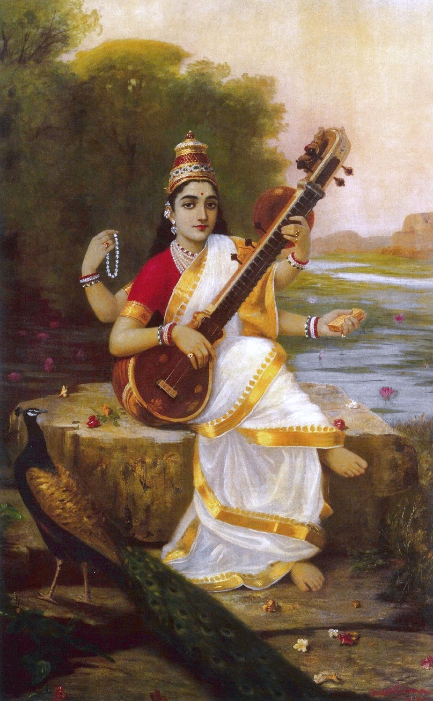

# Three verses and a thousand years of intertext

> Can women be poets ?


_Kāvyādarśa_ (Mirror of Poetry) by _Daṇḍin_ (~700CE, Tamil Nadu) was perhaps the most influential text on literary theory and poetry in the pre-modern world[^1]. In addition to dozens of commentaries in Sanskrit, there were adaptations in Sinhala, Kannada, Old Javanese and Tibetan. It is one of the few non-Buddhist work included in the Tibetan canon[^2] and Tibetan commentaries and interactions continue to early modern times. There is evidence that it was studied in mainland South-East Asia as well. [^3]

_Daṇḍin_ begins the work with the following verse:

> ```
> caturmukhamukhāmbhojavanahaṃsavadhūr mama 
> manase ramatāṃ nityaṃ sarvaśuklā sarasvatī
> ```

Or in translation:[^4]

> ```
> May all-white Sarasvatī— 
> the swan midst the group of the mouth-lotuses 
> of the four-faced one — 
> find long delight in my mind.
> ```



Fig: A 19th century painting of Sarasvatī by Raja Ravi Varma.

That a treatise on literary criticism would begin with a prayer to the goddess of literature is expected. The image of _Sarasvatī_ as all-white was a longstanding trope. It may be construed to mean both the skin-color but also the white ( and thus spotless) robes that the goddess is usually portrayed in.

Beside being the opening verse to a popular work, the verse isn’t much noticeable in its own right. Someone, however, took an exception to this and replied with the following verse:

> ```
> nīlotpaladalaśyāmāṃ vijjikāṃ māṃ ajānatā  
> vṛth'aiva daṇḍinā protktā sarva śuklā sarasvatī
> ```

Or in English:

> ```
> Not knowing me, Vijjikā,
> as dark as the buds of the blue lotus,
> vainly has Daṇḍin said 
> "all-white Sarasvatī"
> ```

Here we have a poetess named _Vijjikā_[^5] making some lighthearted criticisms. While the issues of colorism have a long history in South Asia, this is unlikely to be the case here. _Daṇḍin_ was from the deep south himself and probably quite dark himself while _Vijjikā_ herself was likely from an aristocratic family.

The critic and dramatist _Rājaśekhara_ who was active around the last decades of the ninth and first decades of the tenth century ( so around 880-920 CE) seems to have been extraordinarily interested in praising great poets of the past. Some forty or so verses by him praising classical poets survive. One of them is the following verse:

> ```
> sarasvatīva kārṇāṭī vijayāṅkā jayaty asau 
> yā vidarbhagirāṃ vāsaḥ kālidāsād anantaram
> ```

In English:

> ```
> Hail Vijayāṅkā, she who-
> the Sarasvatī from Karṇāṭa,
> was the home of Vidarbha style,
> second after Kālidāsa.
> ```

_Vijayāṅkā_ here is just the Sanskritized form of the vernacular _Vijjikā_. _Rājaśekhara_ here cleverly references both of the previous verses. The ‘_Vidarbha_ style’, which is usually described as sweet in comparison to others, is a further reference to _Daṇḍin_. _Daṇḍin_’s ancestors were from Vidarbha in central India and he favors this style in his discussion of various regional styles in his work. To be placed second after _Kālidāsa_ is great praise indeed.

These references have long been noticed. There is a one that I think has not yet been considered. _Rājaśekhara_ was immensely proud of his knowledge of Prakrits and especially of _Mahārāṣṭrī_. The _Mahārāṣṭrī_ text par-excellence was a collection of poems called _Gāthā-Saptaśatī_ ( Seven Hundred Verses ) which dates from the first centuries of the first millennium CE. Of the hundreds of poets who contributed to this collection, there were a few female poets. One of them is named _Āndhralakṣmī_. Andhra was then as now a neighboring land to Karnataka. _Karṇāṭa-Sarasvatī_ seems obviously to parallel _Āndhralakṣmī_.

As for Vijjikā herself, more or less nothing is known. From the internal references in the verses we cited above, she must have lived between _Daṇḍin_ (~ 700 CE) and _Rājaśekhara_ (~ 900 CE) in _Karṇāṭa_ in southern India. A few verses of love poetry ascribed to her survive in medieval anthologies but nothing more. There have been speculations that she might have been the daughter of the Western Chalukya king _Pulakeśin_ II ( r. 609-642 CE) but that would make her at least a couple generation older than _Daṇḍin_ himself who was born in the late 650s at the earliest and is therefore highly unlikely.

On the topic of female poets, this is what Rājaśekhara says in his _Kāvyamīmāṃsā_:

> puruṣavat yoṣito’pi kavībhaveyuḥ । saṃskāro hy ātmani samavaiti, na straiṇaṃ pauruṣaṃ vā vibhāgam apekṣate । śrūyante dṛśyante ca rājaputryo mahāmātraduhitaro gaṇikāḥ kautukibhāryāś ca śāstraprahatabuddhayaḥ kavayaś ca ।।

> Women too, like men, can be poets. Apprehension happens in the soul and doesn’t take masculine or feminine divisions into account. Daughters of kings and ministers, escorts and actresses are heard and seen to be proficient in some science and are poets as well.
> 
> _Kāvyamīmāṃsā_. Chapter 10

While discriminatory practices against women for being too ‘irrational’ and thus unfit for many positions sadly were, and sometimes are, common, I have never seen the idea that women can’t be poets[^6]. As _Rājaśekhara_ says, our eyes and ears themselves suggest otherwise.

Maybe the idea was against female poets in Sanskrit especially. From an early period Sanskrit was a learned language akin to medieval Latin and not the mother tongue of any particular community. The speakers of such a language in any pre-modern and patriarchal society would naturally be elite men. In Classical Sanskrit Drama, only kings, male Brahmins and supernatural entities speak Sanskrit and everyone else including elite women speaks some variety of Middle-Indic languages called Prakrit. In _Śūdraka’s_ _Mṛcchakaṭika_ (The Little Clay Cart) we have the following dialogue:

> ```
> Vidūṣakaḥ - bho ehi । gṛhaṃ gacchāvaḥ।  ( bho ehi । gehaṃ gacchemha । )
> 
> Cārudatta :- aho suṣṭhu bhāvarebhilena gītam ।
> 
> Vidūṣakaḥ - mama tāvaddvābhyāmeva hāsyaṃ jāyate । striyā saṃskṛtaṃ paṭhantyā manuṣyeṇa ca kākalīṃ gāyatā । strī tāvatsaṃskṛtaṃ paṭhantī dattanavanasyeva gṛṣṭiradhikaṃ sūsūśabdaṃ karoti । manuṣyo’pi kākalīṃ gāyañśuṣkasumanodāmaveṣṭito vṛddhapurohita iva mantraṃ japandṛḍhaṃ me na rocate ।
> ( mama dāva duvehiṃ jjevva hassaṃ jāadi । itthiāe sakkaaṃ paṭhantīe maṇusseṇa a kāalīṃ gāanteṇa । itthiā dāva sakkaaṃ paṭhantī diṇṇaṇavaṇassā via giṭṭhī ahiaṃ susuāadi । maṇusso vi kāalīṃ gāanto sukkhasumaṇodāmaveṭṭido buḍḍhapurohido via mantaṃ javanto diḍhaṃ me ṇa roadi । ) 
> 
> Cārudatta:- vayasya suṣṭhu khalvadya gītaṃ bhāvarebhilena । na ca bhavānparituṣṭaḥ ।
> ```

Or in Arthur W. Ryder’s translation:

> ```
> Maitreya. Well then, let's go into the house.
> 
> Chārudatta. But how wonderfully Master Rebhila sang!
> 
> Maitreya. There are just two things that always make me laugh. One is a woman talking Sanskrit, and the other is a man who tries to sing soft and low. Now when a woman talks Sanskrit, she is like a heifer with a new rope through her nose; all you hear is "soo, soo, soo." And when a man tries to sing soft and low, he reminds me of an old priest muttering texts, while the flowers in his chaplet dry up. No, I don't like it!
> 
> Chārudatta. My friend, Master Rebhila sang most wonderfully this evening. And still you are not satisfied.
> ```

It is unclear how literally we are to take this. Men singing does not seem ridiculous to the protagonist _Cārudatta_ himself who praises the performance highly. _Maitreya_ moreover is a jester and though a Brahmin doesn’t even speak Sanskrit himself. Still, the author must be portraying, if not condoning, views that really existed.

As for a conclusion, I don’t have one. Just thought it was an interesting topic about how a single thread could be picked up by people in a literary traditions centuries apart from each other.

_If you like my writing, please subscribe to receive similar posts in the future. If there are any errors on my part, I would be grateful to have them pointed out in the comments. Thank you._


---

[^1]: Aristotle’s _Poetics_ is the only contender here.
[^2]: Tibetans seemed to have considered a _Daṇḍin_ a Buddhist and while there is nothing to suggest a sectarian orientation in _Kāvyādarśa_, it is certain from his other works that he was not a Buddhist. There have been suggestions that the religious orientation of the author is deliberately vague ( though not absent ) to facilitate propagation without regard to religious orientation.
[^3]: For more info, see: Bronner, Y. (Ed.). (2023). _A lasting vision: Dandin's Mirror in the World of Asian Letters_. Oxford University Press.
[^4]: Slightly adapted from S.K. Belvalkar’s 1924 English translation.
[^5]: There are all sort of variants of this name, especially of the first two vowels.
[^6]: Maybe because of Insta poetry slop in our age idk. Everyone is a poet nowadays.
