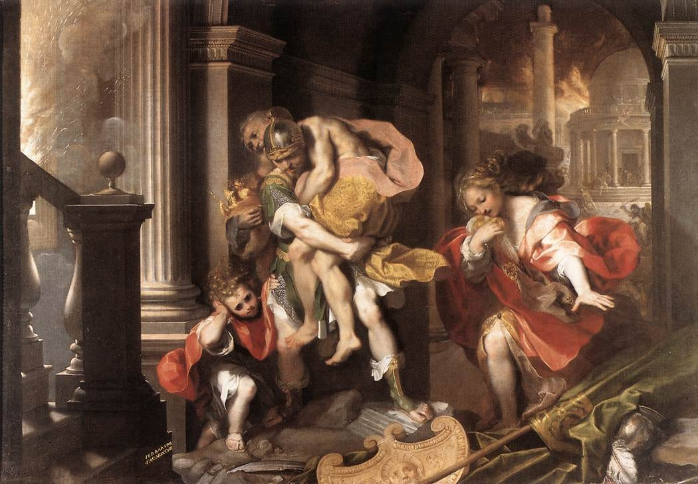

# Why did Augustus not burn the Aeneid ?

> Vergil had wished it so.




Fig: Aeneas Flees Burning Troy, by Federico Barocci (1598)

## Introduction

I would certainly not be exaggerating if I say that every Latin learner learns the opening of Vergil’s Aeneid sooner or later in his education. The first lines of the Aeneid are certainly etched into my memory.

> Arma virumque canō, Trōiae quī prīmus ab ōrīs  
> Ītaliam, fātō profugus, Lāvīniaque vēnit  
> lītora, multum ille et terrīs iactātus et altō  
> vī superum saevae memorem Iūnōnis ob īram;  
> multa quoque et bellō passus, dum conderet urbem,  
> inferretque deōs Latiō, genus unde Latīnum,  
> Albānīque patrēs, atque altae moenia Rōmae.
> 
> Arms, and the man I sing, who, forc’d by fate,  
> And haughty Juno’s unrelenting hate,  
> Expell’d and exil’d, left the Trojan shore.  
> Long labours, both by sea and land, he bore,  
> And in the doubtful war, before he won  
> The Latian realm, and built the destin’d town;  
> His banish’d gods restor’d to rites divine,  
> And settled sure succession in his line,  
> From whence the race of Alban fathers come,  
> And the long glories of majestic Rome.[^1]

These lines in particular have been famous for a long time. Not long after Vergil’s death, young Romans all over the empire would study it as a part of their curriculum. We even get a parody version of its opening lines from a graffiti found in a clothes cleaner’s shop in Pompeii.

> Fullōnēs ululamque canō nōn arma virumque.[^2]

> I sing of launderers and owls not of arms and the man.

Aeneid was one of the most popular Latin texts in the middle ages. Even today Aeneid stands heads and soldiers over other Latin epics in popularity and is worsted only by Homeric epics in that respect. It has influenced, directly or indirectly, uncountable number of later works of literature.

## Biography

When Vergil died suddenly in 19BC, he had been working on the Aeneid for close to eleven years. It was still incomplete when he died and he asked his literary executor to burn the book but the latter, acting explicitly under the authority of Augustus, refrained from doing so and published the work with minimal editing. So, while reading the Aeneid one still encounters some incomplete verses.

Much of this information about the posthumous publication of the Aeneid is obtained from the fourth century Vita Vergilii ( The life of Vergil) by Donatus, whose work is supposed to be based mostly on a lost work on the life of poets by Suetonius ( fl. early 2nd century).

> Anno aetatis quinquagesimo secundo impositurus Aeneidi summam manum statuit in Graeciam et in Asiam secedere triennioque continuo nihil amplius quam emendare, ut reliqua vita tantum philosophiae vacaret. Sed cum ingressus iter Athenis occurrisset Augusto ab oriente Romam revertenti destinaretque non absistere atque etiam una redire, dum Megara vicinum oppidum ferventissimo sole cognoscit, languorem nactus est eumque non intermissa navigatione auxit ita ut gravior aliquanto Brundisium appelleret, ubi diebus paucis obiit XI Kal. Octobr. Cn. Sentio Q. Lucretio coss. Ossa eius Neapolim translata sunt tumuloque condita qui est via Puteolana intra lapidem secundum, in quo distichon fecit tale:
> 
> > “Mantua me genuit, Calabri rapuere, tenet nunc  
> > Parthenope. Cecini pascua, rura, duces.”
> 
> Heredes fecit ex dimidia parte Valerium Proculum fratrem alio patre, ex quarta Augustum, ex duodecima Maecenatem, ex reliqua L. Varium et Plotium Tuccam, qui eius Aeneida post obitum iussu Caesaris emendaverunt. De qua re Sulpicii Carthaginiensis exstant huiusmodi versus:
> 
> > “iusserat haec rapidis aboleri carmina flammis  
> > Vergilius, Phrygium quae cecinere ducem.  
> > Tucca vetat Variusque simul; tu, maxime, Caesar,  
> > non sinis et Latiae consulis historiae.  
> > Infelix gemino cecidit prope Pergamon igni,  
> > et paene est alio Troia cremata rogo.”
> 
> Egerat cum Vario, priusquam Italia decederet, ut siquid sibi accidisset, Aeneida combureret; at is facturum se pernegarat; igitur in extrema valetudine assidue scrinia desideravit, crematurus ipse; verum nemine offerente nihil quidem nominatim de ea cavit. Ceterum eidem Vario ac simul Tuccae scripta sua sub ea condicione legavit, ne quid ederent, quod non a se editum esset. Edidit autem auctore Augusto Varius, sed summatim emendata, ut qui versus etiam inperfectos sicut erant reliquerit; quos multi mox supplere conati non perinde valuerunt ob difficultatem, quod omnia fere apud eum hemistichia absoluto perfectoque sunt sensu, praeter illud:
> 
> > “quem tibi iam Troia”.

Or in my English translation:

> In the fifty second year of his life, he decided to go to Greece and Asia to put final touches to his Aeneid and to do nothing for three years than to edit so that the rest of his life may be dedicated to philosophy. But when he had started his journey and even reached Athens he met Augustus who was at this time returning to Rome from the east and decided not to leave him but to accompany him back.
> 
> He caught fever while travelling to the neighboring town of Megara which was then further worsened by the uninterrupted voyage. So it happened that he had greatly ill by the time he reached Brundisium where he died some days later on the eleventh day before the Kalends of October, in the year when Gnaeus Sentius and Quintus Lucretius were consuls. [21 Sep 19 BC]. His ashes were brought to Neapolis and buried there on the Puteolean road less than two miles from the city. In his tomb, the following couplet, which he himself composed, was placed:
> 
> ```
> Mantua gave birth to me, Calabria took me and now Parthenope 
> holds. I sang of the shepherds, of rustics and of the leader.
> ```
> 
> He made his heirs for half his fortune Valerius Proculus, his brother from another father; for a quarter of his fortune Augustus; for one-twelfth part Maecenas. For the rest, he made his heirs Lucius Varius and Plotius Tucca, the same ones who edited his Aeneid after his death. About this Sulpicius the Carthaginian made the following verses:
> 
> ```
> Vergil had ordered the poem to be burned in flames;
> the one which sang of the Phrygian leader.
> Tucca forbade, and Varius too. You, too, Caesar 
> don't stop caring for the Latin story.
> Unlucky Pergamon nearly perished twice by fire,
> nearly did a second fire burn Troy.
> ```
> 
> Before leaving Italy, he had asked Varius that if anything was to happen to him, Aeneid should be burnt. But Varius declared that he would not do so. So, at the end of his health, he asked for his book-chest to burn it himself. When no one gave it to him, he made no special request on this matter. Again, he authorized Varius and Tucca to his writings on the condition that they would not publish anything that he himself wouldn’t have published.
> 
> And Varius published it under the auspices of Augustus with a few corrections and leaving the incomplete half-verses as they were. Many have tried afterwards to complete these but with no success because of the difficulty as all these incomplete half-verses are complete and perfect sense, except this one: “_quem tibi iam Troia_”.

There are other biographies of Vergil (including one in hexameter verse by Phocas the grammarian) but they more or less tread the same ground. Augustus ordering the Aeneid to be saved makes sense. It was on his request that Aeneid was being written at all[^3]. It does not strike one as particularly mysterious that Augustus would want to save a project in which he had a vested interest in. Authors asking for their works to be destroyed and their friends refusing to do so is, afterall, a time honored tradition. Kafka comes to mind among the authors to do so in more recent times. In our own times, G.R.R Martin has reportedly asked for his works to be destroyed after his death. [^4]

If you want to know what Augustus felt while saving the Aeneid from the flames, you’re in luck. A poem in the Anthologia Latina, ascribed to Augustus himself, is dedicated to this very topic. Whether it is actually by Augustus is doubtful (it is likely not). Even Riese in the Anthologia just included ‘ascribed to Augustus’. Augustus was no stranger to the world of the Muses and I would not be surprised if the consensus on the authorship changes in the future. For the present purposes, however, the question of authorship is immaterial. The speaker of the following poem is certainly presented as Augustus. I quite like it. It is certainly not the pinnacle of Latin poetry, is quite repetitive in parts and is not as polished as it could be. Still, one must not expect every Latin poem to be as good as the Aeneid - the _sacred poem_ as it is called here. There are quite a lot of these fun poems in the Anthologia Latina. Some of these, like the summary of the Aeneid attributed to Ovid, may be the subject of a future post.

As for the translation, it is, like always, in prose. I have tried to be as literal as possible within the bounds of intelligibility. Some notes and comments follow the translation. The notes are numbered A, B, C… so as to not be confused with footnotes. The text is from Alexander Riese’s edition of the Anthologia Latina. I macronized the text myself and though I’ve tried my best, there may be errors still.[^5]

The original and translation follow:[^6]

## Poem

#### Text

> Ergone suprēmīs potuit vōx inproba verbīs  
> tam dīrum mandāre nefās? ergō ībit in ignēs  
> magnaque doctiloquī moriētur Mūsa Marōnis?  
> Ā scelus indignum! solvētur litterā dīves  
> et poterunt spectāre oculī, nec parcere honōrī  
> flamma suō? ductumque operī servābit amōrem?  
> Pulcher Apollo, vetā! Mūsae prohibēte Latīnae!  
> Līber et alma Cerēs, succurrite! vester in armīs  
> mīles erat, vester docilis per rūra colōnus.  
> Nam docuit, quid vēr ageret, quid cōgeret aestās,  
> quid pater autumnus, quid brūma novissima ferret.  
> Mūnera tellūris largā ratiōne notāvit,  
> arbuta fōrmāvit, sociāvit vītibus ulmōs,  
> cūrāvit pecudēs, apibus sua castra dicāvit.  
> Illum, illum Aenēān nescīret fāma perennis,  
> docta Marōnēō caneret nisi pāgina versū!  
> Haec dedit, ut pereant, ipsum sī dīcere fās est!  
> “Sed lēgum est servanda fidēs; suprēma voluntās  
> quod mandat fierīque iubet, pārēre necesse est.”  
> Frangātur potius lēgum reverenda potestās,  
> quam tot congestōs noctēsque diēsque labōrēs  
> auferat ūna diēs, suprēmaque verba parentis  
> āmittant vigilāsse suum. sī forte suprēmum  
> errāvit iam morte piger, sī lingua locūta est  
> nescio quid titubante animō, nōn sponte sed altīs  
> expugnāta malīs odiō languōris inīquī,  
> sī mēns caeca fuit: iterum sentīre ruīnās  
> Troia suās, iterum cōgētur reddere vōcēs?  
> Ārdēbit miserae narrātrīx fāma Creūsae?  
> Sentiet appositōs Cūmāna Sibylla vapōrēs?  
> ūretur Tyriae post fūnera vulnus Elissae  
> et iūrāta morī, nē cingula reddat, Amāzōn?  
> Tam sacrum solvētur opus? tot bella, tot ēnsēs  
> In cinerēs dabit hōra nocēns et perfidus error?  
> Hūc hūc, Pīeridēs, date flūmina cūncta, sorōrēs;  
> Exspīrent ignēs, vīvat Marō ductus ubīque  
> ingrātusque suī studiōrumque invidus orbī  
> Et factus post fāta nocēns. quod iusserat ille  
> sī vetuisse meum satis est post tempora vītae,  
> immō sit aeternum tōtā resonante Camēnā  
> carmen, et in populō dīvī sub nūmine nōmen  
> laudētur vigeat placeat relegātur amētur!  

#### English Translation

> Now, could the wicked voice have ordered something so terrible, so wrong with those last words ? Shall it be that it will go into the flames, and the great Muse of eloquent Maro perish? **[A]** Ah, the evil! Shall the great piece of literature just be let go **[B]** and shall eyes be able to look on when the fire spares not its own honor? And will the love that shaped the work and guided its creation be dragged off and lost?
> 
> Prevent it from happening, o Apollo; prevent it, o Latin Muses! Liber and kindly Ceres, come to his aid! He was your soldier in arms, your obedient farmer in the fields **[C]**. For he taught what the spring does, what the summer compels, what the father autumn, and what each new winter brings. He recorded the gifts of the earth with generosity; he formed the strawberry tree, paired the elm with the vine. He tended the herds and dedicated a home for his bees. **[D]** And will imperishable fame not know _the_ man Aeneas, if it be not sung in learned pages with Maro’s verses.
> 
> He gave these to be burnt, himself, if I be allowed to say the truth. **[E]**
> 
> “_But one should save the faith of the laws; it’s necessary to do what the last wishes orders to be done._”
> 
> Then, let the power of the laws be broken rather than that the labors of so many nights and days be taken away by a single day or that the last words of the creator **[F]** lose their own vigilance. Perhaps the erroneous last words were spoken by a man sluggish with death, perhaps his tongue spoke when the mind was blind and wavering, not by its own will but conquered by deep sufferings and hateful weaknesses. What then ? Will Troy be forced to feel its own ruins again ? Will she be forced to wail again ? Shall the news of miserable Creusa burn again ? Shall the Cumaean Sibyl be forced again to feel the vapors around her ? Shall the wounds of Tyrian Elissa burn even after death along with the Amazon sworn to die rather than surrender her belt? **[G]** Shall so holy a work go to nothing ? So many wars, so many swords, are all these to be reduced to ashes because of a single guilty hour and a treacherous mistake ?
> 
> Here, o Pierian sisters, come here and pour out your streams.**[H]** Extinguish these flames and let Maro, brought out everywhere **[I]**, live. Let him live though he be ungrateful to himself, invidious to his own works. Let him live though he be so harmful even after death.
> 
> If what he ordered should stand, let my forbidding come too late after his lifetime—no! Let his poem be eternal, with the whole Muses’ **[J]** choir resounding. Let his name be praised by men under power divine, let it flourish, let it be pleasing to men, let him be read and loved again and again. **[K]**

---

## Some Notes

**A**: _Shall it be …, and the great Muse of eloquent Maro perish?_ : eloquent translates ‘_doctiloquus’_, from _doctus_ (learned) and _loqui_ (to speak). I’ve used eloquent because the English derivative doctiloquent sounds rather pompous. Maro was the cognomen of Vergil and it is by this name that he is referred to throughout our poem.

**B**: _Shall the great piece of literature just be let go_ … : ‘great piece of literature’ translates ‘littera dives’ (rich letters). ‘letters’ may, like in English, denotes both the individual graphs of the alphabet as well as literature.

**C**: _He was your soldier in arms, your obedient farmer in the fields :_ Muses and Apollo are naturally the divinities that one may appeal here as they are intimately related to the idea of literature and especially of poetry in the Graeco-Roman world. The inclusion of Ceres, a goddess related to agriculture, and Liber, a god who was, among other things, identified with Bacchus/Dionysus and thus with viticulture, are probably due to the subject matters of his poems.

**D**: _For he taught what the spring does … dedicated a home for his bees_ : These refers to the content of Vergil’s previous works. His Eclogues portray pastoral lives and the Georgics are a poetic manual of agriculture. Vergil’s supposed sepulchral verse quoted in the biography part earlier contains the same basic idea.

```
Mantua gave birth to me, Calabria took me and now Parthenope 
holds. I sang of the shepherds (=Eclogues) , of rustics (=Georgics) and of leader (=Aeneid).
```

**E**: … _if I be allowed to say the truth_ : Literally, if it is _fas_ to say so. ‘_fas_’ is right or correct in moral or religious dimension as opposed to ‘_jus’_ or ‘_lex’_. In the first line, ‘_nefas’_, the antonym, of fas has been translated as ‘wrong’. It could be translated to ‘evil’ but that would give the translation too Christian of a coloring.

**F**: The text actually has ‘parent’ in place of the ‘creator’.

**G**: _Will Troy be forced to … than surrender her belt?_ : All are references to events contained in the Aeneid. Tyrian Elissa is Dido. A version of the origin myth of Carthage, with Dido, princess of Tyre, founding the city forms a plot point in the Aeneid. Tyre was located in Phoenicia in the Levant.

**H**: The Muses were the daughter of King Pierus and are often referred to as the Pierian chorus. The Muses are naturally associated with springs and are to weep for dead heroes and poets.

**I**: I am unable to make any sense of the ‘_ductus ubique_’ which I’ve translated as ‘brought out everywhere’ which, I suppose, is as opaque in English as the original is in Latin. There are, in fact, good reasons to suppose that the text is faulty here. In his new edition of Anthologia Latina, Shackleton Bailey emends the text here to ‘_lectus_’ (selected) which doesn’t make any more sense than the original, at least to me. Edward Courtney amends it to ‘_adustus inique_’ (scorched unjustly) which is a little better.

**J**: _with the whole Muses’_ : The Latin has Camena here. Camenae were Roman goddesses often identified with the Greek Muses. In fact the very first verse of one of the oldest Latin literary work we know of, Livius Andronicus’ translation of the Odyssey, translates Muse by Camena. “_virum mihi camena insece versutum_”.

**K**: _Let his poem be eternal … loved again and again_ : There are no multiple ‘let’-s in the original and everything is expressed through a series of subjunctive verbs in active and passive that are all governed by a single noun.


---

[^1]: The English version is from John Dryden’s translation.
[^2]: CIL IV.9131 (Corpus Inscriptionum Latinarum)
[^3]: Servius says in the beginning of his commentary on the Aeneid: “_postea ab Augusto Aeneidem propositam scripsit annis undecim_.” “After this he wrote the Aeneid, which was suggested by Augustus, for eleven years”
[^4]: I’ve actually heard contradictory things about this and am not certain.
[^5]: There _are_ errors in macronization. In the very first line for example _ergone_ should normally be _ergōne_ which would however break the metre. Similar cases occur elsewhere; for example in line seven where Apollo should normally be Apollō.
[^6]: The text is from Riese’s edition of the Anthologia Latina where it occurs as No. 672. Riese, A. (Ed.). (1901). _Anthologia Latina: Sive poesis Latinae supplementum_ (Vol. 2). B.G. Teubner. There is a complete translation of our poem, the only complete one in English that I know of, in Ziolkowski and Putnam’s The Virgilian Tradition where it occurs as a part of a biography of Virgil. Ziolkowski, Jan M., and Michael C. J. Putnam. _The Virgilian Tradition: The First Fifteen Hundred Years_. New Haven: Yale University Press, 2008.
